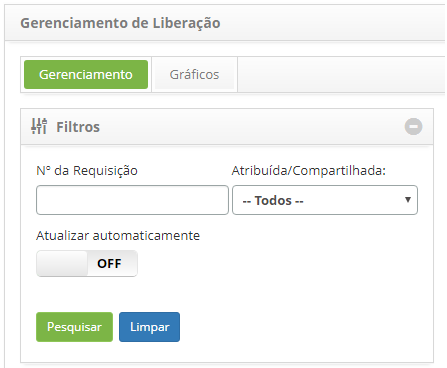
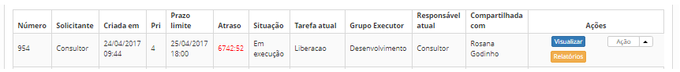
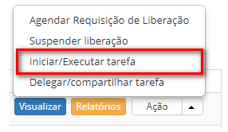

title: Cancelamento de registro de liberação
Description: Esta funcionalidade permite cancelar a requisição de liberação.

# Cancelamento de registro de liberação

Esta funcionalidade permite cancelar a requisição de liberação.

Como acessar
------------

1.  Acesse a funcionalidade de Gerenciamento de Liberação através da
    navegação no menu principal **Processos ITIL \> Gerência de
    Liberação \> Gerenciamento de Liberação**.

Pré- condições
--------------

1.  Ter requisição de liberação registrada (ver conhecimento [Cadastro e
    pesquisa de requisição de liberação];

2.  Ter permissão para cancelar a requisição de liberação.

Filtros
-------

1.  Os seguintes filtros possibilitam ao usuário restringir a participação de
    itens na listagem padrão da funcionalidade, facilitando a localização dos
    itens desejados:

    -   Número da requisição;

    -   Atribuída/Compartilhada.

    

    **Figura 1 - Tela de filtros**

Listagem de itens
-----------------

1.  Os seguintes campos cadastrais estão disponíveis ao usuário para facilitar a
    identificação dos itens desejados na listagem padrão da
    funcionalidade: Número, Solicitante, Criada em, Prioridade, Prazo limite,
    Atraso, Situação, Tarefa atual Grupo Executor, Responsável
    atual e Compartilhada com;

2.  Existem botões de ação disponíveis ao usuário em relação a cada item da
    listagem, são eles: *Visualizar*, *Relatórios* e *Ação* (Agendar Requisição
    de Liberação, Suspender liberação, Iniciar/Executar tarefa e
    Delegar/compartilhar tarefa).

    

    **Figura 2 - Tela de listagem de liberação**

Preenchimento dos campos cadastrais
-----------------------------------

1.  Não se aplica.

Cancelando a requisição de liberação
------------------------------------

1.  Será apresentada a tela de Gerenciamento de Liberação;

2.  Na guia **Gerenciamento**, localize a requisição de liberação que será
    cancelada, clique no botão *Ações* e selecione a opção *Iniciar/Executar
    tarefa*, conforme indicado na figura abaixo:

    

    **Figura 3 - Cancelar requisição de liberação**

3.  Será exibida a tela de **Registro da Requisição de Liberação** com os campos
    preenchidos, com o conteúdo referente a requisição selecionada;

    -   Na área de **Requisição**, no campo **Situação**, altere a situação da
    requisição de liberação para “Cancelada”;

    -   Na área de **Fechamento**, no campo **Fechamento**, descreva o porquê do
    cancelamento da requisição de liberação.

4.  Após registro das informações sobre o cancelamento da liberação, clique no
    botão *Gravar e avançar o fluxo* para efetuar a operação, onde a liberação
    será cancelada com sucesso.

5.  Caso queira gravar somente as informações registradas sobre o cancelamento
    da liberação e manter a tarefa atual, clique no botão *Gravar e manter a
    tarefa atual*.

6.  Em ambos os casos anteriores ao clicar no botão "Gravar" a data, hora e
    usuário serão armazenados automaticamente para uma futuraauditoria.

!!! tip "About"

    <b>Product/Version:</b> CITSmart | 8.00 &nbsp;&nbsp;
    <b>Updated:</b>07/10/2019 – Anna Martins
