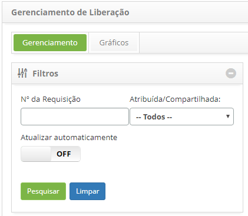
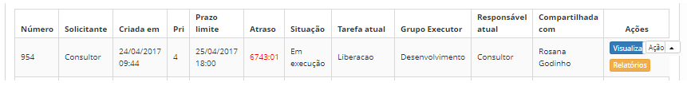
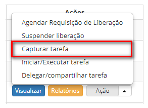

title: Captura de registro de liberação
Description: Esta funcionalidade permite atribuir a requisição de liberação para
o próprio usuário, tornando-se o responsável atual pela execução da mesma.

#Captura de registro de liberação

Esta funcionalidade permite atribuir a requisição de liberação para o próprio
usuário, tornando-se o responsável atual pela execução dela.

Como acessar
------------

1.  Acesse a funcionalidade de Gerenciamento de Liberação **através da
    navegação no menu principal **Processos ITIL \> Gerência de
    Liberação \> Gerenciamento de Liberação**.

Pré-condições
-------------

1.  Ter requisição de liberação registrada (ver conhecimento [Cadastro e
    pesquisa de requisição de
    liberação]().

Filtros
-------

1.  Os seguintes filtros possibilitam ao usuário restringir a participação de
    itens na listagem padrão da funcionalidade, facilitando a localização dos
    itens desejados:

    -   Número da Requisição;

    -   Atribuída/Compartilhada.

    

    **Figura 1 - Tela de filtros**

Listagem de itens
-----------------

1.  Os seguintes campos cadastrais estão disponíveis ao usuário para facilitar a
    identificação dos itens desejados na listagem padrão da
    funcionalidade: **Número**, **Solicitante**, **Criada**
    **em**, **Prioridade**, **Prazo Limite**, **Atraso**, **Situação**, **Tarefa
    **atual**, **Grupo Executor**, **Responsável atual** e **Compartilhada com**.

2.  Existem botões de ação disponíveis ao usuário em relação a cada item da
    listagem, são eles: *Visualizar*, *Relatórios* e *Ação*.

    

    **Figura 2 - Tela de listagem de liberação**

Preenchimento dos campos cadastrais
-----------------------------------

1.  Não se aplica.

Capturando requisição de liberação
----------------------------------

1.  Para capturar a requisição de liberação, acesse a guia **Gerenciamento**,
    localize a requisição de liberação que deseja capturar, clique no
    botão *Ações* e clique na opção *Capturar tarefa*, conforme indicado na
    figura a seguir:

    

    **Figura 3 – Captura de requisição de liberação**

1.  Será exibida uma mensagem de confirmação da captura da tarefa.

2.  Clique em *Ok* para efetuar a operação. Feito isso, será apresentado o
    responsável atual pela execução da requisição de liberação no registro dela.

!!! tip "About"

    <b>Product/Version:</b> CITSmart | 8.00 &nbsp;&nbsp;
    <b>Updated:</b>07/12/2019 - Anna.Martins
