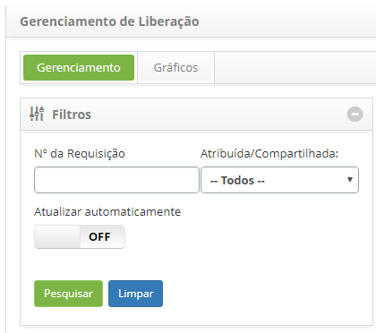
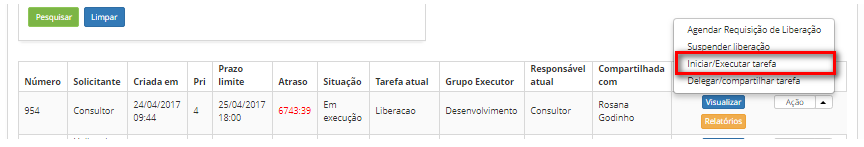

title: Encerramento de liberação
Description: Esta funcionalidade permite finalizar a requisição de liberação.
# Encerramento de liberação

Esta funcionalidade permite finalizar a requisição de liberação.

    !!! note "NOTA"

        Somente o "solicitante" pode encerrar a requisição de liberaçã

Como acessar
------------

1.  Acesse a funcionalidade de Gerenciamento de Liberação através da
    navegação no menu principal **Processos ITIL \>Gerência de
    Liberação \> Gerenciamento de Liberação**.

Pré-condições
-------------

1.  Ter a requisição de liberação com a situação "resolvida".

Filtros
-------

1.  Os seguintes filtros possibilitam ao usuário restringir a participação de
    itens na listagem padrão da funcionalidade, facilitando a localização dos
    itens desejados:

    -  Número da Requisição;

    -  Atribuída/Compartilhada.

**Figura 1 - Tela de pesquisa de liberação**

Listagem de itens
-----------------

1.  Os seguintes campos cadastrais estão disponíveis ao usuário para facilitar a
    identificação dos itens desejados na listagem padrão da
    funcionalidade: Número, Solicitante, Criada
    em, Prioridade, Prazo Limite, Atraso, Situação, Tarefa
    atual, Grupo Executor, Responsável atual e Compartilhada com.

2.  Existem botões de ação disponíveis ao usuário em relação a cada item da
    listagem, são eles: *Visualizar*, *Relatórios*, *Agendar Requisição de*
    *Liberação*, *Suspender liberação*, *Iniciar/Executar*
    *tarefa* e *Delegar/Compartilhar tarefa*.

3.  Para encerrar a requisição de liberação, acesse a
    guia **Gerenciamento**, localize a requisição de liberação que será
    finalizada, clique no botão *Ações* e selecione a opção *Iniciar/Executar*
    *tarefa*, conforme indicado na figura abaixo:

    

    **Figura 2 - Executar tarefa atual da requisição de liberação**

1.  Será exibida a tela de **Requisição de Liberação** com os campos
    preenchidos, com o conteúdo referente à requisição selecionada:

    -  Verifique se a liberação das mudanças foi atendida conforme solicitado;

    -  Registre as informações necessárias sobre o encerramento da requisição de
    liberação.

1.  Na área de **Fechamento**, clique no botão *Adicionar registro de execução*.
    Feito isso, descreva as informações sobre o encerramento.

    -  Após registro das informações sobre o encerramento da liberação, clique no
    botão *Gravar e avançar o fluxo* para efetuar a operação, onde a liberação
    será finalizada com sucesso.

1.  Caso queira gravar somente as informações registradas sobre a encerramento
    da liberação e manter a tarefa atual, clique no botão *Gravar e manter a
    tarefa atual*;

2.  Em ambos os casos anteriores, ao clicar no botão *Gravar* a data, hora e
    usuário serão armazenados automaticamente para uma futura auditoria.

!!! info "IMPORTANTE"

     Após finalizar a requisição de liberação, os itens de configuração
     relacionados a mesma que estão em desenvolvimento ou em homologação, serão
     encaminhados para o ambiente de produção para serem validados.

Preenchimento dos campos cadastrais
-----------------------------------

1.  Não se aplica.

!!! tip "About"

    <b>Product/Version:</b> CITSmart | 8.00 &nbsp;&nbsp;
    <b>Updated:</b>07/12/2019 – Anna Martins
