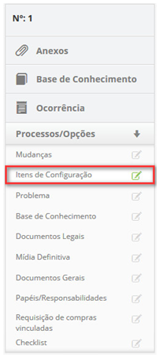

title: Execução de liberação
Description: Esta funcionalidade permite registrar as informações referente a
execução da requisição de liberação das mudanças.

# Execução de liberação

Esta funcionalidade permite registrar as informações referente a execução da
requisição de liberação das mudanças.

Como acessar
------------

1.  Acesse a funcionalidade de Gerenciamento de Liberação através da
    navegação no menu principal **Processos ITIL > Gerência de
    Liberação > Gerenciamento de Liberação**.

Pré-condições
-------------

1.  Ter requisição de liberação registrada (ver conhecimento [Cadastro e
    pesquisa de requisição de
    liberação]();

2.  Ter permissão para executar a requisição de liberação .

Filtros
-------

1.  Os seguintes filtros possibilitam ao usuário restringir a participação de
    itens na listagem padrão da funcionalidade, facilitando a localização dos
    itens desejados:

    -  Nº de Requisição;

    -  Atribuída/Compartilhada.

    

    **Figura 1 - Tela de pesquisa de requisição**

Listagem de itens
-----------------

1.  Os seguintes campos cadastrais estão disponíveis ao usuário para facilitar a
    identificação dos itens desejados na listagem padrão da
    funcionalidade: Número, Solicitante, Criada em, Prioridade, Prazo limite,
    Atraso, Situação, Tarefa atual, Grupo Executor, Responsável
    atual e Compartilhado com.

2.  Existem botões de ação disponíveis ao usuário em relação a cada item da
    listagem, são eles: *Visualizar,* *Relatórios* e *Ação*.

3.  Será apresentada a tela de Gerenciamento de Liberação;

4.  Na guia **Gerenciamento**, localize a requisição de liberação que será
    registrada a sua execução, clique no botão *Ação* e selecione a
    opção *Iniciar/Executar tarefa*, conforme indicado na figura abaixo:

    

    **Figura 2 - Executar requisição de liberação**

1.  Será exibida a tela de **Registro da** **Requisição de Liberação** com os
    campos preenchidos, com o conteúdo referente à requisição selecionada;

2.  Registre as informações necessárias da execução da requisição de liberação:

    -  Na área de **Fechamento**, clique no botão *Adicionar registro de
        execução*. Feito isso, descreva as informações sobre a execução de sua
        atividade.

Vinculando itens de configuração
--------------------------------

1.  Relacione os itens de configuração afetados pela liberação:

    -   Ao lado direito da tela de requisição de liberação, clique
        em **Processos/Opções** e logo em seguida na opção **Itens de
        Configuração**, conforme indicado na figura abaixo:

    

     **Figura 3 - Guia de itens de configuração**

1.  Será apresentada a tela de vínculo de itens de configuração. Clique no ícone 
     para busca do item de configuração;

2.  Será exibida a tela de pesquisa de ICs. Informe o filtro necessário para sua
    pesquisa e clique no botão *Pesquisar*. Serão apresentados os ICs conforme o
    filtro informado;

3.  Clique no ícone   do IC desejado. Feito isso, o IC será vinculado à
    requisição de liberação;

    

     **Figura 4 - Item de configuração relacionado**

    -  Caso queira excluir o vínculo do item de configuração com a requisição de
    liberação, basta clicar no ícone  do mesmo.

    -  Caso queira verificar informações detalhadas do IC, basta clicar no ícone 
     do mesmo.

Vinculando problema
-------------------

1.  Relacione os problemas à requisição de liberação, caso seja necessário:

    -  Ao lado direito da tela de requisição de liberação, clique
        em **Processos/Opções** e logo em seguida na opção **Problema**,
        conforme indicado na figura abaixo:

    

     **Figura 5 - Guia de problema**

1.  Será apresentada a tela de vínculo de problemas. Clique no ícone   para
    adição de problemas;

2.  Será exibida a tela de pesquisa de problemas. Realize a pesquisa e selecione
    o problema referente à requisição de liberação. Feito isso, o mesmo será
    relacionado à requisição de liberação;

    

     **Figura 6 - Tela de vínculo de problemas**

Vinculando base de conhecimento
-------------------------------

1.  Relacione os conhecimentos referente à requisição de liberação:

    -   Ao lado direito da tela de requisição de liberação, clique
        em **Processos/Opções** e logo em seguida na opção **Base de
        Conhecimento**, conforme indicado na figura abaixo:

    

    **Figura 7 - Guia de base de conhecimento**

    -  Será apresentada a tela de vínculo de conhecimento. Clique no ícone   para
    adicionar o conhecimento;

    -  Será exibida a tela de pesquisa de conhecimento. Realize a pesquisa e
    selecione o conhecimento. Feito isso, será relacionado o conhecimento à
    requisição de liberação;

     

     **Figura 8 - Tela de vínculo de conhecimento à requisição de liberação**

Vinculando documentos legais
----------------------------

1.  Adicione os documentos legais referente aos procedimentos da liberação:

    -  Ao lado direito da tela de requisição de liberação, clique
        em **Processos/Opções** e logo em seguida na opção **Documentos
        Legais**, conforme indicado na figura abaixo:

     

     **Figura 9 - Guia de documentos legais**

    -  Será apresentada a tela para anexo de documentos, conforme ilustrada na
    figura a seguir:

     

     **Figura 10 - Tela adição de documentos legais**

    -  Clique no botão *Selecionar arquivo*. Será exibida uma janela para seleção
    do arquivo;

    -  Selecione o arquivo (documento legal) e após isso, informe a descrição
        do mesmo e clique no botão *Adicionar* para efetuar a operação;

Vinculando mídia definitiva
---------------------------

1.  Caso seja necessário, relacione as mídias definitivas referente aos itens de
    configuração relacionados à requisição de liberação:

    -   Ao lado direito da tela de requisição de liberação, clique
        em **Processos/Opções** e logo em seguida na opção **Mídia Definitiva**,
        conforme indicado na figura a seguir:

     

     **Figura 11 - Guia de mídia definitiva**

    -  Será apresentada a tela de vínculo de mídias definitivas. Clique no ícone 
    para busca da mídia;

    -  Será exibida a tela de pesquisa de mídia definitiva. Realize a pesquisa e
    selecione a mídia referente aos ICs relacionados à requisição de liberação.
    Feito isso, será relacionada a mídia definitiva à requisição de liberação;
    
    

    **Figura 12 - Mídia definitiva relacionada**

-   Caso queira excluir uma mídia que foi relacionada à requisição de liberação,
    basta clicar no ícone  do mesmo.

Vinculando documentos gerais
----------------------------

1.  Adicione os documentos gerais referente à requisição de liberação:

    -  Ao lado direito da tela de requisição de liberação, clique
        em **Processos/Opções** e logo em seguida na opção **Documentos
        Gerais**, conforme indicado na figura a seguir:

    

     **Figura 13 - Guia de documentos gerais**

    -  Será apresentada a tela para anexo de documentos, conforme ilustrada na
    figura a seguir:

    

    **Figura 14 - Tela de adição de documentos gerais**

    -  Clique no botão *Selecionar arquivo*. Será exibida uma janela para seleção
    do arquivo;

    -  Selecione o arquivo e após isso, informe a descrição do mesmo e clique
        no botão *Adicionar* para efetuar a operação;

Vinculando papéis/responsabilidades
-----------------------------------

1.  Informe os papéis/responsabilidades, ou seja, os recursos envolvidos na
    execução da liberação de mudança:

    -  Ao lado direito da tela de requisição de liberação, clique na
        aba **Processos/Opções** e selecione a
        opção **Papéis/Responsabilidades**, conforme indicado na figura a
        seguir:

    

     **Figura 15 - Guia de Papéis/responsabilidade**

    -  Será apresentada a tela para adição de papéis/responsabilidades. Clique no
    ícone  para busca dos colaboradores envolvidos na execução da liberação;

    -  Será exibida a tela de pesquisa de colaborador. Realize a pesquisa e
    selecione o colaborador envolvido na execução da liberação. Feito isso, será
    apresentada uma tela para informar a descrição do papel concedido ao
    determinado colaborador;

    -  Informe a descrição do papel que o colaborador exercerá e clique
    em *Ok* para efetuar a operação. Após isso, será adicionado no registro o
    colaborador envolvido na execução da requisição de liberação;

    

    **Figura 16 - Papéis / responsabilidade**

Vinculando requisição de compras vinculadas
-------------------------------------------

1.  Caso tenha realizado uma requisição de compras para executar a liberação da
    mudança, relacione a mesma à requisição de liberação:

    -  Ao lado direito da tela de requisição de liberação, clique na
        aba **Processos/Opções** e selecione a opção **Requisição de compras
        vinculadas**, conforme indicado na figura a seguir:

    

     **Figura 17 - Guia de requisição de compras**

    -  Será apresentada a tela para vínculo da requisição de compras, conforme
    ilustrada na figura abaixo:

    

    **Figura 18 - Tela de vínculo de requisição de compras**

    -  Clique no ícone   para adicionar a requisição de compras. Será exibida a
    tela de pesquisa de requisição de compras. Realize a pesquisa e selecione a
    requisição de compras que deseja associar à requisição de liberação. Feito
    isso, será relacionada a requisição de compras à requisição de liberação.

Vinculando checklist
--------------------

1.  Caso seja necessário, responda o checklist referente a execução da liberação
    da mudança:

    -   Ao lado direito da tela de requisição de liberação, clique na
        aba **Processos/Opções** e selecione a opção **Checklist**, conforme
        indicado na figura a seguir:

    

     **Figura 19 - Guia de checklist**

    -  Será apresentada a tela de Checklist, conforme ilustrada na figura a seguir:

    

    **Figura 20 - Checklist da liberação**

    -  Selecione o questionário e preencha o mesmo de acordo com a execução da
    requisição de liberação realizada;

    -  Após preenchimento do questionário, clique no botão *Gravar* para
        efetuar a operação. Feito isso, será apresentado o questionário, o qual
        foi respondido, em “Histórico”;

    -  Caso queira editar as informações do questionário, clique no ícone   do
        mesmo, altere os dados desejados e clique no botão *Gravar* para efetuar
        a operação.

Vinculando anexos
-----------------

1.  Caso queira visualizar os anexos da requisição ou anexar um arquivo à
    requisição de liberação, proceda da seguinte maneira:

    -   Ao lado direito da tela de requisição de liberação, clique
        em **Anexos**, conforme indicado na figura a seguir:

    

    **Figura 21 - Guia de anexos**

    -  Será apresentada a tela de anexo de arquivos, conforme ilustrada na figura
    abaixo:

    

    **Figura 22 - Tela de adição de arquivos**

1.  Para adicionar um arquivo, clique no botão *Selecionar arquivo*. Será
    apresentada a tela para selecionar o arquivo desejado:

    -  Selecione o arquivo e após isso, informe a descrição do arquivo e clique no
    botão *Adicionar*;

    -  Após adição do arquivo, clique no botão *Fechar* para retornar à tela de
    requisição de liberação.

Vinculando ocorrência
---------------------

1.  Caso queira inserir uma ocorrência à requisição de liberação, proceda da
    seguinte maneira:

    -   Ao lado direito da tela de requisição de liberação, clique
        em **Ocorrência**, conforme indicado na figura a seguir:

    

    **Figura 23 - Guia de ocorrência**

    -  Será exibida a tela de **Ocorrências** contendo duas abas, uma para exibição
    da relação de ocorrências registradas e outra para cadastro de ocorrência;

1.  Na aba de **Cadastro de Ocorrências**, possui campos que devem ser
    preenchidos conforme descritos abaixo:

    

    **Figura 24 - Registro de ocorrências**

    -  **Categoria**: selecione a categoria da ocorrência. Caso não seja encontrada
    a categoria, é possível realizar um cadastro rápido clicando no ícone   de
    “Categoria”;

    -  **Origem**: selecione a origem da ocorrência. Caso não seja encontrada a
        origem, é possível realizar um cadastro rápido clicando no ícone   de
        “Origem”;

    -  **Tempo Gasto (min)**: informe o tempo gasto da ocorrência em minutos;

    -  **Registrado por**: informe por quem está sendo registrada a ocorrência;

    -  **Descrição**: informe a descrição da ocorrência;

    -  **Ocorrência**: informe a ocorrência;

    -  **Informações de Contato**: descreva as informações para contato;

1.  Clique no botão *Gravar*. Após isso, será exibida uma mensagem confirmando o
    sucesso da operação e retornará à tela de requisição de liberação.

Consultando base de conhecimento
--------------------------------

1.  Caso queira consultar a base de conhecimento, basta clicar na guia de **Base
    de Conhecimento**, localizada ao lado direito da tela, conforme indicado na
    figura a seguir:

    

    **Figura 25 - Guia de base de conhecimento**

    -  Após registro das informações da execução da requisição de liberação, clique
    no botão *Gravar e avançar o fluxo* para efetuar a operação, onde a
    liberação será encaminhada para fase de teste;

    -  Caso queira gravar somente as informações registradas da execução da
    liberação e manter a tarefa atual, clique no botão *Gravar e manter a tarefa
    atual*;

    -  Em ambos os casos anteriores ao clicar no botão "Gravar" a data, hora e
    usuário serão armazenados automaticamente para uma futura auditoria.

!!! tip "About"

    <b>Product/Version:</b> CITSmart | 8.00 &nbsp;&nbsp;
    <b>Updated:</b>07/15/2019 – Anna Martins
