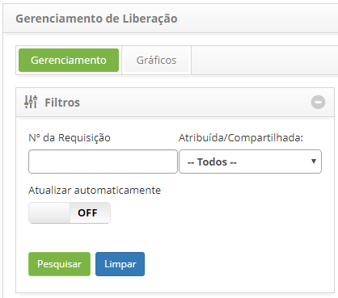
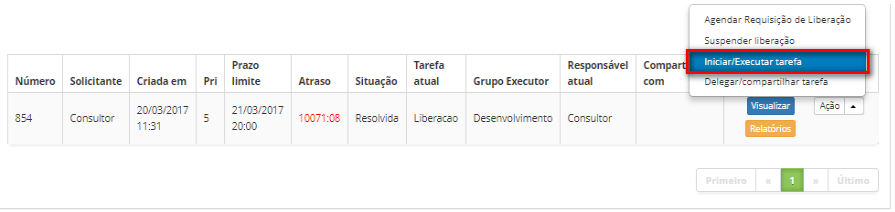

title: Homologação de liberação

Description: Esta funcionalidade permite realizar homologação da liberação de
mudanças que foram executadas e testadas.

# Homologação de liberação

Esta funcionalidade permite realizar homologação da liberação de mudanças que
foram executadas e testadas.

Como acessar
------------

1.  Acesse a funcionalidade de Gerenciamento de Liberação através da
    navegação no menu principal **Processos ITIL > Gerência de
    Liberação > Gerenciamento de Liberação**.

Pré-condições
-------------

1.  Ter a requisição de liberação na fase de homologação;

2.  Ter permissão para executar a homologação da requisição de liberação.

Filtros
-------

1.  Os seguintes filtros possibilitam ao usuário restringir a participação de
    itens na listagem padrão da funcionalidade, facilitando a localização dos
    itens desejados:

    -  Número da Requisição;

    -  Atribuída/Compartilhada.

**Figura 1 - Tela de pesquisa de liberação**

Listagem de itens
-----------------

1.  Os seguintes campos cadastrais estão disponíveis ao usuário para facilitar a
    identificação dos itens desejados na listagem padrão da
    funcionalidade: Número, Solicitante, Criada
    em, Prioridade, Prazo Limite, Atraso, Situação, Tarefa
    atual, Grupo Executor, Responsável atual e Compartilhada com.

2.  Existem botões de ação disponíveis ao usuário em relação a cada item da
    listagem, são eles: *Visualizar*, *Relatórios*, *Agendar Requisição de
    Liberação*, *Suspender liberação*, *Iniciar/Executar
    tarefa* e *Delegar/Compartilhar tarefa*.

3.  Para homologar a requisição de Liberação, acesse a guia **Gerenciamento**,
    localize a requisição de liberação que será homologada, clique no
    botão *Ações* e selecione a opção *Iniciar/Executar tarefa*, conforme
    indicado na figura abaixo:

    

    **Figura 2 - Executar tarefa atual da requisição de liberação**

1.  Será exibida a tela de **Registro da Requisição de Liberação** com os campos
    preenchidos, com o conteúdo referente à requisição selecionada;

    -  Certifique-se que a execução da liberação de mudanças ocorreu conforme
    solicitado;

    -  Na área de **Requisição**, no campo **Situação**, informe a situação da
    requisição de liberação (Resolvido ou Não Resolvido);

    -  Registre as informações necessárias sobre a execução da homologação:

        -  Na área de **Fechamento**, clique no botão *Adicionar registro de
           execução*. Feito isso, descreva as informações sobre a execução de sua
           atividade.

1.  Caso tenha informado a situação **Não Resolvida**:

    -  No campo **Fechamento**, informe o motivo pelo qual não foi realizada a
    liberação das mudanças;

    -  Clique no botão *Gravar e avançar o fluxo* para efetuar a operação, onde a
    requisição de liberação será encaminhada para o solicitante liberar a mesma
    para uma nova execução da atividade.

1.  Caso tenha informado a situação **Resolvida**:

    -  No campo **Data da liberação**, informe a data em que foi realizada a
    liberação das mudanças;

    -  No campo **Categoria de Solução**, informe a categoria de solução, ou seja,
    informe o que foi feio para realizar a liberação das mudanças;

    -  No campo **Fechamento**, informe os detalhes sobre realização da liberação
    das mudanças;

        -  Clique no botão *Gravar e avançar o fluxo* para efetuar a operação, onde a
          requisição de liberação será encaminhada para o solicitante finalizá-la.

         -  Caso queira gravar somente as informações registradas sobre a homologação
         realizada e manter a tarefa atual, clique no botão *Gravar e manter a tarefa
         atual*.

Preenchimento dos campos cadastrais
-----------------------------------

1.  Não se aplica.

!!! tip "About"

    <b>Product/Version:</b> CITSmart | 8.00 &nbsp;&nbsp;
    <b>Updated:</b>07/15/2019 – Anna Martins

