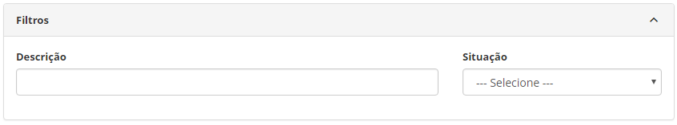
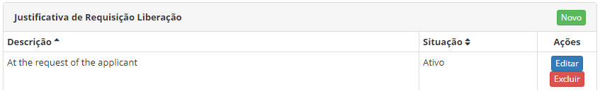
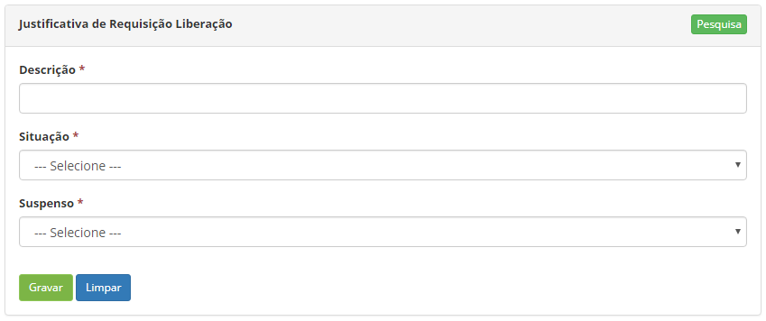

title: Cadastro e pesquisa de justificativa de liberação

Description: Esta funcionalidade tem por objetivo registrar a justificativa de
requisição de liberação que será utilizado em outras rotinas do sistema.

# Cadastro e pesquisa de justificativa de liberação

Esta funcionalidade tem por objetivo registrar a justificativa de requisição de
liberação que será utilizado em outras rotinas do sistema.

Como acessar
------------

1.  Acesse a funcionalidade de Justificativa de Requisição de
    Liberação** **através da navegação no menu principal **Processos ITIL
    \> Gerência de Liberação \> Justificativa Requisição Liberação**.

Pré-condições
-------------

1.  Não se aplica.

Filtros
-------

1.  Os seguintes filtros possibilitam ao usuário restringir a participação de
    itens na listagem padrão da funcionalidade, facilitando a localização dos
    itens desejados:

    -   Descrição;

    -   Situação.

    

    **Figura 1 - Pesquisa de justificativa de requisição de liberação**

Listagem de itens
-----------------

1.  Os seguintes campos cadastrais estão disponíveis ao usuário para facilitar a
    identificação dos itens desejados na listagem padrão da
    funcionalidade: **Descrição** e **Situação**.

2.  Existem botões de ação disponíveis ao usuário em relação a cada item da
    listagem, são eles: *Editar* e *Excluir*.

    

    **Figura 2 - Listagem de justificativa de requisição de liberação**

1.  Para alterar os dados do registro da justificativa de requisição de
    liberação, clique no botão *Editar*. Feito isso, será direcionado para a
    tela de cadastro exibindo o conteúdo do registro.

Preenchimento dos campos cadastrais
-----------------------------------

1.  Será apresentada a tela de Justificativa de Requisição de Liberação;

2.  Clique no botão *Novo*. Feito isso, será apresentada a tela de **Cadastro de
    Justificativa de Requisição de Liberação**, conforme ilustrada na figura a
    seguir:

    

    **Figura 3 - Tela de cadastro de justificativa de requisição de liberação**

1.  Preencha os campos conforme orientações abaixo:

    -   **Descrição**: informe a descrição da justificativa de requisição de
    liberação;

    -   **Situação**: informe a situação da justificativa de requisição de
    liberação;

    -   **Suspenso**: informe se a justificativa será para suspensão da requisição
    de liberação, marcando uma das opções (Não ou Sim).

1.  Clique no botão *Gravar* para efetuar o registro, onde a data, hora e
    usuário serão gravados automaticamente para uma futura auditoria

!!! tip "About"

    <b>Product/Version:</b> CITSmart | 8.00 &nbsp;&nbsp;
    <b>Updated:</b>07/12/2019 – Anna Martins
