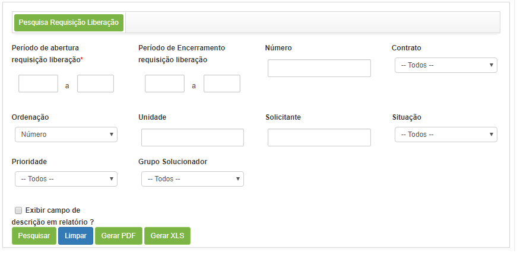

title: Pesquisa de registro de liberação

Description:

#Pesquisa de registro de liberação

Esta funcionalidade permite realizar a busca de requisições de liberação de
acordo com filtros definidos.

Como acessar
------------

1.  Acesse a funcionalidade de Pesquisa de Liberação através da navegação no
    menu principal **Processos ITIL \> Gerência de Liberação \> Pesquisa
    Liberação**.

Pré-condições
-------------

1.  Não se aplica.

Filtros
-------

1.  Os seguintes filtros possibilitam ao usuário restringir a participação de
    itens na listagem padrão da funcionalidade, facilitando a localização dos
    itens desejados:

    -  **Período de abertura da requisição de liberação**: informar o período de
    registro da requisição de liberação;

    -  **Período de encerramento da requisição de liberação**: informar o período
    de encerramento da requisição de liberação para buscar as requisições que
    foram fechadas no determinado período;

    -  **Número**: informar o número de identificação da requisição de liberação,
    caso queira buscar uma requisição específica;

    -  **Contrato**: informar o contrato para buscar as requisições de liberação
    relacionadas ao mesmo;

    -  **Ordenação**: definir a ordem que as requisições serão apresentadas;

    -  **Unidade**: informar a unidade desejada para verificar as requisições de
    liberação relacionadas a mesma;

    -  **Solicitante**: informar o colaborador para verificar as liberações de
    mudanças que foram solicitadas por ele;

    -  **Situação**: informar uma situação para verificar as requisições de
    liberação referentes;

    -  **Prioridade**: informar uma prioridade para verificar as requisições de
    liberação referentes;

    -  **Grupo Solucionador**: informar o grupo executor para verificar as
    requisições de liberação que foram direcionadas para o mesmo;

    -  **Exibir campo descrição em relatórios?**:** **caso queira que a descrição
    da requisição de liberação seja apresentada no relatório, marque essa opção.

1.  Para realizar a pesquisa: acesse a funcionalidade, logo após será
    apresentada a tela de **Pesquisa de Requisição de Liberação**, onde poderá
    definir os filtros necessários para sua pesquisa, conforme a figura abaixo:

    

    **Figura 1 - Tela de pesquisa de requisição de liberação**

1.  Após os filtros definidos, clique no botão *Pesquisar*. Após isso, serão
    listadas as requisições de liberação, conforme os filtros escolhidos;

2.  Para gerar o relatório da requisição de liberação em formato PDF, clique no
    botão *Gerar Relatório (PDF)*.

3.  Para gerar o relatório da requisição de liberação em formato Excel, clique
    no botão *Gerar Relatório (XLS)*.

Listagem de itens
-----------------

1.  Os seguintes campos cadastrais estão disponíveis ao usuário para facilitar a
    identificação dos itens desejados na listagem padrão da
    funcionalidade:** Número, Contrato, Solicitante, Criada em, Prioridade,
    Situação, Data inicial, Data limite, Grupo Aprovador **e** Fechamento.**

2.  Existem botões de ação disponíveis ao usuário em relação a cada item da
    listagem, são eles: *Consultar histórico do
    Ticket*, *Visualizar*e *Ocorrência da Liberação* .

    

    **Figura 2 - Tela de listagem de requisição de liberação**

1.  Ao lado de cada registro de requisição de liberação da lista, há ícones para
    consulta de histórico, reabertura da requisição de liberação e visualização
    de anexos;

2.  Para consultar o histórico da requisição de liberação, procede da seguinte
    forma:

    -  Clique no ícone  ;

    -  Será aberta uma janela exibindo todo o histórico da requisição de
        liberação para visualização.

3.  Para realizar a reabertura da requisição de liberação, proceder da seguinte
    forma:

    -  Clique no ícone  ;

    -  Será exibida uma mensagem para confirmação da reabertura da solicitação;

    -  Clicar em *Ok* para efetuar a operação;

    -  Será exibida uma mensagem confirmando o sucesso da reabertura da
        solicitação.

4.  Para visualizar os anexos da requisição de liberação, proceder da seguinte
    forma:

    -  Clique no ícone  ;

    -  Será aberta uma janela exibindo os anexos da solicitação para
        visualização.

!!! tip "About"

    <b>Product/Version:</b> CITSmart | 8.00 &nbsp;&nbsp;
    <b>Updated:</b>07/15/2019 – Anna Martins

