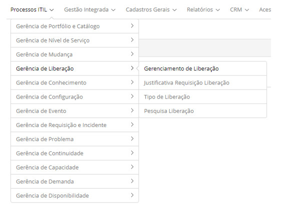

title:  Módulo Gerenciamento de Liberação
Description: O processo de Gerenciamento de Liberação provê o gerenciamento físico de software e hardware. 
# Módulo Gerenciamento de Liberação

Objetivo do módulo
---------------------

Liberação (release) é definida como uma mudança significativa na infraestrutura de TI da organização, a qual pode ser a introdução 
de novos ICs, ou a atualização dos atuais.

O processo de Gerenciamento de Liberação provê o gerenciamento físico de software e hardware, permitindo o planejamento das 
liberações a serem realizadas na infraestrutura de TI, apoiando-se nas informações sobre ICs e seus relacionamentos armazenadas na
BDGC.

Segundo a ITIL os principais objetivos do processo de Gerenciamento de Liberação são:

- Planejar, coordenar e implementar o software e o hardware;
- Projetar e implementar procedimentos eficientes para a distribuição e a instalação de mudanças nos sistemas de TI;
- Garantir que o hardware e o software relacionados com a mudanças possam ser acompanhados, tenham segurança, e que sejam
instaladas apenas versões corretas, autorizadas e testadas;
- Comunicar os usuários e considerar as expectativas deles durante o planejamento e implementação de novas liberações;
- Determinar juntamente com o Gerenciamento de Mudanças a composição e o planejamento de uma implementação;
- Implementar novas liberações de software e novo hardware na infraestrutura operacional, sob o controle do Gerenciamento de
Mudanças e com suporte do Gerenciamento da Configuração;
- Garantir que as cópias originais de softwares estejam armazenadas com segurança na BSD e que o BDGC seja atualizado. A mesma
coisa vale para o hardware que está na DHD.

Onde estão suas funcionalidades
----------------------------------

Acesse o menu principal **Processos ITIL > Gerência de Liberação**.

**Figura 1 - Menu do módulo Gerência de Liberação**

Principal funcionalidade (em destaque)
----------------------------------------

Na seção "Veja também" é possível acessar a(s) funcionalidade(s) principal(is) deste módulo, desta forma se pode obter um
conhecimento mais detalhado.

!!! abstract "SAIBA MAIS"

    Dependendo da sua permissão de acesso, é possível realizar uma série de ações nas requisições de liberação existentes, sendo:
    visualizar as informações do registro da requisição de liberação, agendar atividade referente à requisição de liberação,
    suspender o atendimento da requisição de liberação, reativar a requisição de liberação que foi suspensa para atendimento, 
    delegar a requisição de liberação para outra pessoa ou grupo, capturar requisição de liberação, executar atendimento da 
    requisição de liberação e entre outras.
    
Veja também
--------------

- [Cadastro e pesquisa de registro de liberação](/pt-br/citsmart-platform-7/processes/release/requisition.html)

!!! tip "About"

    <b>Product/Version:</b> CITSmart | 7.00 &nbsp;&nbsp;
    <b>Updated:</b>07/29/2019 - Larissa Lourenço
