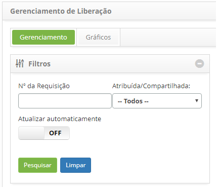

title: Reativação de registro de liberação
Description:Esta funcionalidade permite reativar a requisição de liberação que foi suspensa.

# Reativação de registro de liberação

Esta funcionalidade permite reativar a requisição de liberação que foi suspensa.

Como acessar
------------

1.  Acesse a funcionalidade de Gerenciamento de Liberação através da
    navegação no menu principal **Processos ITIL \>Gerência de
    Liberação \> Gerenciamento de Liberação**.

Pré-condições
-------------

1.  Ter a permissão para reativar a requisição de liberação.

Filtros
-------

1.  Os seguintes filtros possibilitam ao usuário restringir a participação de
    itens na listagem padrão da funcionalidade, facilitando a localização dos
    itens desejados:

    -  Número da Requisição;

    -  Atribuída/Compartilhada.

    

    **Figura 1 - Tela de pesquisa de liberação**

Listagem de itens
-----------------

1.  Os seguintes campos cadastrais estão disponíveis ao usuário para facilitar a
    identificação dos itens desejados na listagem padrão da
    funcionalidade: Número,Solicitante, Criada
    em, Prioridade, Prazo Limite, Atraso, Situação, Tarefa
    atual, Grupo Executor, Responsável atual e Compartilhada com.

2.  Existem botões de ação disponíveis ao usuário em relação a cada item da
    listagem, são eles: *Visualizar*, *Relatórios* e *Ação*.

3.  Para reativar a requisição de liberação, acesse a guia **Gerenciamento**,
    localize a requisição de liberação que está suspensa e deseja reativar,
    clique no botão *Ações* e selecione a opção *Reativar mudança*, conforme
    indicado na figura abaixo:

    

    **Figura 2 - Reativar requisição de liberação**

1.  Será exibida uma mensagem para confirmação da reativação.

2.  Clique em *Ok* para efetuar a operação.

3.  A situação da requisição será atualizada na lista de requisições de
    liberação.

Preenchimento dos campos cadastrais
-----------------------------------

1.  Não se aplica.

!!! tip "About"

    <b>Product/Version:</b> CITSmart | 8.00 &nbsp;&nbsp;
    <b>Updated:</b>07/15/2019 – Anna Martins

