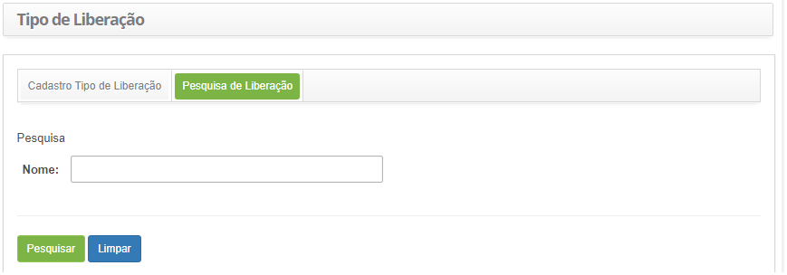
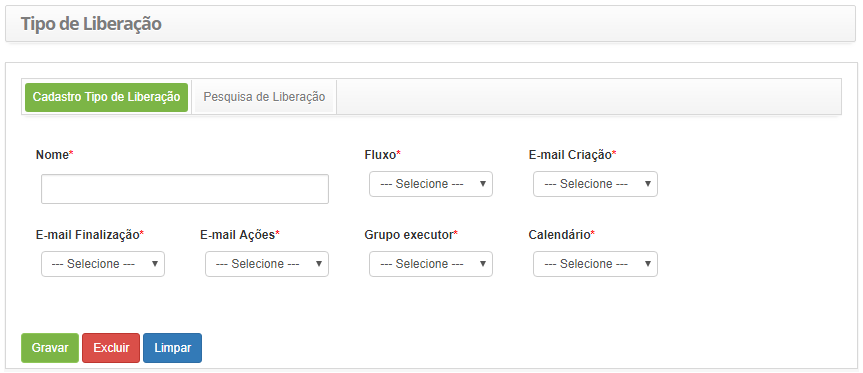

title: Cadastro e pesquisa de tipo de liberação

Description: Esta funcionalidade tem por objetivo registrar o tipo de liberação
que será utilizado para definir toda a configuração do fluxo de trabalho que a
liberação irá seguir.

# Cadastro e pesquisa de tipo de liberação

Esta funcionalidade tem por objetivo registrar o tipo de liberação que será
utilizado para definir toda a configuração do fluxo de trabalho que a liberação
irá seguir.

Como acessar
------------

1.  Acesse a funcionalidade de tipo de liberação através da navegação no
    menu principal **Processos ITIL \> Gerência de Liberação \> Tipo de
    Liberação**.

Pré-condições
-------------

1.  Ter o fluxo referente ao gerenciamento de liberação cadastrado (ver
    conhecimento [Manutenção de fluxo de
    trabalho]()

2.  Configurar os modelos de e-mails (ver conhecimento [Cadastro e pesquisa de
    configuração de modelo de
    e-mail]()

3.  Ter o grupo executor cadastrado (ver conhecimento [Cadastro e pesquisa de
    grupo]()

4.  Ter o calendário cadastrado (ver conhecimento [Cadastro e pesquisa de
    calendário]()

Filtros
-------

1.  O seguinte filtro possibilita ao usuário restringir a participação de itens
    na listagem padrão da funcionalidade, facilitando a localização dos itens
    desejados:

    -  Nome.

1.  Na tela de **Tipo de Liberação**, clique na aba **Pesquisa de Liberação**.
    Será apresentada a tela de pesquisa conforme ilustrada na figura abaixo:

    

    **Figura 1 - Tela de pesquisa de tipo de liberação**

1.  Realize a pesquisa de tipo de liberação:

    -  Informe o nome do tipo de liberação que deseja pesquisar e clique no
    botão *Pesquisar*. Após isso, será exibido o registro do tipo de liberação
    conforme o nome informado;

    -  Caso deseje listar todos os registros de tipo de liberação, basta clicar
    diretamente no botão *Pesquisar*.

Listagem de itens
-----------------

1.  O seguinte campo cadastral está disponível ao usuário para facilitar a
    identificação dos itens desejados na listagem padrão da
    funcionalidade: **Nome**.

    

    **Figura 2 - Tela de pesquisa de tipo de liberação**

1.  Após a pesquisa, selecione o registro desejado. Feito isso, será direcionado
    para a tela de cadastro exibindo o conteúdo referente ao registro
    selecionado;

2.  Para alterar os dados do registro de tipo de liberação, basta modificar as
    informações dos campos desejados e clicar no botão *Gravar*para que seja
    gravada a alteração realizada no registro, onde a data, hora e usuário serão
    gravados automaticamente para uma futura auditoria.

Preenchimento dos campos cadastrais
-----------------------------------

1.  Será apresentada a tela de **Cadastro de Tipo de Liberação**, conforme
    ilustrada na figura abaixo:

    

    **Figura 3 - Tela de cadastro de tipo de liberação**

1.  Preencha os campos conforme orientações abaixo:

    -   **Nome**: informe o nome do tipo de liberação;

    -   **Fluxo**: selecione o fluxo de liberação para que o mesmo seja
        associado ao tipo de liberação que está sendo cadastrado;

    -   **E-mail Criação**: selecione o modelo de e-mail de registro de
        liberação que servirá para notificar ao solicitante que a liberação foi
        registrada;

    -   **E-mail Finalização**: selecione o modelo de e-mail de finalização da
        liberação que servirá para notificar ao solicitante que a liberação foi
        finalizada;

    -   **E-mail Ações**: selecione o modelo de e-mail de andamento da liberação
        que servirá para notificar ao solicitante sobre o andamento da
        liberação;

    -   **Grupo Executor**: informe o grupo executor, o qual será o grupo padrão
        do tipo de liberação, responsável pela execução da requisição de
        mudança;

    -   **Calendário**: informe o calendário do tipo de liberação;

2.  Clique no botão *Gravar* para efetuar o registro, onde a data, hora e
    usuário serão gravados automaticamente para uma futura auditoria.

!!! tip "About"

    <b>Product/Version:</b> CITSmart | 8.00 &nbsp;&nbsp;
    <b>Updated:</b>07/10/2019 – Anna Martins
