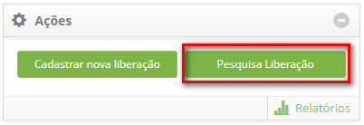
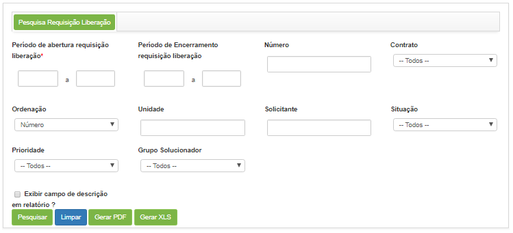
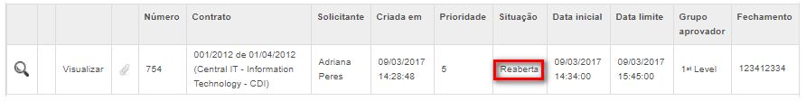

title: Reabertura de registro de liberação
Description:Esta funcionalidade permite reabrir a requisição de liberação de mudanças

# Reabertura de registro de liberação

Esta funcionalidade permite reabrir a requisição de liberação de mudanças.

Como acessar
------------

1.  Acesse a funcionalidade de Gerenciamento de Liberação através da
    navegação no menu principal **Processos ITIL \> Gerência de
    Liberação \> Gerenciamento de Liberação**.

2.  Será apresentada a tela de Gerenciamento de Liberação. Na
    guia **Gerenciamento**, clique no botão *Pesquisa Liberação* para realizar a
    pesquisa de requisições de liberação, conforme indicado na figura abaixo:

    

    **Figura 1 – Pesquisar requisição de liberação**

Pré-condições
-------------

1.  Ter a permissão para reabrir a requisição de liberação;

2.  Solicitar a reabertura da requisição de liberação.

Filtros
-------

1.  Os seguintes filtros possibilitam ao usuário restringir a participação de
    itens na listagem padrão da funcionalidade, facilitando a localização dos
    itens desejados:

    -  Período de abertura da requisição de liberação;

    -  Período de Encerramento da requisição de liberação;

    -  Número;

    -  Contrato;

    -  Ordenação;

    -  Unidade;

    -  Solicitante;

    -  Situação;

    -  Prioridade;

    -  Grupo Solucionador;

    -  Exibir campo descrição em relatório?

1.  Ao acessar a funcionalidade, será exibida a janela de **Pesquisa de
    Requisição de Liberação**, onde poderá informar os filtros necessários para
    sua pesquisa;

    

    **Figura 2 – Tela de pesquisa de requisição de liberação**

    -  Realize a pesquisa da requisição de liberação que deseja reabrir;

    -  Após a pesquisa, clique no ícone de reabertura   da requisição de liberação.
    Feito isso, será exibida uma mensagem para confirmação da reabertura da
    requisição de liberação.

    -  Clique em *Ok* para efetuar a operação.

    -  A requisição de liberação será reaberta e encaminhada para o solicitante
    liberar a mesma para uma nova execução.

Listagem de itens
-----------------

1.  Os seguintes campos cadastrais estão disponíveis ao usuário para facilitar a
    identificação dos itens desejados na listagem padrão da
    funcionalidade: Número, Contrato, Solicitante, Criada
    em, Prioridade, Situação, Data inicial, Data
    limite, Grupo Aprovador e Fechamento.

2.  Existem botões de ação disponíveis ao usuário em relação a cada item da
    listagem, são eles: *Consultar histórico do
    Ticket* , *Visualizar* e *Visualizar anexos*.

    -  Após a reabertura da requisição, a mesma será exibida na lista de
    requisições de liberação, conforme exemplo ilustrado na figura abaixo:

    

    **Figura 3 – Requisição de liberação reaberta**

Preenchimento dos campos cadastrais
-----------------------------------

1.  Não se aplica.

!!! tip "About"

    <b>Product/Version:</b> CITSmart | 8.00 &nbsp;&nbsp;
    <b>Updated:</b>07/15/2019 – Anna Martins
