title: Cadastro e pesquisa de requisição de liberação
Description: Esta funcionalidade permite registrar a requisição de liberação de
mudanças na infraestrutura de TI.

# Cadastro e pesquisa de requisição de liberação

Esta funcionalidade permite registrar a requisição de liberação de mudanças na
infraestrutura de TI.

Como acessar
------------

1.  Acesse a funcionalidade de Gerenciamento de Liberação através da
    navegação no menu principal **Processos ITIL \> Gerência de
    Liberação \> Gerenciamento de Liberação**.

Pré-condições
-------------

1.  Ter o colaborador cadastrado (ver conhecimento [Cadastro e pesquisa de
    colaborador]();

2.  Ter o grupo executor cadastrado (ver conhecimento [Cadastro e pesquisa de
    grupo]();

3.  Ter a unidade cadastrada (ver conhecimento [Cadastro e pesquisa de
    unidade]();

4.  Ter o contrato cadastrado (ver conhecimento [Cadastro e pesquisa de
    contrato]()
    ;

5.  Ter o grupo vinculado ao contrato (ver conhecimento [Como relacionar grupo
    ao
    contrato?]();

6.  Ter a unidade vinculada ao contrato (ver conhecimento [Como relacionar
    unidade ao
    contrato?]();

7.  Ter o tipo de liberação cadastrado (ver conhecimento [Cadastro e pesquisa de
    tipo de
    liberação]();

8.  Ter o grupo de atividade periódica cadastrado (ver conhecimento [Cadastro e
    pesquisa de grupo de atividade
    periódica]().

Filtros
-------

1.  Os seguintes filtros possibilitam ao usuário restringir a participação de
    itens na listagem padrão da funcionalidade, facilitando a localização dos
    itens desejados:

    -   Número de requisição;

    -   Atribuída/Compartilhada.

    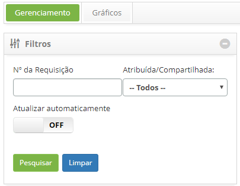
    
    **Figura 1 - Tela de pequisa de liberação**

Listagem de itens
-----------------

1.  Os seguintes campos cadastrais estão disponíveis ao usuário para facilitar a
    identificação dos itens desejados na listagem padrão da
    funcionalidade: Número, Solicitante, Criada em, Prioridade, Prazo limite,
    Atraso, Situação, Tarefa atual, Grupo Executor, Responsável
    atual e Compartilhada com.

2.  Existem botões de ação disponíveis ao usuário em relação a cada item da
    listagem, são eles: *Visualizar,* *Relatórios* e *Ações*.

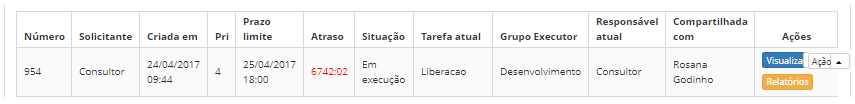

**Figura 2 - Tela de listagem de liberação**

Preenchimento dos campos cadastrais
-----------------------------------

1.  Será apresentada a tela de Gerenciamento de Liberação. Clique no
    botão *Cadastrar nova liberação*. Será apresentada a respectiva tela
    de **Cadastro de Liberação**, contendo uma série de passos a serem seguidos
    para realizar o registro;

2.  Entendendo a tela principal da funcionalidade:

    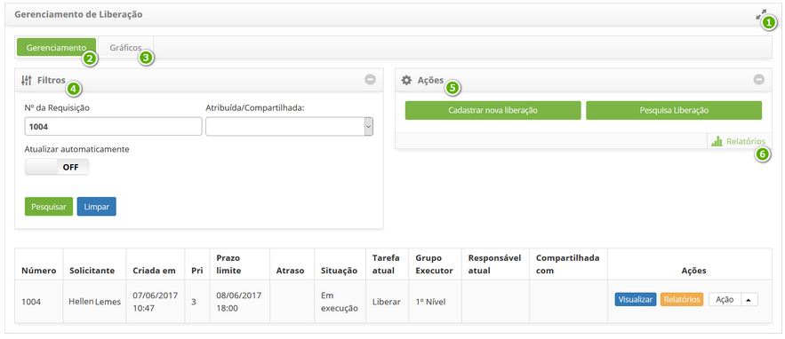

    **Figura 3 - Tela de gerenciamento de liberação**

Uma visão rápida da funcionalidade:

1.    : amplia a tela de Gerenciamento de Liberação;

2.  **Gerenciamento**: apresentada os registros de registro de liberação para
    atendimento e gerenciamento;

3.  **Gráficos**: apresenta os gráficos de informações dos registros de
    liberação por situação (em andamento, suspensas e atrasadas), por prioridade
    e por grupo;

4.  **Filtros**: apresenta os filtros para pesquisa de registro de liberação;

5.  **Ações**: permite registrar novo problema e realizar uma pesquisa rápida
    de registro de liberação;

6.  **Relatórios**: apresenta os relatórios dinâmicos referente ao
    gerenciamento de liberação.

    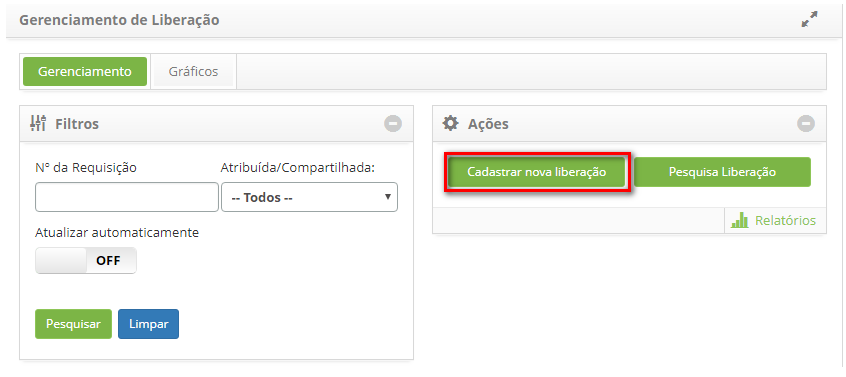

    **Figura 4 - Tela de gerenciamento de liberação**

1.  Registre as informações do contrato, conforme indicadas abaixo:

    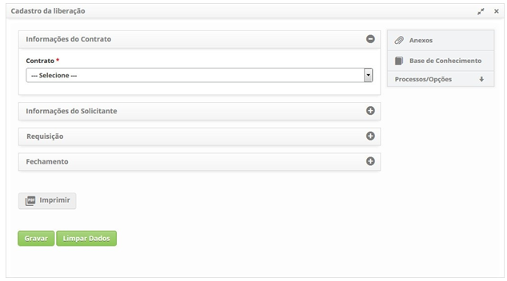

    **Figura 5 - Registro de registro de liberação - informações do contrato**

    -   **Contrato**: informe o contrato referente a registro de liberação;

1.  Registre as informações do solicitante, conforme indicadas abaixo:

    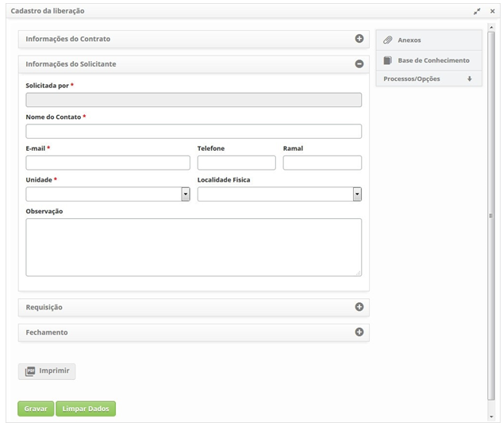

    **Figura 6 - Registro de registro de liberação - informações do solicitante**

    -   **Solicitada por**: informe o nome da pessoa que está solicitando a registro
    de liberação;

    !!! note "NOTA"

        Após informar o solicitante, caso o mesmo já tenha os dados pessoais
        (informações de contato, e-mail, telefone, ramal e/ou unidade) registrados no
        sistema, os campos referentes a estes dados serão preenchidos pelo sistema com
        as informações.

    -  **Nome do Contato**: informe o nome de uma pessoa para contato sobre a
    registro de liberação;

        -  **E-mail**: informe o e-mail do contato;

        -  **Telefone**: informe código de área (DDD) e o número de telefone do
        contato;

        -  **Ramal**: informe o número do ramal do contato, caso o tenha;

        -  **Unidade**: selecione a unidade na qual o contato está lotado;

        -  **Localidade Física**: informe a localização do contato;

        -  **Observação**: descreva as observações sobre o contato, caso seja
        necessário.

1.  Registre as informações da requisição, conforme indicadas abaixo:

    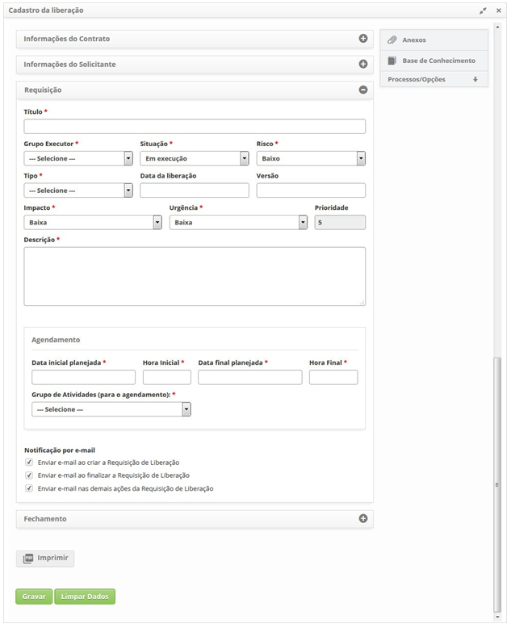

    **Figura 7 - Registro de registro de liberação - informações da requisição**

    -   **Título**: defina o título da registro de liberação;

    -   **Grupo Executor**: informe o grupo executor, o qual será responsável pela
    execução da registro de liberação;

    -   **Situação**: informe a situação da registro de liberação;

    -   **Risco**: informe o risco da registro de liberação;

    -   **Tipo**: informe o tipo da registro de liberação;

    -   **Data da Liberação**: informe a data da liberação;

    -   **Versão**: informe a versão da liberação;

    -   **Impacto**: informe o impacto da liberação no ambiente organizacional;

    -   **Urgência**: informe a urgência da realização da liberação no ambiente
    organizacional;

    -   **Prioridade**: a prioridade será definida após informar o impacto e a
    urgência. A prioridade é usada para identificar a importância da liberação e
    para identificar os tempos requeridos para que ações adequadas sejam
    tomadas. A prioridade vai de 1 a 5, sendo que o 1 é a prioridade mais alta e
    5 é a mais baixa.

    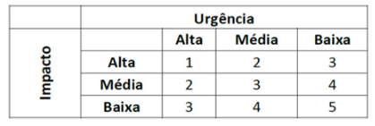

    **Figure 8 - Urgência X impacto**

1.  A combinação destas informações definirá a prioridade necessária para
    realização da liberação.

    -   **Descrição**: informe a descrição da liberação de mudança que está sendo
    solicitada. A descrição deve ser objetiva, incluindo toda informação
    necessária para realização da liberação;

    -   **Agendamento**: agende a atividade da registro de liberação para execução:

    -   **Data inicial planejada**: informe a data programada para início da
    execução da registro de liberação;

    -   **Hora Inicial**: informe a hora programada para início da execução da
    registro de liberação;

    -   **Data final planejada**: informe a data programada para o final da execução
    da registro de liberação;

    -   **Hora Final**: informe a hora programada para o final da execução da
    registro de liberação;

    -   **Grupo de Atividades (para o agendamento)**: selecione o grupo que irá
    executar a atividade da registro de liberação.

    -   **Notificação por e-mail**: marque as opções de envio de notificação sobre a
    registro de liberação que serão enviadas para o solicitante.

Vinculando mudanças
-------------------

1.  Relacione a(s) mudança(s) que será(ão) liberada(s):

    -   Ao lado direito da tela, clique em **Processos/Opções** e logo em seguida na
    opção** Mudanças**;

    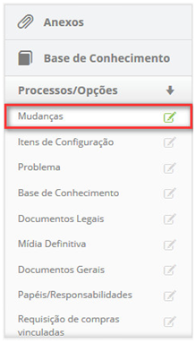

    **Figura 9 - Guia de mudanças**

    -   Será apresentada a tela de vínculo de mudanças. Clique no ícone . Após isso, será exibida a tela de pesquisa de mudanças;

        -   Realize a pesquisa e selecione a mudança que será liberada. Feito isso,
        o registro de mudança será adicionado na tela, conforme exemplo
        ilustrado na figura a seguir;

    !!! note "NOTA"

        Caso a mudança tenha itens de configuração relacionados, os mesmos
        serão adicionados à liberação**.

    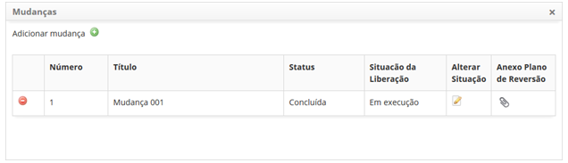

    **Figura 10- Relacionamento de mudança à liberação**

    -   Caso queira alterar a situação da liberação da mudança que foi adicionada,
    basta clicar no ícone  da mesma;

    -   Clique no ícone   para visualizar o plano de reversão da mudança que será liberada;

    -   Caso queira excluir o vínculo da mudança com a liberação, basta clicar
        no ícone   do mesmo.

Vinculando anexos
-----------------

1.  Caso queira anexar um arquivo no registro da registro de liberação, proceda
    da seguinte maneira:

    -   Ao lado direito da tela, clique em **Anexos**;

    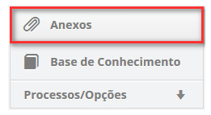

    **Figura 11 - Guia de anexos**

    -   Será apresentada uma janela para anexo de arquivos;

    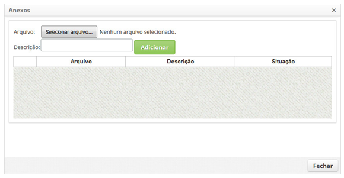

    **Figura 12 - Anexo de arquivos**

-   Clique no botão *Selecionar arquivo*. Após isso, selecione o arquivo
    desejado, informe a descrição do mesmo e clique no botão *Adicionar*;

-   Após adição do arquivo, clique no botão *Fechar* para retornar à tela de
    registro de registro de liberação.

-   Clique no botão *Gravar* para efetuar o registro da registro de liberação,
    onde a data, hora e usuário serão gravados automaticamente para uma futura
    auditoria.

-   Será exibida uma mensagem confirmando o sucesso do registro da registro de
    liberação.

!!! tip "About"

    <b>Product/Version:</b> CITSmart | 8.00 &nbsp;&nbsp;
    <b>Updated:</b>07/10/2019 – Anna Martins
