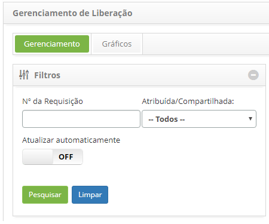
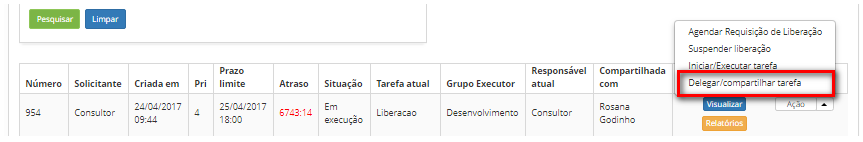
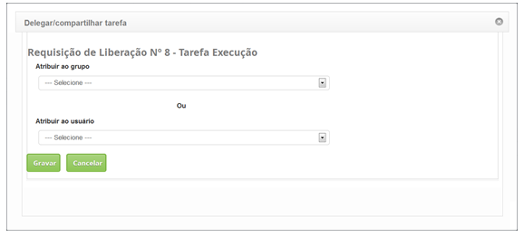
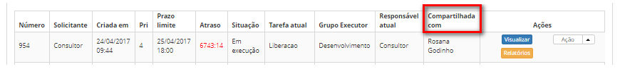

title: Compartilhamento de liberação
Description: Esta funcionalidade permite compartilhar a requisição de liberação
com outro grupo executor ou usuário.

# Compartilhamento de liberação

Esta funcionalidade permite compartilhar a requisição de liberação com outro
grupo executor ou usuário.

Como acessar
------------

1.  Acesse a funcionalidade de Gerenciamento de Liberação através da
    navegação no menu principal **Processos ITIL \> Gerência de
    Liberação \> Gerenciamento de Liberação.**

Pré-condições
-------------

1.  Ter requisição de liberação registrada (ver conhecimento [Cadastro e
    pesquisa de requisição de
    liberação]();

2.  Ter permissão para delegar/compartilhar a requisição de liberação.

Filtros
-------

1.  Os seguintes filtros possibilitam ao usuário restringir a participação de
    itens na listagem padrão da funcionalidade, facilitando a localização dos
    itens desejados:

    -   Nº da Requisição;

    -   Atribuída/Compartilhada.

**Figura 1 - Tela de pesquisa de liberação**

Listagem de itens
-----------------

1.  Os seguintes campos cadastrais estão disponíveis ao usuário para facilitar a
    identificação dos itens desejados na listagem padrão da
    funcionalidade: **Número, Solicitante, Criada em, Prioridade, Prazo limite,**
    **Atraso, Situação, Tarefa atual, Grupo** **Executor, Responsável**
    **atual** e **Compartilhada com**.

2.  Existem botões de ação disponíveis ao usuário em relação a cada item da
    listagem, são eles: *Visualizar,* *Relatórios* e *Ação*.

3.  Será apresentada a tela de Gerenciamento de Liberação;

4.  Na guia **Gerenciamento**, localize a requisição de liberação que será
    compartilhada, clique no botão *Ações* e selecione a
    opção *Delegar/compartilhar tarefa*, conforme indicado na figura abaixo:

    

    **Figura 2 - Compartilhar requisição de liberação**

1.  Será exibida uma tela para a seleção do **Grupo** ou **Usuário**, com o qual
    será compartilhada a requisição;

    

    **Figura 3 - Compartilhamento da requisição de liberação**

1.  Selecione o grupo ou usuário que deseja compartilhar a requisição. Feito
    isso, clique no botão *Gravar*;

2.  Após efetuar a operação, será exibido o nome do usuário ou grupo, com o qual
    foi compartilhada a requisição de liberação, em **Compartilhada com**,
    conforme exemplo ilustrado na figura abaixo:

    

    **Figura 4 – Requisição de liberação compartilhada**

Preenchimento dos campos cadastrais
-----------------------------------

1.  Não se aplica.

!!! tip "About"

    <b>Product/Version:</b> CITSmart | 8.00 &nbsp;&nbsp;
    <b>Updated:</b>07/12/2019 - Anna Martins

