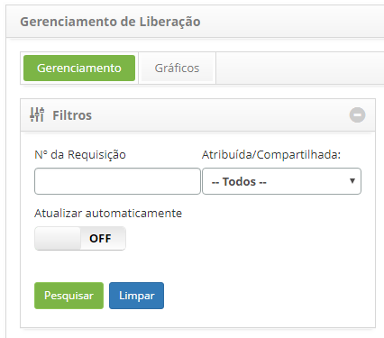
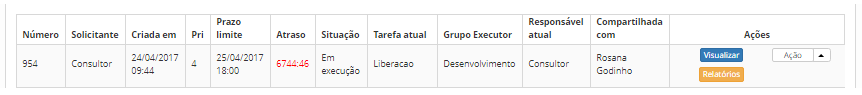
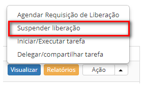
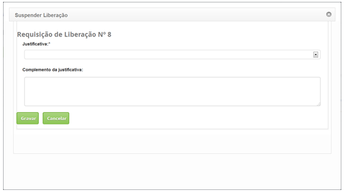
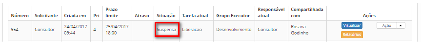

title: Suspensão de registro de liberação

Description:Esta funcionalidade permite suspender a execução da requisição de liberação.

# Suspensão de registro de liberação

Esta funcionalidade permite suspender a execução da requisição de liberação.

Como acessar
------------

1.  Acesse a funcionalidade de Gerenciamento de Liberação através da
    navegação no menu principal **Processos ITIL \> Gerência de
    Liberação \> Gerenciamento de Liberação**.

Pré-condições
-------------

1.  Ter a permissão para suspender a requisição de liberação;

2.  Ter a justificativa de requisição de liberação cadastrada (ver
    conhecimento [Cadastro e pesquisa de justificativa de
    liberação][1]).

Filtros
-------

1.  Os seguintes filtros possibilitam ao usuário restringir a participação de
    itens na listagem padrão da funcionalidade, facilitando a localização dos
    itens desejados:

    -   Nº da Requisição;

    -   Atribuída/Compartilhada.

    

    **Figura 1 - Tela de pesquisa de requisição de liberação**

Listagem de itens
-----------------

1.  Os seguintes campos cadastrais estão disponíveis ao usuário para facilitar a
    identificação dos itens desejados na listagem padrão da
    funcionalidade: Número, Solicitante, Criada em, Prioridade, Prazo limite,
    Atraso, Situação, Tarefa atual, Grupo Executor, Responsável
    atual e Compartilhado com.

2.  Existem botões de ação disponíveis ao usuário em relação a cada item da
    listagem, são eles: *Visualizar*, *Relatórios* e *Ação*.

    

    **Figura 2 - Tela de listagem de requisição de liberação**

Preenchimento de campos cadastrais
----------------------------------

1.  Será apresentada a tela de Gerenciamento de
    Liberação. Na guia **Gerenciamento**, localize a requisição de liberação que
    deseja suspender, clique no botão *Ações* e selecione a opção *Suspender
    liberação*, conforme indicado na figura abaixo:

    

    **Figura 3 - Suspendendo requisição de liberação**

2.  Será exibida a tela de registro de justificativa de suspensão da requisição
    de liberação:

    

    **Figura 4 - Registro da justificativa de suspensão da requisição de liberação**

    -   **Justificativa**: selecione a justificativa de suspensão da requisição de
    liberação (campo de seleção obrigatória);

    -   **Complemento da justificativa**: informe o complemento da justificativa de
    suspensão da requisição de liberação;

    -   Após os dados informados, clique no botão *Gravar*, onde a data, hora e
    usuário serão armazenados automaticamente para uma futura auditoria.

3.  Após a suspensão da requisição de liberação, a situação da mesma será
    atualizada para **Suspensa**, conforme indicado na figura a seguir:

    

    **Figura 5 - Requisição de liberação suspensa**

[1]:/pt-br/citsmart-platform-7/processes/release/justification.html

!!! tip "About"

    <b>Product/Version:</b> CITSmart | 8.00 &nbsp;&nbsp;
    <b>Updated:</b>07/15/2019 – Anna Martins

