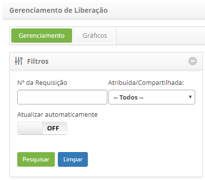
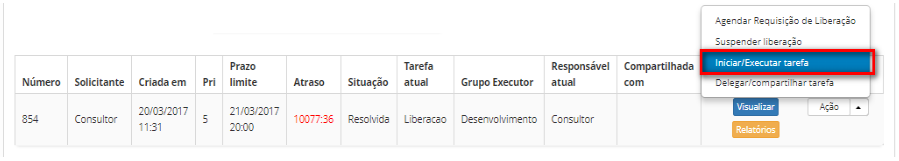
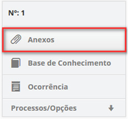
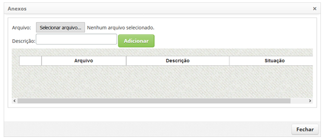

title: Teste de liberação
Description: Esta funcionalidade permite registrar as informações da execução
dos testes referente às mudanças que foram realizadas durante a fase de execução
da requisição de liberação.

# Teste de liberação

Como acessar
------------

1.  Acesse a funcionalidade de Gerenciamento de Liberação através da navegação
    no menu principal **Processos ITIL \> Gerência de Liberação \>
    Gerenciamento de Liberação**.

Pré-condições
-------------

1.  Ter a requisição de liberação na fase de teste.

Filtros
-------

1.  Os seguintes filtros possibilitam ao usuário restringir a participação de
    itens na listagem padrão da funcionalidade, facilitando a localização dos
    itens desejados:

    -  Nº da Requisição;

    -  Atribuída/ Compartilhada.

    

    **Figura 1 - Tela de pesquisa de liberação**

Listagem de itens
-----------------

1.  Os seguintes campos cadastrais estão disponíveis ao usuário para facilitar a
    identificação dos itens desejados na listagem padrão da
    funcionalidade: Número, Solicitante, Criada em, Prioridade, Prazo limite,
    Atraso, Situação, Tarefa atual, Grupo Executor, Responsável
    atual e Compartilhada com.

2.  Existem botões de ação disponíveis ao usuário em relação a cada item da
    listagem, são eles: *Visualizar*, *Relatórios* e *Ação*.

3.  Será apresentada a tela de Gerenciamento de Liberação. Na
    guia **Gerenciamento**, localize a requisição de liberação, na qual será
    registrada as informações de teste, clique no botão *Ações* e selecione a
    opção *Iniciar/Executar tarefa*, conforme indicado na figura abaixo:

    

    **Figura 2 - Executar tarefa atual da requisição de liberação**

1.  Será exibida a tela de **Registro da Requisição de Liberação** com os campos
    preenchidos, com o conteúdo referente à requisição selecionada;

    -  Registre as informações necessárias sobre a execução dos testes;

    -  Na área de **Fechamento**, clique no botão *Adicionar registro de execução*.
    Feito isso, descreva as informações sobre a execução de sua atividade.

Vinculando anexo
----------------

1.  Caso queira anexar um arquivo à requisição de liberação, proceda da seguinte
    maneira:

    -  Ao lado direito da tela de requisição de liberação, clique em **Anexos**,
    conforme indicado na figura a seguir:

    

    **Figura 3 – Guia de anexos**

    -  Será apresentada a tela de anexo de arquivos, conforme ilustrada na figura
    abaixo:

    

    **Figura 4 – Tela de adição de arquivos**

    -  Para adicionar um arquivo, clique no botão *Selecionar arquivo*. Será
    apresentada a tela para selecionar o arquivo desejado;

    -  Selecione o arquivo e após isso, informe a descrição do arquivo e clique no
    botão *Adicionar*;

    -  Após adição do arquivo, clique no botão *Fechar* para retornar à tela de
    requisição de liberação.

1.  Após registro das informações do teste realizado, clique no botão *Gravar e
    avançar o fluxo* para efetuar a operação, onde a liberação será encaminhada
    para fase de homologação;

2.  Caso queira gravar somente as informações registradas sobre o teste
    realizado e manter a tarefa atual, clique no botão G*ravar e manter a tarefa
    atual*;

   -  Em ambos os casos anteriores ao clicar no botão *Gravar* a data, hora e
    usuário serão armazenados automaticamente para uma futura a auditoria.

Preenchimento dos campos cadastrais
-----------------------------------

1.  Não se aplica.

!!! tip "About"

    <b>Product/Version:</b> CITSmart | 8.00 &nbsp;&nbsp;
    <b>Updated:</b>07/15/2019 – Anna Martins
