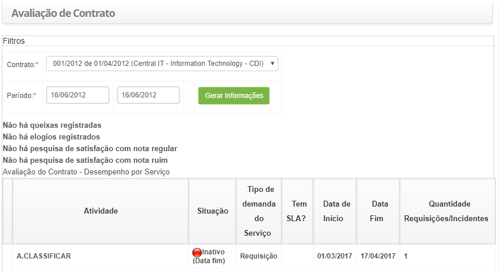

title: Avaliação de contrato
Description:  Verificar o desempenho do contrato por serviço.

# Avaliação de contrato

Esta funcionalidade tem por objetivo verificar o desempenho do contrato por
serviço.

Como acessar
------------

1.  Acesse a funcionalidade de Avaliação de Contrato através da navegação no
    menu principal **Processos ITIL > Gerência de Nível de
    Serviço > Avaliação de Contrato**.

Pré-condições
-------------

1.  Ter o contrato cadastrado (ver conhecimento [Cadastro e pesquisa de
    contrato]();

2.  Ter atividades cadastradas (ver conhecimento [Cadastro da atividade de
    serviço]().

Filtros
-------

1.  Os seguintes filtros possibilitam ao usuário restringir a participação de
    itens na listagem padrão da funcionalidade, facilitando a localização dos
    itens desejados:

    -  Contrato;

    -  Período.

Listagem de itens
-----------------

1.  Os seguintes campos cadastrais estão disponíveis ao usuário para facilitar a
    identificação dos itens desejados na listagem padrão da
    funcionalidade:** Atividade, Situação, Tipo de demanda do Serviço, Tem SLA?,
    Data de Início, Data Fim **e **Quantidade Requisições/Incidentes.**

2.  Será apresentada a tela de **Avaliação de Contrato**, conforme ilustrada na
    figura a seguir:

**Figura 1 - Tela de consulta de desempenho do contrato por serviço**

1.  Selecione o contrato e informe o período desejado;

2.  Após os filtros definidos, clique no botão *Gerar Informações*. Feito isso,
    será gerado o relatório de desempenho do contrato por serviço.

Preenchimento dos campos cadastrais
-----------------------------------

1.  Não se aplica.
