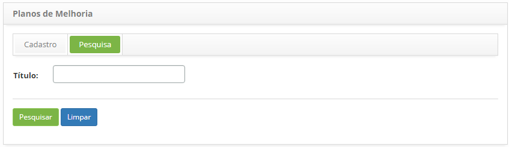
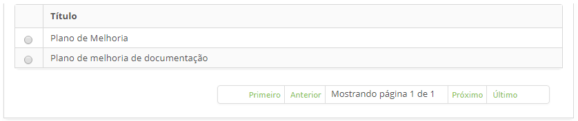
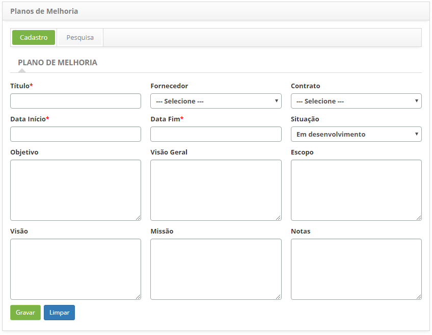
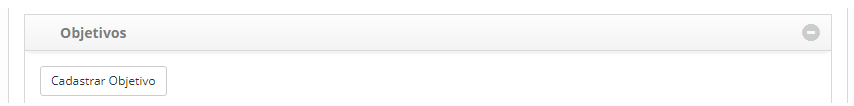
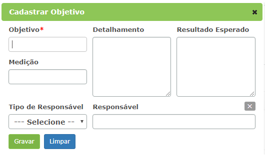
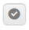
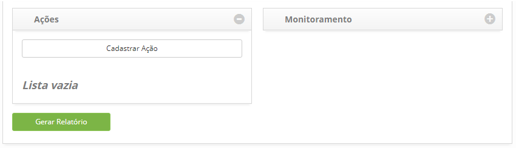
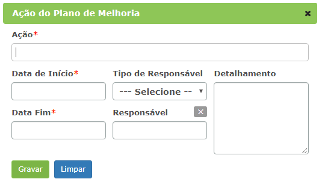

title: Cadastro e pesquisa de plano de melhoria
Description: Esta funcionalidade tem por objetivo registrar os planos de
melhoria que visa implementar melhorias ao serviço de TI.

# Cadastro e pesquisa de plano de melhoria

Esta funcionalidade tem o objetivo de registrar os planos de melhoria que visa
implementar melhorias ao serviço de TI.

Pré-condições
-------------

1.  Ter o fornecedor cadastrado (ver conhecimento [Cadastro e Pesquisa de
    Fornecedor]();

2.  Ter o contrato cadastrado (ver conhecimento [Cadastro e Pesquisa de
    Contrato]().

Como acessar
------------

1.  Acesse a funcionalidade de Plano de Melhoria através da navegação no menu
    principal **Processos ITIL > Gerência de Níveis de Serviço > Plano
    Melhoria**.

Filtros
-------

1.  O seguinte filtro possibilita ao usuário restringir a participação de itens
    na listagem padrão da funcionalidade, facilitando a localização dos itens
    desejados:

    -  Título.

    

    **Figura 1 - Tela de pesquisa de planos de melhoria**

1.  Realize a pesquisa do plano de melhoria;

2.  Informe o título do plano de melhoria que deseja pesquisar e clique no
    botão *Pesquisar*. Após isso, será exibido o registro do plano de melhoria
    conforme o título informado.

3.  Caso deseje listar todos os registros de plano de melhoria, basta clicar
    diretamente no botão *Pesquisar*.

Listagem de itens
-----------------

1.  O seguinte campo cadastral está disponível ao usuário para facilitar a
    identificação dos itens desejados na listagem padrão da
    funcionalidade: **Título**.

2.  Na tela de Plano de Melhoria, clique na guia **Pesquisa**. Será apresentada
    a tela de pesquisa conforme ilustrada na figura abaixo:

    

    **Figura 2 - Listagem de títulos de planos de melhoria**

1.  Após a pesquisa, selecione o registro de plano de melhoria desejado. Feito
    isso, será direcionado para tela de cadastro exibindo o conteúdo referente
    ao registro selecionado.

2.  Para alterar os dados do registro de plano de melhoria, basta modificar as
    informações dos campos desejados e clicar no botão *Gravar*para que seja
    gravada a alteração realizada no registro, onde a data, hora e usuário serão
    gravados automaticamente para uma futura auditoria.

Preenchimento dos campos cadastrais
-----------------------------------

1.  Será apresentada a tela de **Cadastro de Plano de Melhoria**, conforme
    ilustrada na figura a seguir:

    

    **Figura 3 - Tela de cadastro de plano de melhoria**

1.  Preencha os campos conforme orientações abaixo:

    -  **Título**: informe o título do plano de melhoria;

    -  **Fornecedor**: informe o fornecedor;

    -  **Contrato**: informe o contrato;

    -  **Data Início**: informe a data de início do plano de melhoria;

    -  **Data Fim**: informe a data de encerramento do plano de melhoria;

    -  **Situação**: selecione a situação em que o plano de melhoria se encontra;

    -  **Objetivo**: descreva o objetivo do plano de melhoria, ou seja, o que se
    espera obter após implantação do plano de melhoria;

    -  **Visão Geral**: descreva a visão geral do plano de melhoria;

    -  **Escopo**: descreva o escopo do plano de melhoria;

    -  **Visão**: descreva a visão do plano de melhoria;

    -  **Missão**: descreva a missão do plano de melhoria;

    -  **Notas**: informe as notas do plano de melhoria.

1.  Clique no botão *Gravar* para efetuar a operação, onde a data, hora e
    usuário serão gravados automaticamente para uma futura auditoria.

Registrando objetivos do plano de melhoria
------------------------------------------

1.  Após a gravação do plano de melhoria, será apresentada uma área para
    registro do objetivo, conforme ilustrado na figura abaixo:

    

    **Figura 4 - Tela de cadastro de plano de melhoria**

1.  Clique no botão *Cadastrar Objetivo*. Feito isso, será apresentada uma tela
    para registro das informações do objetivo do plano de melhoria, conforme
    ilustrado na figura abaixo:

    

    **Figura 5 - Tela de cadastro de objetivo do plano de melhoria**

    -  **Objeto**: informe a descrição do objetivo específico do plano de melhoria;

    -  **Detalhamento**: informe os detalhes do objetivo do plano de melhoria;

    -  **Resultado Esperado**: informe o resultado esperado do objetivo do plano de
    melhoria;

    -  **Medição**: informe a medição do objetivo do plano de melhoria;

    -  **Tipo de Responsável**: informe o tipo de responsável pelo objetivo do
    plano de melhoria: usuário ou grupo;

    -  **Responsável**: informe o responsável pelo objetivo do plano de melhoria.

1.  Após os dados informados, clique no botão *Gravar* para gravação e adição do
    objetivo no registro de plano de melhoria.

2.  Para alterar as informações do registro do objetivo do plano de melhoria,
    clique no ícone  do mesmo, modifique os dados que desejar e clique
    em *Gravar* para efetuar a alteração, onde a data, hora e usuário serão
    gravados automaticamente para uma futura auditoria.

3.  Para verificar/registrar as ações e monitoramento do objetivo, clique no
    ícone  do mesmo.

Registrando ações e monitoramento do objetivo do plano de melhoria
------------------------------------------------------------------

1.  Após a definição do objetivo do plano de melhoria, será apresentada uma área
    para registro de ações e outra para registro de monitoramento conforme
    ilustrado na figura abaixo:

**Figura 6 - Área para registro de ações e monitoramento**

### Ações

1.  Clique no botão *Cadastrar Ação*. Feito isso, será apresentada uma tela para
    registro das informações da ação conforme ilustrado na figura abaixo:

    

    **Figura 7 - Tela de cadastro de ação**

    -  **Ação**: informe a descrição da ação do objetivo do plano de melhoria;

    -  **Data de Início**: informe a data de início da ação do objetivo do plano de
    melhoria;

    -  **Data Fim**: informe a data final da ação do objetivo do plano de melhoria

    -  **Tipo de Responsável**: informe o tipo de responsável pela ação do objetivo
    do plano de melhoria: usuário ou grupo;

    -  **Responsável**: informe o responsável pela ação do objetivo do plano de
    melhoria;

    -  **Detalhamento**: descreva o que será feito para atingir o objetivo e como
    será feito;

1.  Após os dados informados, clique no botão *Gravar* para gravação e adição da
    ação do objetivo no registro de plano de melhoria.

2.  Para alterar as informações do registro de ação, clique no ícone 
     do mesmo, modifique os dados que desejar e clique em *Gravar*para efetuar a
    alteração, onde a data, hora e usuário serão gravados automaticamente para
    uma futura auditoria;

### Monitoramento

1.  Clique no botão *Cadastrar Monitoramento*. Feito isso, será apresentada uma
    tela para registro das informações do monitoramento conforme ilustrado na
    figura abaixo:

    

    **Figura 8 - Tela de cadastro de monitoramento**

    -   **Título**: informe o título do monitoramento;

    -   **Fator Crítico de Sucesso**: informe o fator crítico de sucesso do
    monitoramento;

    -   **Tipo de Responsável**: informe o tipo de responsável pelo monitoramento:
    usuário ou grupo;

    -   **Responsável**: informe o responsável pelo monitoramento;

    -   **Métrica**: descreva a métrica do monitoramento;

    -   **Medição**: descreva a medição do monitoramento;

    -   **Relatórios**: informe o relatório do monitoramento;

    -   **KPI**: informe o KPI do monitoramento e clique no botão *Inserir* para
    inserção do KPI no registro de monitoramento. Pode ser inserido vários KPIs
    no registro, quantos forem necessários.

1.  Após os dados informados, clique no botão *Gravar* para gravação e adição do
    monitoramento do objetivo no registro de plano de melhoria.

2.  Para alterar as informações do registro de monitoramento, clique no ícone 
     do mesmo, modifique os dados que desejar e
    clique em *Gravar* para efetuar a alteração, onde a data, hora e usuário
    serão gravados automaticamente para uma futura auditoria.

!!! tip "About"

    <b>Product/Version:</b> CITSmart | 8.00 &nbsp;&nbsp;
    <b>Updated:</b>07/12/2019 – Anna Martins

