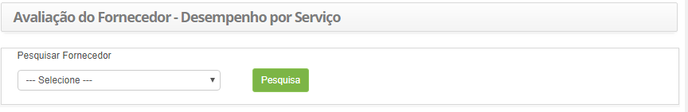
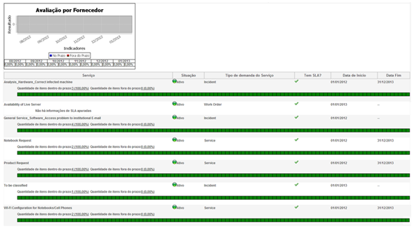

title: Avaliação de fornecedor
------------------------------

Description:  Esta funcionalidade tem por objetivo verificar o desempenho do
fornecedor por serviço..

# Avaliação de fornecedor

Esta funcionalidade tem por objetivo verificar o desempenho do fornecedor por
serviço.

Como acessar
------------

1.  Acesse a funcionalidade de Avaliação de Fornecedor através da navegação no
    menu principal **Processos ITIL > Gerência de Nível de
    Serviço > Avaliação por Fornecedor**.

Pré-condições
-------------

1.  Ter o fornecedor cadastrado (ver conhecimento [Cadastro e pesquisa de
    fornecedor](https://itsm.citsmartcloud.com/citsmart/pages/knowledgeBasePortal/knowledgeBasePortal.load#/knowledge/377));

2.  Ter um serviço cadastrado (ver conhecimento [Cadastro da atividade de
    serviço](https://itsm.citsmartcloud.com/citsmart/pages/knowledgeBasePortal/knowledgeBasePortal.load#/knowledge/4450)).

Filtros
-------

1.  O seguinte filtro possibilita ao usuário restringir a participação de itens
    na listagem padrão da funcionalidade, facilitando a localização dos itens
    desejados:

     - Pesquisar Fornecedor.

1.  Será apresentada a tela de **Avaliação de Fornecedor**, conforme ilustrada
    na figura a seguir:

**Figura 1 - Tela de avaliação de desempenho do fornecedor por serviço**

Listagem de itens
-----------------

1.  Os seguintes campos cadastrais estão disponíveis ao usuário para facilitar a
    identificação dos itens desejados na listagem padrão da
    funcionalidade:** Serviço, Situação, Tipo de Demanda do Serviço, Tem SLA?,
    Data de Início **e **Data Fim.**

2.  Será gerado o relatório de desempenho do fornecedor por serviço, conforme
    exemplo ilustrado na figura abaixo:

**Figura 2 - Relatório de avaliação do fornecedor**

Preenchimento dos campos cadastrais
-----------------------------------

1.  Não se aplica.

!!! tip "About"

    <b>Product/Version:</b> CITSmart | 8.00 &nbsp;&nbsp;
    <b>Updated:</b>07/12/2019 – Anna Martins
