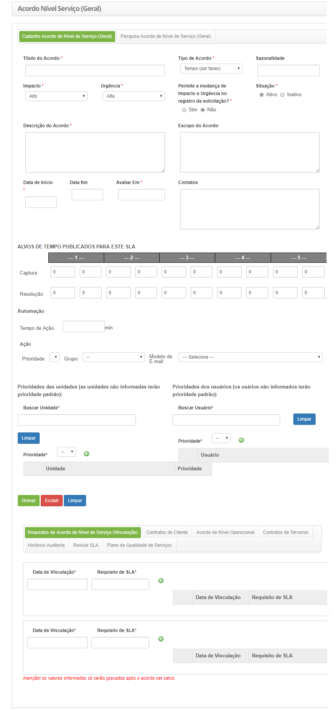

title: Cadastro e pesquisa de acordo de nível de serviço geral
Description:  Esta funcionalidade tem por objetivo registrar o acordo de nível
de serviço do tipo *disponibilidade*, *tempo (por fases)* e *informações
diversas capturadas de outras fontes*.

# Cadastro e pesquisa de acordo de nível de serviço geral

Essa funcionalidade permite registrar o acordo de nível de serviço do
tipo *disponibilidade*, *tempo (por fases)* e *informações diversas capturadas
de outras fontes*.

Como acessar
------------

1.  Acesse a funcionalidade de Acordo de Nível de Serviço Geral através da
    navegação no menu principal **Processos ITIL \> Gerência de Nível de
    Serviço \> Acordo de Nível de Serviço**.

Pré-condições
-------------

1.  Ter a prioridade cadastrada (ver conhecimento [Cadastro e pesquisa de
    prioridade]()

2.  Ter o grupo cadastrado (ver conhecimento [Cadastro e pesquisa de
    grupo]()

3.  Ter definido os modelos de e-mail (ver conhecimento [Cadastro e pesquisa de
    configuração de modelo de
    e-mail]()

4.  Ter a unidade cadastrada (ver conhecimento [Cadastro e pesquisa de
    unidade]()

5.  Ter o usuário cadastrado (ver conhecimento [Cadastro e pesquisa de
    usuário]()

6.  Ter o requisito de acordo de nível de serviço cadastrado (ver
    conhecimento [Cadastro e pesquisa de requisito de acordo de nível de
    serviço]()

Filtros
-------

1.  Os seguintes filtros possibilitam ao usuário restringir a participação de
    itens na listagem padrão da funcionalidade, facilitando a localização dos
    itens desejados, conforme ilustrado na figura abaixo:

    -  Título;

    -  Situação;

    -  Tipo de Acordo.

1.  Na tela Acordo de nível de serviço geral, clique na guia **Acordo de nível
    de serviço de pesquisa** (Geral). A tela de pesquisa será exibida conforme
    mostrado na figura abaixo:

    

    **Figura 1 - Tela de pesquisa de Acordo de Nível de Serviço geral**

1.  Realizar pesquisa de acordo de nível de serviço;

    -   **Título**: insira o título do contrato de nível de serviço que deseja
    pesquisar;

    -   **Situação**: selecione o status do contrato de nível de serviço;

    -   Depois que o filtro estiver configurado, clique no botão *Pesquisar*. Uma
    vez feito isso, o registro do acordo de nível de serviço será exibido de
    acordo com os dados relatados.

    -   Se deseja listar todos os registros do acordo de nível de serviço, basta
    clicar no botão *Pesquisar* diretamente.

1.  Para alterar os dados de registro de acordo com o acordo de nível de
    serviço, basta modificar as informações dos campos desejados e clicar no
    botão *Gravar* para salvar a alteração feita na gravação, onde a data, a
    hora e o usuário serão salvos automaticamente para uma auditoria futura.

Listagem de itens
-----------------

1.  Os seguintes campos cadastrais estão disponíveis ao usuário para facilitar a
    identificação dos itens desejados na listagem padrão da
    funcionalidade: **Título**, **Situação**,** Data de Início**, **Data
    fim** e **Avaliar em**.

**Figura 2 - Tela de itens**

Preenchimento dos campos cadastrais
-----------------------------------

1.  Será apresentada a tela de **Cadastro de Acordo de Nível de Serviço Geral**,
    conforme ilustrada na figura a seguir:

    

    **Figura 3 - Tela de cadastro de Acordo de Nível de Serviço geral**

1.  Preencha os campos conforme orientações abaixo:

    -  **Título do Acordo**: informe o título do acordo de nível de serviço;

    -  **Tipo de Acordo**: selecione o tipo de acordo de nível de serviço;

       -  **Disponibilidade**: esse tipo de acordo indica a disponibilidade do
           serviço, ou seja, se está acessível durante um período de tempo acordado.
           Ex.: ter o prestador de serviço monitorando o site da empresa cliente em
           tempo integral para ter certeza que os usuários possam ter acesso ao
           conteúdo do site em tempo integral;

        -  **Tempo (por fases)**: esse tipo de acordo vincula o tempo de atendimento a
           uma fase, ou seja, no lugar de calcular por tempo, o SLA será calculado por
           uma fase que corresponde a um período acordado para o período de captura e
           período de execução;

        -  **Informações diversas capturadas de outras fontes**: esse tipo de acordo
           estipula os limites da OS (Ordem de Serviço) ao serviço escolhido.

    -   **Sazonalidade**: informe a época em que os serviços e acordo de nível de
    serviço serão evoluídos em conformidade com o negócio;

    -   **Impacto**: informe o impacto que causa a ausência do funcionamento do
    serviço dentro do ambiente organizacional. Exemplo: a rede local para de
    funcionar, o impacto na organização é muito alto, já que ninguém acessa os
    serviços disponibilizados pelos servidores;

    -   **Urgência**: informe a urgência do restabelecimento do serviço dentro do
    ambiente organizacional. Exemplo: seguindo o exemplo citado acima, a
    urgência de restabelecimento do link da rede local é alta já que a empresa é
    dependente da comunicação com os servidores para o armazenamento de suas
    informações operacionais prejudicando toda a produtividade da empresa nesta
    parada;

    -   **Permite a mudança de Impacto e Urgência no registro da solicitação?**:
    defina se será permitido a mudança do impacto e urgência no registro da
    solicitação de serviço;

    -   **Situação**: informe a situação do acordo de nível de serviço: Ativo (em
    uso corrente) ou Inativo (desabilitado);

    -   **Descrição do Acordo**: descreva os detalhes sobre o acordo de nível de
    serviço;

    -   **Escopo do Acordo**: descreva uma visão macro sobre o acordo de nível de
    serviço;

    -   **Data de Início**: informe a data de início do acordo de nível de serviço;

    -   **Data Fim**: informe a data futura para encerramento do acordo de nível de
    serviço. A mesma pode ser informada no momento do encerramento do acordo;

    -   **Avaliar Em**: informe a data na qual o acordo de nível de serviço será
    avaliado;

    -   **Contatos**: descreva as informações para contato sobre o acordo de nível
    de serviço;

    -   Se o tipo de acordo informado for **Disponibilidade**, informe o índice de
    disponibilidade do serviço:

    

    **Figura 4 - Registro de índice de disponibilidade**

       -  Informe o percentual de disponibilidade do serviço, isto é, se definir 90%
          significa que a partir de 10% de indisponibilidade sobre o serviço o
          contrato poderá sofrer algum tipo de penalidade acordada sobre ele.

    -  Se o tipo de acordo informado for Tempo (por fase), defina os prazos de SLA
    (acordo de nível de serviço), levando em consideração a prioridade. A
    prioridade vai de 1 a 5, sendo que o 1 é a prioridade mais alta e 5 é a mais
    baixa:

    

    **Figura 5 - Registro de tempo (por fase)**

       -  **Captura**: defina o tempo de captura da solicitação de serviço, conforme a
    prioridade;

       -  **Resolução**: defina o tempo de resolução do serviço, conforme a
    prioridade;

       -  **Tempo de Ação**: informe o tempo para execução da solicitação de serviço;

       -  **Prioridade**: informe a prioridade do serviço;

       -  **Grupo**: informe o grupo executor do serviço;

       -  **Modelo de E-mail**: selecione o modelo de e-mail, o qual será enviado
    quando a solicitação de serviço não for atendida pelo prazo de SLA
    determinado.

    !!! info "IMPORTANTE"

        Após os N minutos (informado no tempo de ação) e caso não tenha realizado
        nenhuma ação na solicitação do serviço vinculado a este SLA, o sistema
        atribuirá a prioridade e escalará o grupo para execução da solicitação do
        serviço.

    -   Selecione as unidades e atribua uma prioridade para cada;

         -  **Buscar Unidade**: informe a unidade que receberá a prioridade;

         -   **Prioridade**: indique a prioridade do serviço para a unidade;

        -   Feito isso, clique no ícone  para adição das informações de
            prioridade da unidade;

        -   Caso queira remover alguma informação de prioridade da unidade que
              foi adicionada, basta clicar no ícone .

    -  Selecione os usuários e atribua uma prioridade para cada;

       -   **Buscar Usuário**: informe o usuário;

       -   **Prioridade**: indique a prioridade do serviço para o usuário;

       -   Feito isso, clique no ícone  para adição das informações de
            prioridade do usuário;

       -   Caso queira remover alguma informação de prioridade do usuário que
            foi adicionada, basta clicar no ícone .

    -   Se o tipo de acordo informado for Informações diversas capturadas de outras
    fontes, informe os dados de acordo de serviço:

    

    **Figura 6 - Registro de informações diversas capturadas de outras fontes**

    -   **Valor Limite**: informe o valor limite para glosa. Esse valor pode ser um
    percentual de atendimento ou quantidade de eventos. Exemplo: o serviço deve
    alcançar mensalmente 99,7 % de disponibilidade ou podem ocorrer no mês até 4
    incidentes causados pela organização contratada. O excedente deste limite
    será penalizado com o valor especificado no campo Limite de Glosa;

    -   **Unidade (do Valor Limite)**: informe a unidade do valor limite para glosa.
    Exemplo: percentual ou quantidade de eventos;

    -   **Glosa**: informe os detalhes do que foi acordado referente a glosa.
    Exemplo: A disponibilidade de uso para os serviços críticos deve ser de
    24x7;

    -   **Limite Glosa**: informe os percentuais a serem pagos sobre o valor do
    contrato no caso do não cumprimento do acordo. Exemplo: 0,5% de glosa para
    cada décimo de falha no serviço ou 0,2% para cada falha de notificação
    superior à meta até 10 ocorrências, 0,5% até 20 ocorrências, etc.

1.  Após informar os dados, clique no botão *Gravar* para efetuar o registro,
    onde a data, hora e usuário serão gravados automaticamente para uma futura
    auditoria.

Verificando o histórico de auditoria do acordo de nível de serviço
------------------------------------------------------------------

1.  Depois de pesquisar, selecione o registro desejado. Uma vez feito isso, será
    direcionado para a tela de registro exibindo o conteúdo do registro
    selecionado:

    -  A relação entre o acordo de nível de serviço e os contratos de clientes é
    fornecida na guia Contratos do Cliente;

    -  A relação entre o acordo de nível de serviço e o acordo de nível operacional
    é fornecida na guia Acordo de Nível Operacional;

    -  A guia Contratos de terceiros é a associação entre o contrato de nível de
    serviço com contratos de terceiros;

    -  O histórico das mudanças feitas no registro do acordo de nível de serviço é
    exibido na guia Histórico, conforme mostrado na figura abaixo:

 **Figura 7 -Tela de histórico de auditoria**

!!! tip "About"

    <b>Product/Version:</b> CITSmart | 8.00 &nbsp;&nbsp;
    <b>Updated:</b>07/12/2019 – Anna Martins

