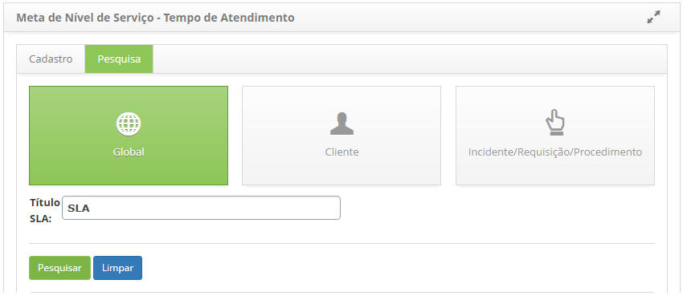
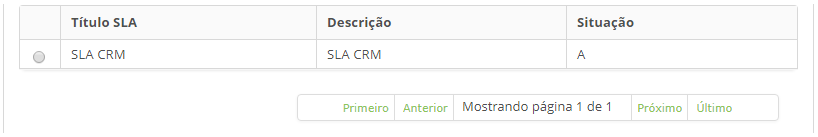
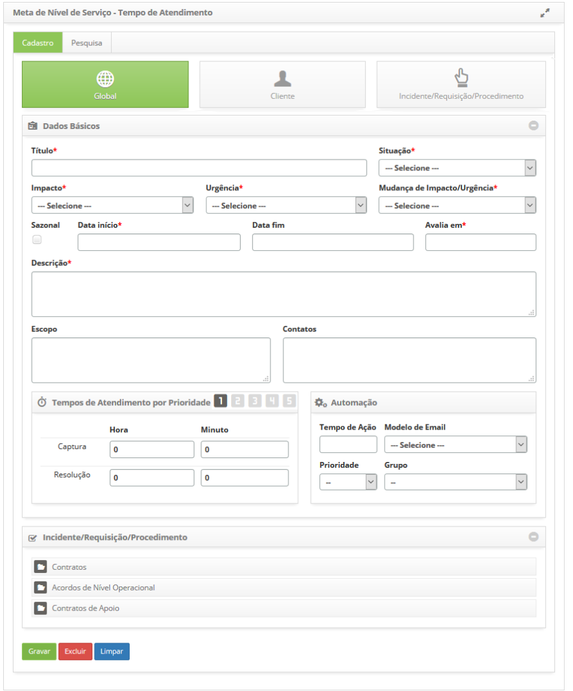
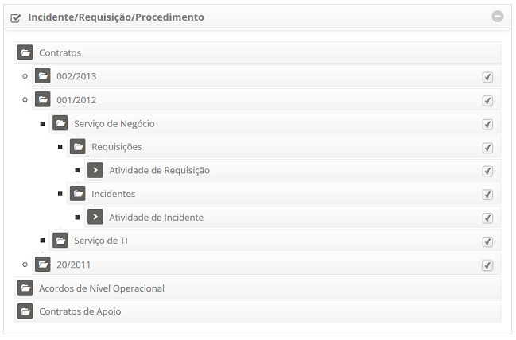
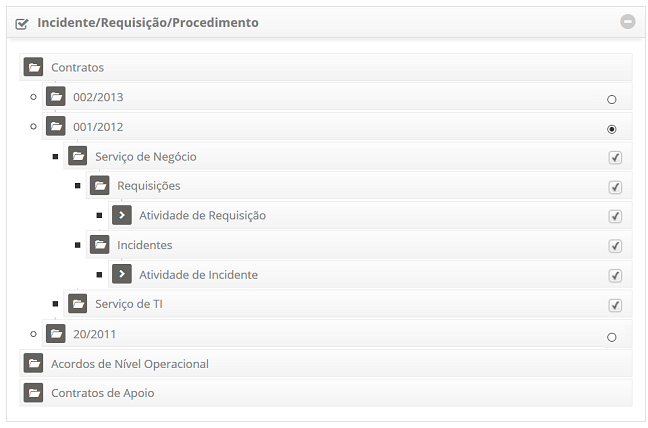
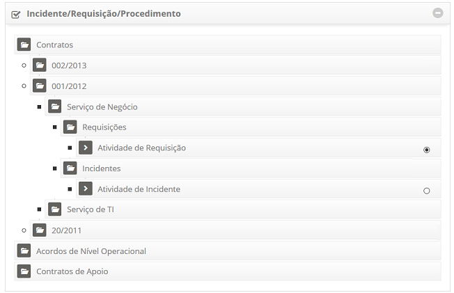
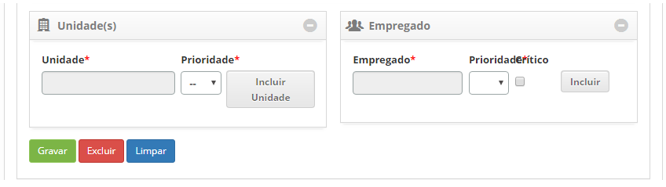

title:Cadastro e pesquisa de tempo de atendimento
Description:Permite registrar o tempo de atendimento do tipo *Global* (aplica-se a todos os serviços), *Cliente*(aplica-se aos serviços de um contrato) e *Incidente/Requisição/Procedimento* (aplica-se a um serviço específico).

# Cadastro e pesquisa de tempo de atendimento

A funcionalidade de tempo de atendimento permite registrar o tempo de
atendimento do tipo *Global* (aplica-se a todos os serviços), *Cliente*
(aplica-se aos serviços de um contrato)
e *Incidente/Requisição/Procedimento* (aplica-se a um serviço específico).

Pré-condições
-------------

1.  Ter definido o portfólio de serviços para aplicar o tempo de atendimento aos
    serviços (ver conhecimentos [Cadastro de Portfólio de
    Serviços](), [Cadastro
    de
    Serviços](), [Configuração
    dos Atributos do
    Serviço]()

Como acessar
------------

1.  Acesse a funcionalidade de Tempo de Atendimento através da navegação no
    menu principal **Processos ITIL \> Gerência de Níveis de
    Serviço \> Tempo de Atendimento**.

Filtros
-------

1.  O seguinte filtro possibilita ao usuário restringir a participação de itens
    na listagem padrão da funcionalidade, facilitando a localização dos itens
    desejados:

    -  Título SLA

1.  Na tela de **Tempo de Atendimento**, clique na guia **Pesquisa**, será
    apresentada a respectiva tela de pesquisa conforme ilustrada na figura
    abaixo:

**Figura 1 - Tela de pesquisa de tempo de atendimento**

Listagem de items
-----------------

1.  Os seguintes campos cadastrais estão disponíveis ao usuário para facilitar a
    identificação dos itens desejados na listagem padrão da
    funcionalidade: Título SLA, Descrição e Situação.

    

    **Figura 2 - Tela de listagem de tempo de atendimento**

1.  Realize a pesquisa do tempo de atendimento:

    -  A consulta é realizada por tipo de atendimento (Global, Cliente e
    Requisição/Incidente/Procedimento). Selecione o tipo de atendimento que
    desejar, informe o título do registro e clique no botão *Pesquisar*. Feito
    isso, será exibido o registro conforme o título informado;

    -  Caso queira listar todos os registros de tempo de atendimento de um tipo
       de atendimento, basta clicar diretamente no botão *Pesquisar*, onde
       todos os registros referentes ao tipo de atendimento selecionado serão
       exibidos.

3.  Após a pesquisa, selecione o registro de tempo de atendimento desejado.
    Feito isso, será direcionado para a tela de cadastro exibindo o conteúdo
    referente ao registro selecionado.

4.  Para alterar os dados do registro de tempo de atendimento, basta modificar
    as informações dos campos desejados e clicar no botão *Gravar* para que seja
    gravada a alteração realizada no registro, onde a data, hora e usuário serão
    gravados automaticamente para uma futura auditoria.

Preenchimento de campos cadastrais
----------------------------------

1.  Será apresentada a tela de **Cadastro de Tempo de Atendimento**, conforme
    ilustrada na figura abaixo:

    

    **Figura 3 - Tela de cadastro de tempo de atendimento**

1.  Preencha os campos conforme orientação abaixo:

    -  Selecione o tipo de tempo de atendimento que deseja
    criar: **Global**, **Cliente** ou **Incidente/Requisição/Procedimento**;

    -  **Título**: informe o título do tempo de atendimento;

    -  **Situação**: selecione a situação do tempo de atendimento: Ativo (em uso
    corrente) ou Inativo (desabilitado);

    -  **Impacto**: informe o impacto que causa a ausência do funcionamento do
    serviço dentro do ambiente organizacional;

    -  **Urgência**: informe a urgência do restabelecimento do serviço dentro do
    ambiente organizacional;

    -  **Mudança de Impacto / Urgência**: defina se será permitido a alteração do
    impacto e urgência no registro de solicitação de serviço;

    -  **Sazonal**: marque essa opção caso o tempo de atendimento seja temporário.
    Ao marcar essa opção, o preenchimento do campo "Data fim" se torna
    obrigatório;

    -  **Data de início**: informe a data de início do tempo de atendimento de
    serviços;

    -  **Data fim**: informe uma data futura para desativação do tempo de
    atendimento ou informe a data no momento que for desativar o mesmo;

    -  **Avaliar em**: informe a data na qual o tempo de atendimento de serviços
    será avaliado;

    -  **Descrição**: descreva os detalhes sobre o tempo de atendimento de
    serviços;

    -  **Escopo**: descreva uma visão macro sobre o tempo de atendimento de
    serviços;

    -  **Contatos**: descreva as informações para contato referente ao tempo de
    atendimento;

    -  Defina o tempo de atendimento dos serviços, levando em consideração a
    prioridade. A prioridade é usada para identificar os tempos requeridos para
    que ações adequadas sejam tomadas. A prioridade vai de 1 a 5, sendo que o 1
    é a prioridade mais alta e 5 é a mais baixa. Selecione a prioridade para
    definição do tempo:

        -  **Captura**: defina o tempo de captura da solicitação do serviço,
        conforme a prioridade selecionada;

        -  **Resolução**: defina o tempo de resolução do serviço, conforme a
        prioridade selecionada.

    !!! warning "ATENÇÃO"

        Antes de preencher os campos da aba "Automação" ela deve estar
        adequadamente parametrizada, para isso se faz necessário executar os passos
        contidos no conhecimento [Como habilitar a regra de escalonamento das
        Solicitações de Serviço?](),com exceção do parâmetro "190 - Liga o 
        funcionamento das regras de escalonamento? (Ex: S ou N - Default:´N´)" 
        que deverá estar igual a ‘N’ neste contexto.

1.  Defina os dados da automação:

    -   **Grupo**: informe o grupo executor do serviço.

    -   **Prioridade**: informe a prioridade de execução do serviço;

    -   **Modelo de E-mail**: selecione o modelo de e-mail, o qual será enviado
        quando a solicitação do serviço não for atendida no tempo de atendimento
        determinado.

    -   **Tempo de Ação**: informe o tempo para execução da solicitação do
        serviço;

    !!! note "NOTA"

        Após os N minutos (informado no tempo de ação) e caso não tenha
        realizado nenhuma ação na solicitação do serviço vinculado a este tempo de
        atendimento, o sistema atribuirá a prioridade e escalará o grupo para execução
        da solicitação do serviço.

    -  No quadro de **Incidente/Requisição/Procedimento**, selecione os serviços
    para aplicar as configurações, levando em consideração o tipo de tempo de
    atendimento selecionado:

    -  **Global**: permite selecionar todos os contratos, quantos desejar, para
    aplicar a configuração do tempo de atendimento nos serviços dos mesmos,
    conforme exemplo ilustrado na figura abaixo:

    

    **Figura 4 - Aplicação do Tempo de Atendimento aos Serviços dos Contratos**

    -   **Cliente**: permite selecionar somente um contrato parar aplicar a
    configuração do tempo de atendimento nos serviços do mesmo, conforme exemplo
    ilustrado na figura abaixo:

    

    **Figura 5 - Aplicação do tempo de atendimento aos serviços de um cliente
(Contrato)**

    - **Requisição/Incidente/Procedimento**: permite selecionar somente um serviço
    para aplicar a configuração do tempo de atendimento, conforme exemplo
    ilustrado na figura abaixo:

    

    **Figura 6 - Aplicação do tempo de atendimento ao serviço de
requisição/incidente**

1.  Se tipo o tipo de tempo de atendimento selecionado
    for **Cliente** ou **Incidente/Requisição/Procedimento**, relacione as
    unidades e os empregados (colaboradores);

    

    **Figura 7 - Relacionamento de unidade e empregado**

    -  Informe a unidade e atribua uma prioridade;

        -  **Unidade**: informe a unidade desejada;

        -  **Prioridade**: indique a prioridade do serviço para a unidade;

    -  Feito isso, clique no botão *Incluir* para efetuar a operação.

    -  Informe o empregado e atribua uma prioridade;

        -  **Empregados**: informe o empregado;

        -  **Prioridade**: indique a prioridade do serviço para o empregado;

        -  **Crítico**: indique se o empregado é do tipo "crítico" ao negócio, ou seja,
          que deve ter o atendimento do serviço com prioridade alta.

     -  Feito isso, clique no botão *Incluir* para efetuar a operação.

1.  Após o cadastro dos dados, clique no botão *Gravar* para efetuar o registro,
    onde a data, hora e usuário serão gravados automaticamente para uma futura
    auditoria.

!!! tip "About"

    <b>Product/Version:</b> CITSmart | 8.00 &nbsp;&nbsp;
    <b>Updated:</b>07/12/2019 – Anna Martins
