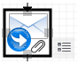
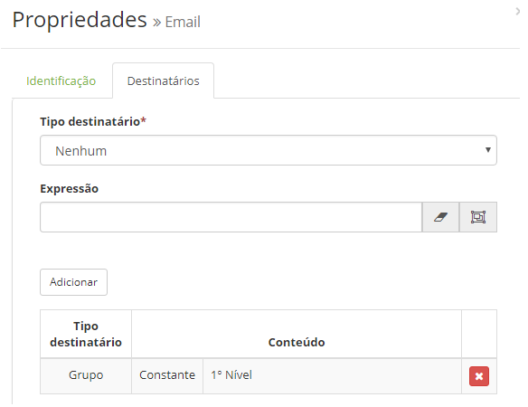
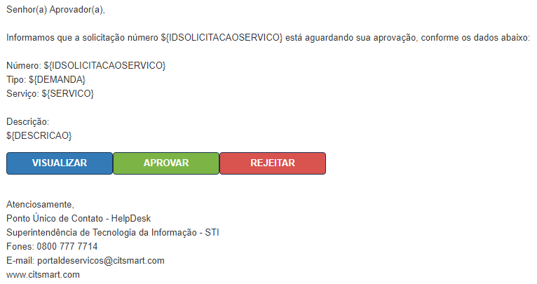
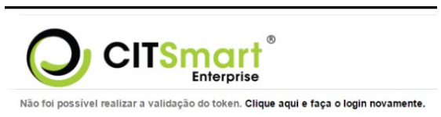

title: Aprovação de solicitação via e-mail
Description: Tem por objetivo aprovar ou rejeitar a solicitação de um ticket por meio do e-mail, sem a necessidade do administrador estar logado

# Aprovação de solicitação via e-mail

Esta funcionalidade tem por objetivo aprovar ou rejeitar a solicitação de um
ticket por meio do e-mail, sem a necessidade do administrador estar logado.

Pré-condições
-------------

1.  Informe o conteúdo abaixo nos parâmetros (ver conhecimento [Regras de
    parametrização - sistema];

    -   Parâmetro 33: URL de acesso ao sistema corretamente;

    -   Parâmetro 370: deverá estar setado em 'S';

1.  Ter ao menos um usuário/grupo cadastrado (ver conhecimentos [Cadastro e
    pesquisa de usuário]; [Cadastro e pesquisa de grupo];

2.  Saber desenhar fluxo de aprovação de solicitação via e-mail cadastrado.
    Neste fluxo deverá existir a tarefa "Aprovação" e o desenho para envio de
    e-mail (para maiores detalhes, ver a seção "Passos para configurar e-mail no
    fluxo");

3.  Cadastrar o modelo de e-mail com o modelo "Aguardando Aprovação" que se
    encontra em anexo;

4.  O servidor de e-mail deverá ser configurado (ver conhecimento [Regras de
    parametrização - e-mail].

Como acessar
------------

1.  Acesse a funcionalidade através da navegação no menu
    principal **Sistema > Manutenção de fluxos**.

Passos para configurar e-mail no fluxo
---------------------------------

1.  Selecione o fluxo de aprovação de solicitação;

2.  No fluxo de aprovação de solicitação clique no ícone , para configurar;

3.  Cadastrar, na aba Identificação, o nome e o modelo de e-mail a ser utilizado
    (Para cadastrar o modelo de e-mail, verifique a seção seguinte);

    !!! warning "ATENÇÃO"
    
        Não alterar o template de e-mail de criação (vinculado ao portfólio) para o template de aprovação.

1.  Configurar, na aba Destinatários, os tipos destinatários (grupo/usuário) do
    e-mail a ser enviado;

    !!! warning "ATENÇÃO"
        
        O sistema não busca destinatários via "Expressão".

    

    **Figura 1 - Tela de configuração de destinatário**

!!! warning "ATENÇÃO"
     
    - Caso opte que o destinatário seja "grupo", é necessário vincular o envio do e-mail para os 
    usuários do grupo selecionado (Acesso e Permissão > Grupo).

    - Caso no grupo aprovador, o usuário coloque para receber e-mail, "outros
     usuários", deve ser observado que esse usuário talvez não poderá aprovar a
     solicitação, pois, a condição para isso é que o usuário esteja no grupo
     aprovador e não somente sendo informado que existe uma aprovação.

Configurando o e-mail de notificação de aprovação
-------------------------------------------------

1.  Acesse a funcionalidade através do menu **Sistema > Configurações > Modelo
    de e-mail**;

2.  Será apresentada a tela de Cadastro de modelo de e-mail;

3.  Cadastrar o e-mail de notificação de aprovação;

    !!! warning "ATENÇÃO"

         - Este e-mail é feito por HTML.

         - O modelo de notificação de aprovação por e-mail a ser utilizado está
         disponível em anexo.

         - Para maiores detalhes de como transferir o modelo HTLM ao cadastrar uma nova
         notificação, veja o conhecimento [Cadastro e pesquisa de configuração de modelo de
         e-mail][5]

1.  Logo após transcrever o modelo HTML para a o cadastro da notificação,
    verifique as seguintes diretrizes:

    -   href="{TOKEN(serviceRequestIncident, \${IDSOLICITACAOSERVICO}, VIEW, 50)};

    -   serviceRequestIncident = Direcionamento da interface : esse campo não pode
    ser alterado pelo usuário;

    -   \${IDSOLICITACAOSERVICO} = Chave para incrementar o número da solicitação de
    serviço : esse campo não pode ser alterado pelo usuário;

    -   VIEW - chama o comando para abrir a solicitação : esse campo não pode ser
    alterado pelo usuário;

    -   MM (50) - Tempo de expiração do token em Minutos : esse campo pode ser
    alterado pelo usuário;

1.  Realizada as instruções acima, o modelo de e-mail estará pronto, conforme a
    figura abaixo:

    

    **Figura 2 - Exemplo do e-mail**

1.  O usuário clica em *Visualizar*:

    -   Permite observar os detalhes do pedido;

2.  Se o usuário clicar *Aprovar*:

    -   Permite a aprovação do pedido e uma caixa de diálogo confirmando que a
    aprovação é gerada;

1.  Se o usuário clicar em *Rejeitar*;

    -   Permite a rejeição da solicitação e uma caixa de diálogo é gerada que
        confirma a desaprovação.

    !!! warning "ATENÇÃO"
    
        Ao enviar o e-mail, esse rótulo será substituído por um link direto ao
        pedido, válido por 8 horas, por exemplo. Após 8 horas, quem clica no link é
        redirecionado para uma página de erro do sistema (figura 3).

    

    **Figura 3 - Mensagem de erro**

Anexos
------

[Dowload - AguardandoAprovacao - email][5]

[1]:#
[2]:#
[3]:#
[4]:#
[5]:/pt-br/docs/citsmart-platform-7/processes/tickets/images/aguardandoaprovacao-email.docx

!!! tip "About"

    <b>Product/Version:</b> CITSmart | 8.00 &nbsp;&nbsp;
    <b>Updated:</b>07/10/2019 – Anna Martins
