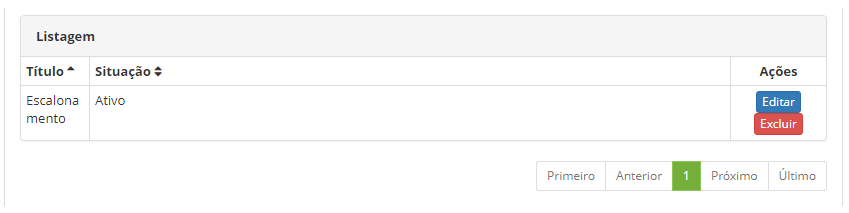

title: Cadastro e pesquisa de regras de escalonamento de um ticket
Description: Tem o objetivo de registrar diversos tipos de equipes ou áreas que podem gerar um ticket.

# Cadastro e pesquisa de regras de escalonamento de um ticket

Como acessar
-----------

1.  Acesse o menu principal **Processos ITIL > Gerência de
    Ticket > Regras de escalonamento**.

Pré-condições
-------------

1.  No arquivo citsmart.cfg, ter configurado a
    propriedade **START_MONITORA_INCIDENTES** informando o
    parâmetro **TRUE**, para esse ajuste neste arquivo somente o administrador
    do sistema operacional do servidor da aplicação (ver conhecimento [Manual de
    instalação on-premise
    (ITSM)][1]();

2.  Informe o conteúdo abaixo no parâmetro (ver conhecimento [Regras de
    parametrização -
    ticket][2]();

    -   Parâmetro 190: com o valor S

1.  Ter o contrato cadastrado (ver conhecimento [Cadastro e pesquisa de
    contrato][3]();

2.  Ter o colaborador cadastrado (ver conhecimento [Cadastro e pesquisa de
    colaborador][4]();

3.  Ter o grupo cadastrado (ver conhecimento [Cadastro e pesquisa de
    grupo][5]();

4.  Ter o portfólio de serviços definido (ver conhecimento [Cadastro de
    portfólio de
    serviços][6]().

Filtros
-------

1.  Os seguintes filtros possibilitam ao usuário restringir a participação de
    itens na listagem padrão da funcionalidade, facilitando a localização dos
    itens desejados:

    -   Título;

    -   Situação.
    
    
    
    **Figura 1 - Tela de pesquisa de regra de escalonamento**

1.  Realize a pesquisa do registro de regras de escalonamento, informando o nome
    da regra, o filtro *Situação* pode ser usado para refinar mais ainda a
    pesquisa.

Listagem de itens
-----------------

1.  Os seguintes campos cadastrais estão disponíveis ao usuário para facilitar a
    identificação dos itens desejados na listagem padrão da
    funcionalidade: Título e Situação.

2.  Existem botões de ação disponíveis ao usuário em relação a cada item da
    listagem, são eles: *Editar* e *Excluir*.

    

    **Figura 2 - Tela de lista de itens**

1.  Após a pesquisa, selecione o registro desejado clicando no botão *Editar*.
    Feito isso, será direcionado para tela de cadastro exibindo o conteúdo
    referente ao registro selecionado.

Preenchimento dos campos cadastrais
-----------------------------------

1.  Ao clicar no botão *Novo*, a tela de cadastro das **Regras de Escalonamento
    e notificações automáticas** será exibida, conforme ilustrada na figura
    abaixo:

    

    **Figura 3 - Tela de cadastro de regras de escalonamento**

1.  Preencha os campos conforme orientação abaixo:

    -   **Título**: informe o nome na nova regra de escalonamento;

    -   **Situação**:informe a situação da regra (ativo ou inativo);

    -   **Solicitante**: informe o solicitante da regra;

    -   **Grupo executor**: informe o nome do grupo executor;

    -   **Catálogo**: selecione o tipo de catálogo (Negócio ou Técnico);

    -   **Serviço**: informe o serviço do catálogo;

    -   **Tipo**: informe um tipo de solicitação (Requisição ou Incidente);

    -   **Categoria**: selecione um tipo de categoria;

    -   **Atividade (Requisição/Incidente)**: informe o nome do tipo de serviço
    (requisição ou incidente);

    -   **Contrato**: selecione o contrato a ser vinculado;

    -   **Impacto**: informe o nível de impacto (Baixo, Médio ou Alto);

    -   **Urgência**: informe o nível de urgência (Baixo, Médio ou Alto);

    -   Regras

        -   **Tempo**:digitar a quantidade de tempo referente a regra;

        -   **Formato**: escolher se refere a minutos (tempo da regra) ou percentual
            (referente ao tempo do SLA);

        -   **Condição**: informe a condição (Antes ou Depois);

        -   **Data**: escolha a data de referência (data de criação, data da última
            ocorrência ou data limite);

        -   **Ação**: informe o tipo de ação.

1.  Clique em *Adicionar* e a nova regra de escalonamento será exibida em uma
    nova listagem para checagem, se regra estiver correta, clicar em *Gravar*.

[1]:
[2]:
[3]:
[4]:
[5]:

!!! tip "About"

    <b>Product/Version:</b> CITSmart | 8.00 &nbsp;&nbsp;
    <b>Updated:</b>07/10/2019 – Anna Martins
