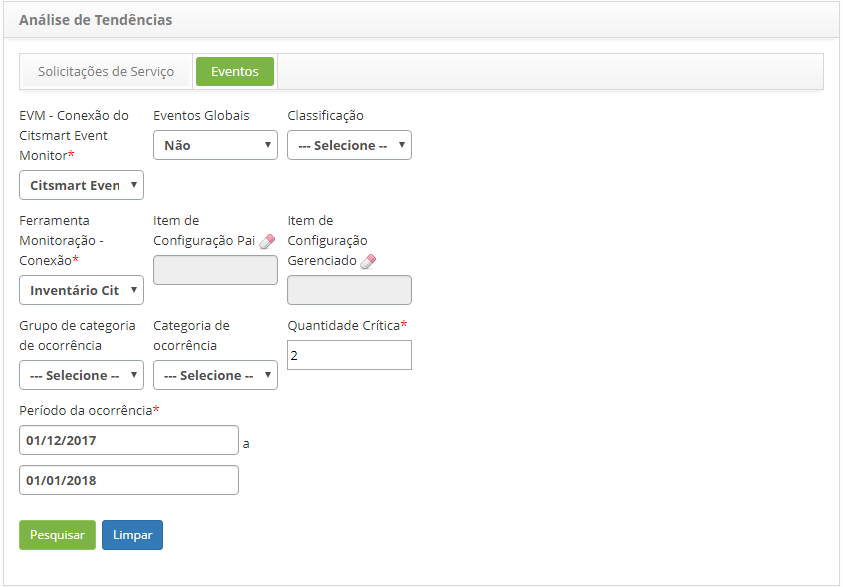
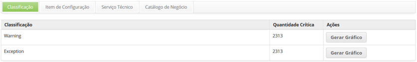
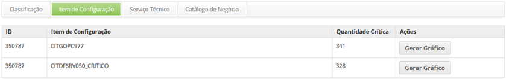
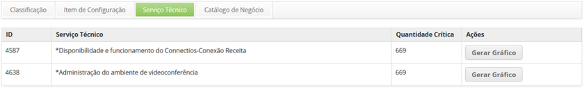
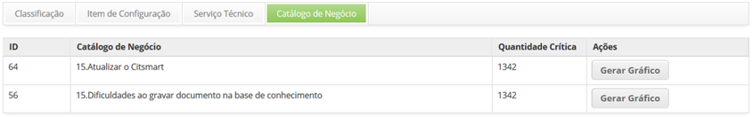

title: Análise de tendência de eventos

Description: Tem por objetivo gerar gráfico de Análise de Tendência de Eventos
por Serviço de Negócio em determinado período, a fim de realizar uma análise dos
eventos.

# Análise de tendência de eventos

Esta funcionalidade tem por objetivo gerar gráfico de Análise de Tendência de
Eventos por Serviço de Negócio em determinado período, a fim de realizar uma
análise dos eventos. A análise de tendências consiste na utilização de dados
para projeção de resultados futuros.

!!! warning "ATENÇÃO"

    Esta funcionalidade somente poderá ser usada em instâncias em que o
    cliente implantou também o módulo de Evento.

Como acessar
------------

1.  Acesse a funcionalidade de análise de tendências de eventos através da
    navegação no menu principal **Processos ITIL** > **Gerência de
    Tickets** > **Análise de Tendências.**

2.  Após o acesso a funcionalidade, será apresentada a tela Análise de
    Tendências, clique na aba *Eventos* para abrir a tela de análise de
    tendência de eventos.

Pré-condições
-------------

1.  Ter um contrato cadastrado e ativo (ver conhecimento [Cadastro e pesquisa de
    contrato] [1](https://itsm.citsmartcloud.com/citsmart/pages/knowledgeBasePortal/knowledgeBasePortal.load#/knowledge/256));

2.  Ter uma solicitação de serviço cadastrada ([Gerenciamento de ticket
    (serviços)][2](https://itsm.citsmartcloud.com/citsmart/pages/knowledgeBasePortal/knowledgeBasePortal.load#/knowledge/4699))
    e estar vinculada ao contrato;

3.  Configurar conexão do CITSmart Event Monitor (ver conhecimento [Conexão
    CITSmart Event
    Monitor][3](https://itsm.citsmartcloud.com/citsmart/pages/knowledgeBasePortal/knowledgeBasePortal.load#/knowledge/502));

4.  Configurar e instalar a ferramenta de monitoração (ver conhecimento [Manual
    de instalação do componente
    Inventory][4](https://itsm.citsmartcloud.com/citsmart/pages/knowledgeBasePortal/knowledgeBasePortal.load#/knowledge/170)).

Filtros
-------

1.  Os seguintes filtros possibilitam ao usuário restringir a participação de
    itens na listagem padrão da funcionalidade, facilitando a localização dos
    itens desejados, conforme ilustrado na figura abaixo:

        
    
    **Figura 1 - Tela de análise de tendência de eventos**

1.  Preencha os campos conforme as orientações abaixo:

-   **EVM - Conexão do Citsmart Event Monitor:** informe a conexão do Citsmart
    Event Monitor;

-   **Eventos Globais:** selecione a opção desejada (um evento desse tipo tem
    impacto em vários segmentos);

-   **Classificação:** informe a classificação do evento que deseja analisar;

-   **Ferramenta Monitoração - Conexão:** informe a ferramenta de monitoração;

-   **Item de Configuração Pai:** informe o item de configuração pai;

-   **Item de Configuração Gerenciado:** informe o item de configuração
    gerenciado;

-   **Grupo categoria ocorrência:** selecione o grupo de categoria de ocorrência
    de eventos;

-   **Categoria ocorrência:** selecione a categoria de ocorrência de eventos;

-   **Quantidade Crítica:** informe a quantidade crítica de eventos;

-   **Período de ocorrência:** informe o período desejado, com a data início e
    data fim de ocorrência de evento.

Listagem de itens
-----------------

1.  Os seguintes campos cadastrais estão disponíveis ao usuário para facilitar a
    identificação dos itens desejados na listagem padrão da funcionalidade.
    Existe um botão de ação disponível ao usuário em relação a cada item da
    listagem, é ele: *Gerar Gráfico*.

2.  Após preenchimento dos filtros, clique no botão *Pesquisar*. Feito isso, o
    sistema irá filtrar e totalizar os eventos que atendem aos filtros
    selecionados e gerará quatro guias de resultados, sendo:

-   **Classificação**: nessa guia é apresentado as ocorrências de eventos por
    classificação;

-   **Item de Configuração:** nessa guia é apresentado as ocorrências de eventos
    por item de configuração;

-   **Serviço Técnico**: nessa guia é apresentado as ocorrências de eventos por
    serviço técnico;

-   **Catálogo de Negócio**: nessa guia é apresentado as ocorrências de eventos
    por serviços de negócios.

-   Aba Classificação:

    -   **Classificação **e** Quantidade Crítica.**

    

    **Figura 2 - Tela de listagem de eventos - aba Classificação**

    Aba Item de Configuração:

    -   **ID, Item de Configuração** e **Quantidade Crítica**.

    

    **Figura 3 - Tela de listagem de eventos - aba Item de Configuração**

    -   Aba Serviço Técnico:

    -   **ID, Item de Configuração** e **Quantidade Crítica.**

    

    **Figura 4 - Tela de listagem de eventos - aba Serviço Técnico**

    -   Aba Catálogo de Negócio:

    -   **ID, Item de Configuração** e **Quantidade Crítica.**

    

    **Figura 5 - Tela de listagem de eventos - aba Catálogo de Negócio**

1.  Em cada guia de resultado conterá um botão para geração do gráfico de
    análise de tendências, o qual apresenta as datas que compreendem o período
    informado nos filtros e o número quantitativo de ocorrências de eventos
    naquela determinada data. Portanto, caso queira gerar o gráfico para análise
    de tendência dos eventos por classificação, IC, serviço técnico e/ou serviço
    de negócio, basta clicar no botão *Gerar Gráfico*.

Preenchimento dos campos cadastrais
-----------------------------------

1.  Não se aplica.

Veja também
-----------

-   [Análise de tendências de solicitações de
    serviço](https://itsm.citsmartcloud.com/citsmart/pages/knowledgeBasePortal/knowledgeBasePortal.load#/knowledge/395).

[1]:
[2]:
[3]:
[4]:

!!! tip "About"

    <b>Product/Version:</b> CITSmart | 8.00 &nbsp;&nbsp;
    <b>Updated:</b>07/10/2019 – Anna Martins
