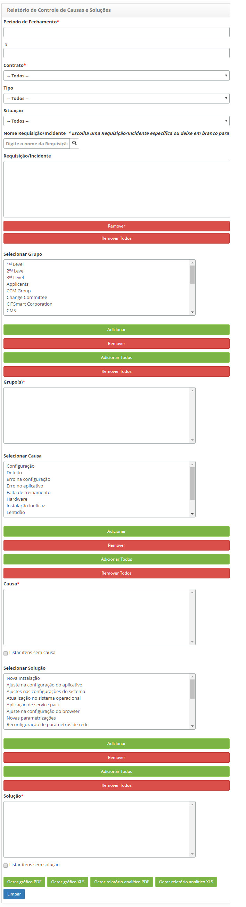

title:  Geração de relatórios - Gerência de Incidentes e Requisições
Description: Esse relatório tem o objetivo de apresentar as causas e soluções das solicitações de serviços. 
# Geração de relatórios - Gerência de Incidentes e Requisições

Gerando relatório de causas e soluções
---------------------------------------

Esse relatório tem o objetivo de apresentar as causas e soluções das solicitações de serviços.

*Como acessar*

1. Acesse a funcionalidade de Controle de Causas e Soluções através da navegação no menu principal 
**Relatórios > Gerência de Incidentes/Requisição > Controle de Causas e Soluções**.

*Filtros*

1. Os seguintes filtros possibilitam ao usuário restringir a participação de itens na listagem padrão da funcionalidade, 
facilitando a localização dos itens desejados:

    - **Período de Fechamento**: informe o período de fechamento desejado;
    - **Contrato**: informe o contrato desejado;
    - **Tipo**: selecione o tipo de serviço;
    - **Situação**: selecione a situação das solicitações de serviço;
    - **Nome Requisição/Incidente**: informe o nome do serviço. Escolha um serviço específico ou deixe em branco para todos os
    serviços;
    - **Requisição/Incidente**: serão listados todos os serviços escolhidos no campo anterior, “Nome Requisição/Incidente”;
        - Se desejar retirar algum serviço, basta seleciona-lo e clicar no botão "Remover". Mas caso deseje retirar todos os 
        serviços, basta clicar diretamente no botão "Remover Todos".
    - **Selecionar Grupo**: é apresentado uma lista de grupos ativos referente ao contrato selecionado, onde permite selecionar
    o(s) grupo(s) desejado(s);
        - Selecione o grupo desejado e clique no botão "Adicionar", o mesmo será adicionado no campo "Grupo(s)". Mas caso deseje 
        adicionar todos os grupos, basta clicar diretamente no botão "Adicionar Todos";
        - Se desejar retirar algum grupo, basta selecioná-lo e clicar no botão "Remover". Mas caso deseje retirar todos os grupos,
        basta clicar diretamente no botão "Remover Todos".
    - **Selecionar Causa**: é apresentado uma lista de causas, onde permite selecionar a(s) causa(s) desejada(s);
       - Para listar itens sem causa, marque a opção “**Listar itens sem causa**”;
       - Selecione a causa desejada e clique no botão "Adicionar", a mesma será adicionada no campo "Causa". Mas caso deseje 
       adicionar todas as causas, basta clicar diretamente no botão "Adicionar Todos";
       - Se desejar retirar alguma causa, basta selecioná-la e clicar no botão "Remover". Mas caso deseje retirar todas as 
       causas, basta clicar diretamente no botão "Remover Todos".
   - **Selecionar Solução**: é apresentado uma lista de soluções, onde permite selecionar a(s) solução(ões) desejada(s);
       - Para listar itens sem solução, marque a opção “**Listar itens sem solução**”;
       - Selecione a solução desejada e clique no botão "Adicionar", a mesma será adicionada no campo "Solução". Mas caso deseje
       adicionar todas as soluções, basta clicar diretamente no botão "Adicionar Todos";
       - Se desejar retirar alguma solução, basta selecioná-la e clicar no botão "Remover". Mas caso deseje retirar todas as 
       soluções, basta clicar diretamente no botão "Remover Todos".
       
2. Será apresentada a tela de **Relatório de Controle de Causas e Soluções**, conforme ilustrada na figura a seguir:

   
