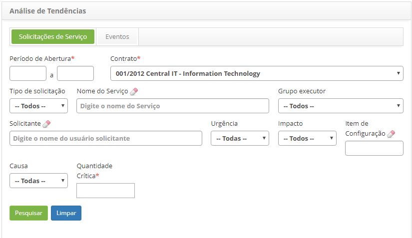
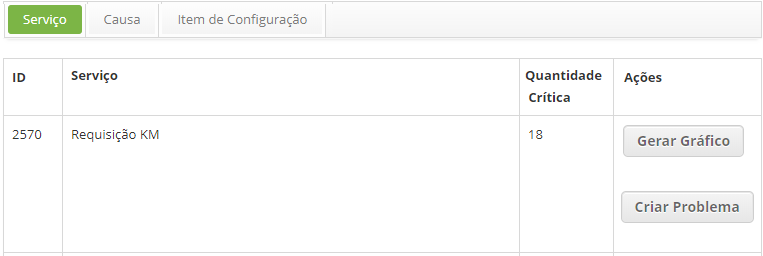
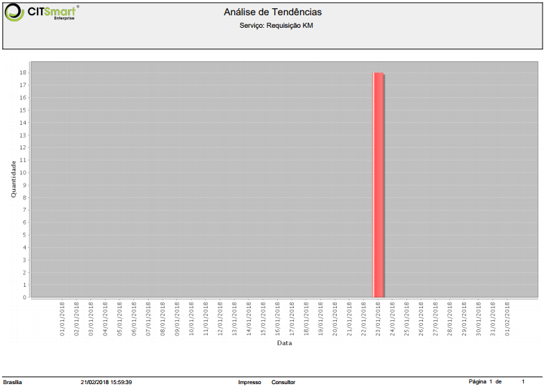
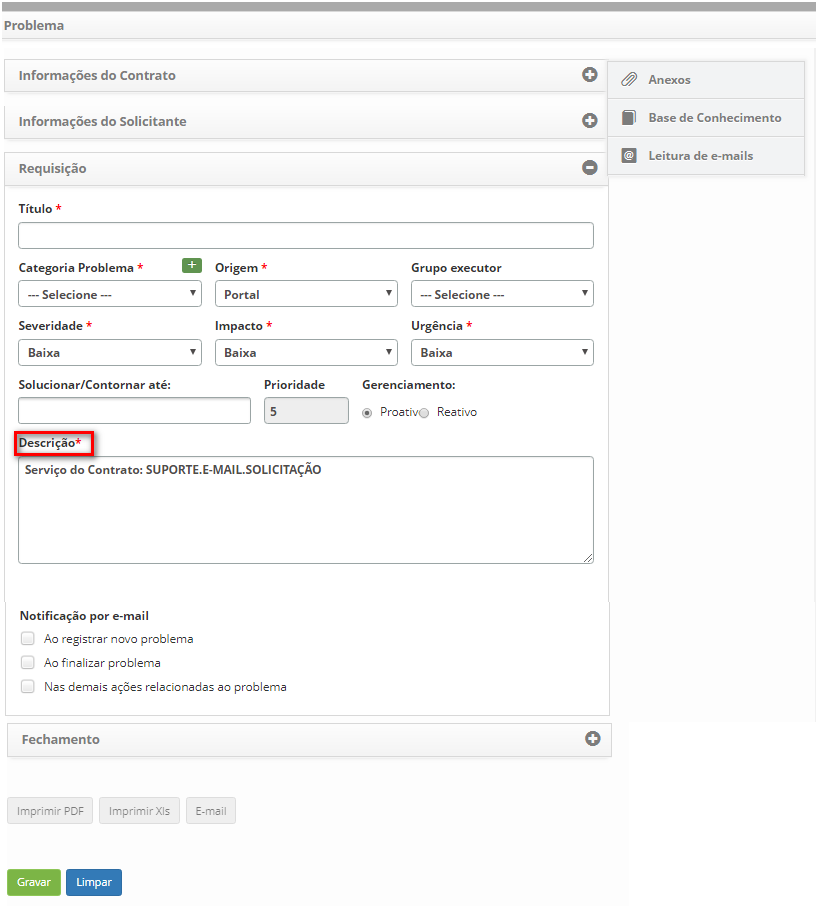
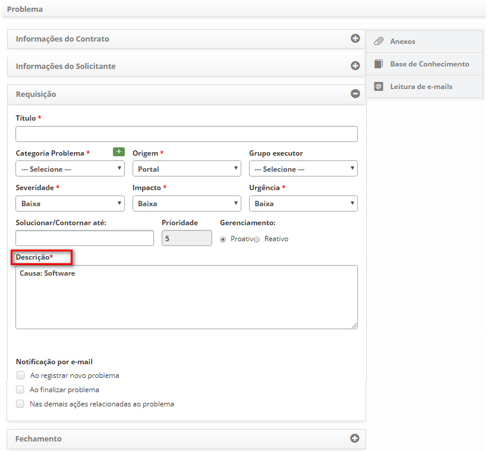
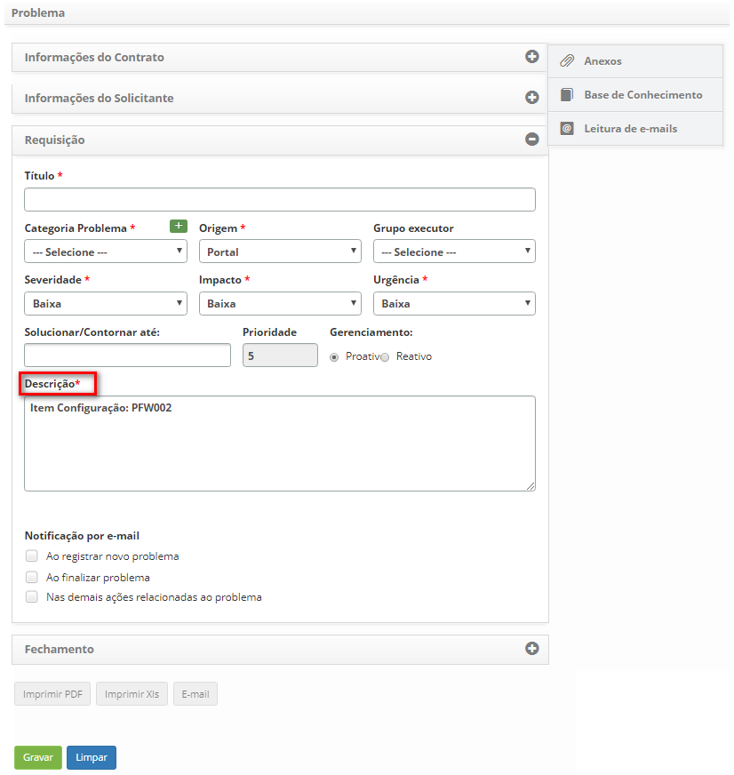

title: Análise de tendências de solicitações de serviço
Description: Tem por objetivo realizar uma análise das solicitações, baseada na quantidade crítica, para identificar quais itens vão influenciar em um lançamento de uma nova solicitação.

# Análise de tendências de solicitações de serviço

Como acessar
------------

1.  Acesse o menu principal **Processos ITIL > Gerência de
    Ticket > Análise de Tendências**, aba Solicitações de Serviço.

Pré-condições
-------------

1.  Ter um contrato cadastrado e ativo (ver conhecimento [Cadastro e pesquisa de
    contrato](1));

2.  Ter uma solicitação de serviço cadastrada (ver cohecimento [Gerenciamento de
    ticket(serviços)](2)) seção Cadastro de ticket) e estar vinculada ao contrato (ver
    conhecimento [Configuração dos atributos de serviço](3) seção Vinculando contratos ao serviço).

Filtros
-------

1.  Os seguintes filtros possibilitam ao usuário restringir a participação de
    itens na listagem padrão da funcionalidade, facilitando a localização dos
    itens desejados, conforme ilustrado na figura abaixo:

    -   Período de abertura;

    -   Contrato;

    -   Tipo de solicitação;

    -   Nome do Serviço;

    -   Grupo executor;

    -   Solicitante;

    -   Urgência;

    -   Impacto;

    -   Item de configuração;

    -   Causa;

    -   Quantidade Crítica.

    

    **Figura 1 - Tela de análise de tendência de solicitações de serviço**

1.  Preencha os filtros conforme sua necessidade:

    -   **Período de Abertura**: informar o período do cadastro de solicitações
        de serviço;

    -   **Contrato**: informar o contrato para verificar as solicitações de
        serviço referente ao mesmo;

    -   **Tipo de solicitação**: selecionar o tipo de solicitação que deseja
        verificar;

    -   **Nome do Serviço**: informar o serviço para verificar a quantidade de
        solicitações referente ao mesmo;

    -   **Grupo executor**: selecionar o grupo executor para verificar as
        solicitações de serviço que foram direcionadas para o mesmo;

    -   **Solicitante**: informar o nome do usuário solicitante para verificar
        as solicitações de serviço solicitadas pelo mesmo;

    -   **Urgência**: selecionar o grau de urgência para verificar as
        solicitações de serviço referentes ao mesmo;

    -   **Impacto**: selecionar o grau do impacto para verificar as solicitações
        de serviço referentes ao mesmo;

    -   **Item de Configuração**: informar o item de configuração para verificar
        as solicitações de serviços relacionadas ao mesmo;

    -   **Causa**: informar a causa para verificar as solicitações de serviço
        ocasionadas pela mesma;

    -   **Quantidade Crítica**: informar o número crítico de solicitações de
        serviços que merecem atenção e análise.

2.  Após os filtros informados, clique no botão *Pesquisar*.

Listagem de itens
-----------------

1.  Os seguintes campos cadastrais estão disponíveis ao usuário para facilitar a
    identificação dos itens desejados na listagem padrão da
    funcionalidade: **ID, Serviço e Quantidade Crítica**.

2.  Existem botões de ação disponíveis ao usuário em relação a cada item da
    listagem, são eles: *Gerar Gráfico* e *Criar Problema*.

3.  O sistema irá filtrar e totalizar a quantidade de solicitações que atendem
    aos filtros selecionados e gerará três guias de resultados, conforme exemplo
    ilustrado na figura abaixo:
    
    
    
    **Figura 2 - Resultados para análise de tendência**

    !!! warning "ATENÇÃO"

         Serão exibidas em cada guia (Serviço, Causa e Item de Configuração), a quantidade crítica de solicitações, igual ou superior à quantidade crítica mínima informada no filtro.
        

1.  Em cada guia serão apresentados os resultados referentes a cada tipo
    (Serviço, Causa e Item de Configuração) e em cada item serão exibidos dois
    botões, um para **Gerar Gráfico de Análise de Tendências** (conforme
    ilustrado na figura anterior) o qual apresenta as datas que compreendem o
    período informado e o número de ocorrências naquela data, e outro
    para **Criar Problema**, onde será exibida a tela de cadastro de problema
    para registro das informações necessárias do problema.

    

    **Figura 3 - Gráfico gantt de análise de tendências de solicitações de serviço**

-   Ao optar por registrar um problema a partir do **Serviço**, será exibida a
    tela de cadastro de problema com o campo "Descrição" alimentado com o nome
    do serviço correspondente;

    

    **Figura 4 - Tela Criar problema - aba Serviço**

-   Ao optar por registrar um problema a partir da **Causa**, será exibida a
    tela de cadastro de problema com os campos "Descrição" e "Causa" alimentados
    com a descrição da causa correspondente;

    

    **Figura 5 - Tela Criar problema - aba Causa**

-   Ao optar por registrar um problema a partir do **Item de Configuração**,
    será exibida a tela de cadastro de problema com o campo "Descrição"
    alimentado com informação do item de configuração correspondente.

    

    **Figura 6 - Tela Criar problema - aba Item de Configuração**

Preenchimento dos campos cadastrais
-----------------------------------

1.  Não se aplica.

Veja também
-----------

-   [Análise de tendência de eventos](4)).

[1]:/pt-br/citsmart-platform-7/additional-features/contract-management/use/register-contract.html
[2]:/pt-br/citsmart-platform-7/processes/tickets/ticket-management.html
[3]:/pt-br/citsmart-platform-7/processes/portfolio-and-catalog/configure-service-attribute.html
[4]:/pt-br/citsmart-platform-7/processes/tickets/event-trends.html

!!! tip "About"

    <b>Product/Version:</b> CITSmart | 8.00 &nbsp;&nbsp;
    <b>Updated:</b>07/10/2019 – Anna Martins
