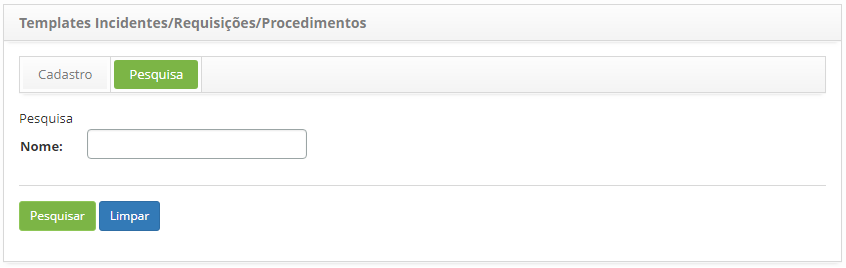
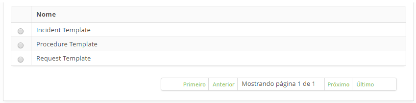
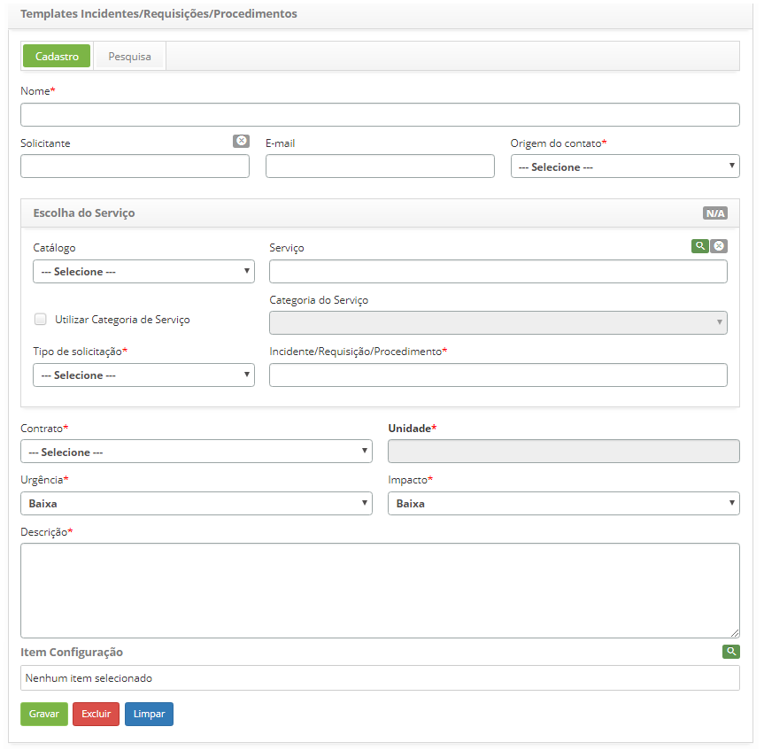

title: Cadastro e pesquisa de template de incidentes, requisições e procedimentos
Description: Tem o objetivo de cadastrar um template para facilitar a abertura de uma nova solicitação.

# Cadastro e pesquisa de template de incidentes, requisições e procedimentos

Esta funcionalidade tem por objetivo cadastrar um template para facilitar a
abertura de uma nova solicitação.

Como acessar
------------

1.  Acesse a funcionalidade de Template de Incidentes/Requisições/Procedimentos
    através da navegação no menu principal **Processos ITIL > Gerência de
    Ticket > Templates Incidentes/Requisições/Procedimentos**.

Pré-condições
-------------

1.  Ter acesso à funcionalidade de Templates
    Incidentes/Requisições/Procedimentos (ver conhecimento [Cadastro e pesquisa
    de perfil de acesso](1));

2.  Ter o grupo cadastrado (ver conhecimento [Cadastro e pesquisa de
    grupo](2));

3.  Ter o contrato cadastrado (ver conhecimento [Cadastro e pesquisa de
    contrato](3));

4.  Ter a unidade cadastrada (ver conhecimento [Cadastro e pesquisa de
    unidade](4));

5.  Ter o grupo vinculado ao contrato (ver conhecimento [Como relacionar grupo
    ao contrato?](5));

6.  Ter a unidade vinculada ao contrato (ver conhecimento [Como relacionar
    unidade ao contrato?](6));

7.  Ter o portfólio com o serviço e as atividades de requisição e incidente
    cadastrados (ver conhecimentos [Cadastro de portfólio de serviços](7), [Cadastro
    de serviços](8)), [Configuração dos atributos do serviço](9));

8.  Ter o tempo de atendimento das atividades de requisição e incidente
    definidos (ver conhecimento [Cadastro e pesquisa de tempo de
    atendimento](10));

9.  Ter o contrato vinculado ao serviço (Ver conhecimento [Configuração dos
    atributos do serviço](11));

10. Ter as atividades de requisição e incidente vinculadas ao contrato do
    serviço (ver conhecimento [Configuração dos atributos do contrato do
    serviço](12));

11. Informe o conteúdo abaixo no parâmetro (ver conhecimento [Regras de
    parametrização - Ticket](13)):

    -   Parâmetro 9: definir o grupo de 1º nível para o atendimento da solicitação.

1.  O solicitante deve estar incluído no grupo que está vinculado ao contrato
    para que seja possível registrar a solicitação.

Filtros
-------

1.  O seguinte filtro possibilita ao usuário restringir a participação de itens
    na listagem padrão da funcionalidade, facilitando a localização dos itens
    desejados:

    -   Nome.

    

    **Figura 1 - Tela de pesquisa de template incidentes/requisições/procedimentos**

1.  Realize a pesquisa do template;

-   Informe o nome do template que deseja pesquisar e clique no
    botão *Pesquisar*. Após isso, será exibido o registro do template conforme o
    nome informado;

-   Caso deseje listar todos os registros de template, basta clicar diretamente
    no botão *Pesquisar.*

Listagem de itens
-----------------

1.  O seguinte campo cadastral está disponível ao usuário para facilitar a
    identificação dos itens desejados na listagem padrão da
    funcionalidade: **Nome.**

    

    **Figura 2 - Tela de listagem de templates incidentes/requisições/procedimentos**

1.  Após a pesquisa, selecione o registro desejado. Feito isso, será direcionado
    para a aba de cadastro exibindo o conteúdo referente ao registro
    selecionado;

2.  Para alterar os dados do registro de template, basta modificar as
    informações dos campos desejados e clicar no botão *Gravar* para que seja
    gravada a alteração realizada no registro, onde a data, hora e usuário serão
    gravados automaticamente para uma futura auditoria.

Preenchimento dos campos cadastrais
-----------------------------------

1.  Será apresentada a tela de cadastro de Template de
    Incidentes/Requisições/Procedimentos, conforme ilustrada na figura abaixo:
    
    

    **Figura 3 - Tela de cadastro de template**

1.  Preencha os campos conforme orientação abaixo:

    -   **Nome**: informe o nome do Incidente, Requisição ou Procedimento;

    -   **Solicitante**: informe o nome do solicitante, ou seja, o nome da pessoa
    que está solicitando a abertura de incidente ou requisição de serviço;

    -   **E-mail**: informe o e-mail do solicitante;

    -   **Origem do Contato**: informe a origem da solicitação;

    -   **Catálogo**: esse campo será estabelecido pelo sistema após informar o
    solicitante e contrato. Caso o contrato selecionado seja do tipo "contrato",
    será exibida neste campo a informação do Catálogo de Serviços de "Negócio" e
    caso o contrato selecionado seja do tipo "contrato de apoio" ou "acordo de
    nível operacional", será exibida neste campo a informação do Catálogo de
    Serviços "Técnico";

    -   **Serviço**: informe o serviço referente ao catálogo de serviços. Se o
    catálogo de serviços for de "negócio", serão disponibilizados neste campo os
    serviços de negócio para seleção, mas se o catálogo de serviços for
    "técnico", serão disponibilizados neste campo os serviços de apoio/técnico
    para seleção;

    -   **Utilizar a categoria de serviço**: marque este campo, se optar buscar os
    serviços por categoria;

    -   **Categoria de Serviço**: caso tenha optado pela busca de serviços por
    categoria, informe a categoria de serviço desejado. A categoria do serviço
    irá identificar a natureza do serviço, posicionando-o dentro de grupos
    semelhantes de atuação, situando-o na hierarquia de sua categoria;

    -   **Tipo de solicitação**: informe o tipo da solicitação, se é uma abertura de
    incidente, requisição de serviço ou procedimento;

        -   **Incidente**: caso a situação apresentada seja uma interrupção não
        planejada, uma redução na qualidade do serviço ou falha de algum item de
        configuração que ainda não tenha impactado um serviço de TI. Ex: o link
        de rede está fora, a rede está lenta, o servidor inacessível, etc.

        -   **Requisição**: refere-se aos pedidos de demandas realizados pelos
        usuários dentro do ambiente da Tecnologia da Informação. Podem ser desde
        pedidos de acesso até sugestões de melhoria a baixo custo. Ex: pedido de
        acesso à rede para um novo usuário, solicitação de configuração de algum
        equipamento, requisição para adicionar algum software na estação de
        trabalho, etc.

        -   **Procedimento**: refere-se ao procedimento de continuidade do serviço
        de TI, no caso de ocorrência de incidente crítico.

    -   **Incidente/Requisição/Procedimento**: informe o serviço que será realizado;

    -   **Contrato**: informe o contrato para qual será feita a solicitação;

    -   **Unidade**: informe a unidade do solicitante;

    -   **Urgência**: indique a velocidade na qual o serviço precisa ser realizado;

    -   **Impacto**: indique o impacto ao negócio;

    -   **Descrição**: informe a descrição da solicitação. A descrição deve ser
    objetiva, incluindo toda informação necessária para o atendimento da
    solicitação;

    -   **Item Configuração**: informe o item de configuração referente a
    solicitação.

1.  Após os dados informados, clique no botão *Gravar* para efetuar o registro,
    onde a data, hora e usuário serão gravados automaticamente para uma futura
    auditoria.

[1]:/pt-br/citsmart-platform-7/initial-settings/access-settings/profile/user-profile.html
[2]:/pt-br/citsmart-platform-7/initial-settings/access-settings/user/group.html
[3]:/pt-br/citsmart-platform-7/additional-features/contract-management/use/register-contract.html
[4]:/pt-br/citsmart-platform-7/plataform-administration/region-and-language/register-unit.html
[5]:/pt-br/citsmart-platform-7/processes/tickets/relate-group.html
[6]:/pt-br/citsmart-platform-7/processes/tickets/relate-unit.html
[7]:/pt-br/citsmart-platform-7/processes/portfolio-and-catalog/register.html
[8]:/pt-br/citsmart-platform-7/processes/portfolio-and-catalog/services.html
[9]:/pt-br/citsmart-platform-7/processes/portfolio-and-catalog/configure-service-attribute.html
[10]:/pt-br/citsmart-platform-7/processes/service-level/time-attendance.html
[11]:/pt-br/citsmart-platform-7/processes/portfolio-and-catalog/configure-service-attribute.html
[12]:/pt-br/citsmart-platform-7/processes/portfolio-and-catalog/contract-attributes.html
[13]:/pt-br/citsmart-platform-7/plataform-administration/parameters-list/parametrizaion-ticket.html

!!! tip "About"

    <b>Product/Version:</b> CITSmart | 8.00 &nbsp;&nbsp;
    <b>Updated:</b>07/10/2019 – Anna Martins
