title: Gerenciamento de ticket (serviços)
Description: Tem por objetivo elucidar de forma clara e didática a funcionalidade ticket como um todo, explicando concisamente suas opções.
# Gerenciamento de ticket (serviços)

Este conhecimento tem por objetivo elucidar de forma clara e didática a funcionalidade ticket como um todo, explicando concisamente suas opções.
A tela abaixo mostra a principal tela do módulo tickets:

   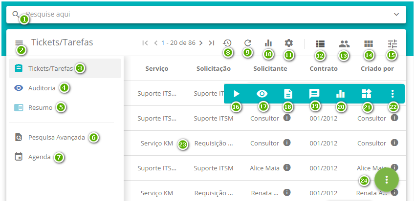

   **Figura 1 - Tela de gerenciamento de tickets**

•	**1**: Campo de pesquisa: permite buscar os tickets;

•	**2**: Botão de menu: exibe os itens de menu da tela de gerenciamento;

•	**3**: Tickets: apresenta os registros de requisições de serviços e incidentes para atendimento e gerenciamento;

•	**4**: Auditoria: apresenta os logs gerados nas diversas ações relacionadas aos tickets;

•	**5**: Resumo: exibe a quantidade de tickets por diversos itens;

•	**6**: Pesquisa avançada: permite realizar uma busca avançada dos tickets;

•	**7**: Agenda: permite visualizar a agenda de atividades periódicas, na qual se verifica as atividades referentes aos tickets que foram agendados para serem atendidos em uma data determinada;

•	**8**: Atualização automática: recurso para, quando acionado, atualizar a lista de tickets de forma automática. O tempo de atualização automática da lista de ticket é de 30 segundos. Atualmente, este tempo não pode ser alterado;

•	**9**: Atualização manual: recurso usado para atualizar a lista de tickets;

•	**10**: Relatórios: permite acessar relatórios do tipo global, ou seja, aqueles não ligados a um ticket específico, podendo analisar todos (na criação do relatório via opção Relatórios Smart esta característica é definida);

•	**11**: Opções: apresenta a funcionalidade de “Suspensão/Reativação” (que permite suspender todas os tickets com status “Em andamento” de um determinado grupo executor e reativar os mesmos) e a funcionalidade de “Alterar colunas” (que permite alterar a disposição das colunas na lista de tickets; o conjunto de colunas definidas permanece mesmo após o encerramento da sessão do usuário);

•	**12**: Listagem: filtra o modo de exibição de ticket por listagem;

•	**13**: Por atendente: filtra o modo de exibição de ticket por atendente no modo kanban;

•	**14**: Por situação: filtra o modo de exibição de ticket por situação SLA. Para esta opção ficar visível é necessário habilitar a permissão de acesso para o usuário logado, marque o item "Gestão de Equipe" (ver conhecimento Permissão de acesso do gerenciamento de tickets);

•	**15**: Por status do fluxo: filtra o modo de exibição de ticket por status do fluxo;

•	**16**: Clique para capturar e ser responsável pelo ticket;

•	**17**: Clique para mostrar todas as informações básicas referente ao ticket, não sendo possível nessa tela realizar qualquer tipo de alteração nos dados;

•	**18**: Clique para mostrar apenas a descrição do ticket;

•	**19**: Clique disponibilizar a funcionalidade de Mensagem, que permite a troca de mensagens entre o solicitante do ticket e o responsável pela sua resolução;

•	**20**: Clique para acessar relatórios do tipo específico, ou seja, aqueles ligados ao ticket atual (na criação do relatório via opção Relatórios Smart esta característica é definida);

   !!! warning "ATENÇÃO"

       A exibição destes relatórios depende da configuração (cadastro) de relatórios específicos na funcionalidade Relatórios > Relatórios Smart > Gerador de Relatórios Smart (ver conhecimento Gerador de relatórios Smart)

•	**21**: Clique para mostrar o fluxo referente ao ticket, sendo possível então observar a posição do usuário dentro do mesmo;

•	**22**: Clique para abrir outras ações, tais como: Delegar, Suspender, Alterar SLA, Reclassificar, Criar sub-solicitações, Exibir sub-solicitações, Agendar atividade, Criar solicitação relacionada e Imprimir solicitação;

•	**23**: Solicitações: listagem de registros de tickets;

•	**24**: Botão de Opções: ao ser acionado apresenta o botão para cadastro de novos tickets e o botão para cadastro de ticket via template.

A lista abaixo mostra as 28 possíveis operações desta tela, em ordem alfabética:

1.	Agendar atividades
2.	Alterar o SLA
3.	Aprovar
4.	Cadastrar
5.	Cadastrar (via leitura de e-mail)
6.	Cadastrar (via template)
7.	Cadastrar uma ocorrência
8.	Cancelar
9.	Capturar
10.	Delegar
11.	Direcionar
12.	Encerrar
13.	Gerenciar o atendimento das equipes pelo quadro Kanban
14.	Imprimir
15.	Pesquisar (forma rápida e avançada)
16.	Reabrir
17.	Realizar auditoria
18.	Reativar
19.	Reclassificar
20.	Registrar a execução
21.	Suspender e reativativar de forma múltiplas
22.	Suspender
23.	Vincular a um Problema
24.	Vincular a um Projeto
25.	Vincular a um sub-ticket
26.	Vincular a um ticket relacionado
27.	Vincular a uma Liberação
28.	Vincular a uma Mudança

As demais seções deste conhecimento explicam com detalhes as orientações de uso dessas operações através dos menus, links e botões disponíveis na tela.
As seções estão dispostas na ordem de disposição na tela para facilitar o autodesenvolvimento.

Cadastro de ticket
-----------------

### Como acessar

1.	Acesse o menu principal **Processos ITIL > Gerência de Ticket > Ticket** .

### Pré-condições

1.	Ter permissão para registrar ticket (ver conhecimento Cadastro e pesquisa de grupo);
2.	Ter o colaborador cadastrado (ver conhecimento Cadastro e pesquisa de colaborador);
3.	Ter o grupo cadastrado (ver conhecimento Cadastro e pesquisa de grupo);
4.	Ter o contrato cadastrado (ver conhecimento Cadastro e pesquisa de contrato);
5.	Ter a unidade cadastrada (ver conhecimento Cadastro e pesquisa de unidade);
6.	Ter o usuário vinculado à unidade;
7.	Ter o usuário vinculado ao grupo;
8.	Ter o grupo vinculado ao contrato (ver conhecimento Como relacionar grupo ao contrato?);
9.	Ter a unidade vinculada ao contrato (ver conhecimento Como relacionar unidade ao contrato?);
10.	Ter o portfólio com o serviço e as atividades de tickets cadastrados (ver conhecimentos Cadastro de portfólio de serviços, Cadastro de serviços, Configuração dos atributos do serviço);
11.	Ter o tempo de atendimento das atividades de tickets definidos (ver conhecimento Cadastro e pesquisa de tempo de atendimento)
12.	Ter o contrato vinculado ao serviço (ver conhecimento Configuração dos atributos do serviço);
13.	Ter as atividades de tickets vinculadas ao contrato do serviço (ver conhecimento Configuração dos atributos do contrato do serviço);
14.	O solicitante deve estar incluído no grupo que está vinculado ao contrato para que seja possível registrar o ticket;
15.	Informe o conteúdo abaixo nos parâmetros (ver conhecimento Regras de parametrização - tickets):

  -	Parâmetro 9:

  -	Parâmetro 40;

  -	Parâmetro 41;

  -	Parâmetro 260: default 1-Lista sem restrição;

  -	Parâmetro 343: default: "S".

### Filtros (pesquisa rápida)

1.	O seguinte filtro possibilita ao usuário restringir a participação de itens na listagem padrão da funcionalidade, facilitando a localização dos itens desejados:

  -	Pesquise aqui: no campo de pesquisa, é permitido a busca por número, descrição da tarefa e responsável pelo atendimento;

   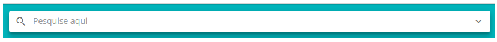

   **Figura 2 - Tela de pesquisa**

2.	Caso queira realizar a busca utilizando outros filtros, basta clicar no ícone   do campo de pesquisa. Será então apresentada uma tela com vários filtros, possibilitando dessa forma o refinamento da pesquisa. A figura abaixo ilustra estes filtros:

    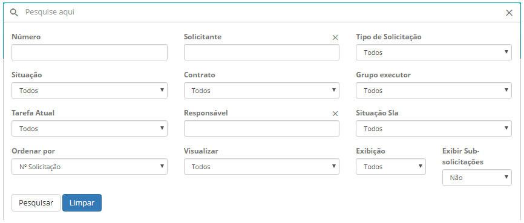

    **Figura 3 - Tela de pesquisa detalhada**
    
  -	Número: informar o número de identificação do ticket, caso queira verificar um ticket específico;

  -	Solicitante: informar o solicitante de serviços para verificar seus tickets;

  -	Tipo de solicitação: informar o tipo de ticket para verificação dos tickets;

  -	Situação: informar a situação para verificar os tickets referentes;

  -	Contrato: informar o contrato para verificar aos tickets relacionadas ao mesmo;

  -	Grupo executor: informar o grupo executor para verificar os tickets que foram direcionadas ao mesmo;

  -	Tarefa atual: informar o tipo de tarefa para verificar os tickets relacionados ao mesmo;

  -	Responsável: informar o responsável pelo atendimento do ticket para verificar aos tickets que foram atendidos pelo mesmo;

  -	Situação SLA: informar a situação do SLA para verificar os tickets referentes à situação selecionada;

  -	Ordenar por: permite definir a ordem em que os tickets serão apresentados;

  -	Visualizar: informar a forma de visualização do ticket de acordo com as ações disponíveis ao eventual responsável pelo ticket, tais como: execução e apenas visualização;

  -	Exibição: permite filtrar o ticket das solicitações consideradas críticas e solicitações abertas pelo chat;

  -	Exibir Sub-solicitações: se estiver marcado com Sim, o resultado da pesquisa trará também os sub-tickets de cada item do resultado.

   !!! warning "ATENÇÃO"
    
      A eficácia da pesquisa depende do seguimento de algumas regras de permissão pelo filtro, tais como: execução, delegação, acompanhamento, visualização, grupos de usuários, vínculo com contrato, unidades e colaborador logado.

### Listagem de itens

1.	Os seguintes campos cadastrais estão disponíveis ao usuário para facilitar a identificação dos itens desejados na listagem padrão da funcionalidade: Ticket, Prioridade, Serviço, Solicitação, Solicitante, Contrato, Criado por, Data criação, Tarefa e Grupo atual .
2.	Será exibida a tela de Gerenciamento Ticket. A figura abaixo ilustra esse campo:

    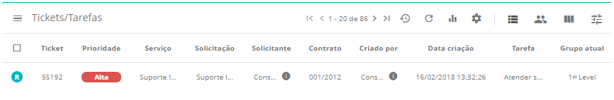

    **Figura 4 - Tela de listagem de tickets**

### Preenchimento dos campos cadastrais - Cadastro de ticket

1.	Ao acessar a funcionalidade, será exibida a tela de Gerenciamento ticket;
2.	Clique no botão de opções  localizado no canto inferior direito da tela, logo em seguida clique no botão de cadastro .
3.	Feito isso, será apresentada a tela de Cadastro de ticket, conforme ilustrada na figura a seguir:

    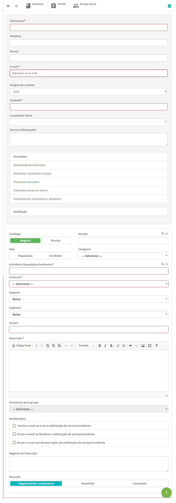

    **Figura 5 - Tela de cadastro de ticket**
    
3.	Preencha os campos conforme orientações descritas abaixo:

a.	Registre as informações do solicitante:

  -	Solicitante: informe o nome do solicitante, ou seja, o nome da pessoa que está solicitando a abertura do ticket;

    !!! warning "ATENÇÃO"
    
        Ao informar o solicitante é mostrado um resumo estatístico dos chamados dele (por situação), 
        bem como um outro resumo estatístico de satisfação (por tipo de resposta) dos serviços já solicitados por ele. 
        Por uma questão de desempenho e de preservação do layout da tela, esses dois resumos são paginados, ou seja, é 
        possível avançar/retroceder para visualizar todas as informações.

  -	Telefone: informe o número de telefone do solicitante;

  -	Ramal: informe o número do ramal do solicitante, caso o tenha;

  -	E-mail: informe o e-mail do solicitante;

  -	Origem do contato: informe a origem do contato para registro do ticket;

  -	Unidade: selecione a unidade na qual o solicitante está lotado;

  -	Localidade Física: informe a localização do solicitante;

  -	Outras Informações: descreva as observações sobre o solicitante, se achar necessário.

   !!! warning " ATENÇÃO"

        Caso exista questionário (Satisfação) vinculado a atividade, o solicitante responderá através do e-mail automático
        de pesquisa de satisfação.

b.	Registre as informações do ticket:

  -	Catálogo: selecione o catálogo de serviços;

  -	Serviço: informe o serviço referente ao catálogo de serviços selecionado. Se o catálogo de serviços for "Negócio", serão 
disponibilizados neste campo os serviços de negócio para seleção, mas se o catálogo de serviços for "Técnico", serão disponibilizados 
neste campo os serviços de apoio/técnico para seleção;

  -	Tipo: selecione o tipo do ticket, se é uma abertura de incidente ou requisição de serviço;

    -	Incidente: caso a situação apresentada seja uma interrupção não planejada, uma redução na qualidade do serviço ou falha de algum item
de configuração que ainda não tenha impactado um serviço de TI. Ex.: O link de rede está fora, a rede está lenta, o servidor inacessível,
etc.

    -	Requisição: refere-se aos pedidos de demandas realizados pelos usuários dentro do ambiente da Tecnologia da Informação. 
Podem ser desde pedidos de acesso até sugestões de melhoria a baixo custo. Ex.: pedido de acesso à rede para um novo usuário, 
solicitação de configuração de algum equipamento, requisição para adicionar algum software na estação de trabalho, etc.

  -	Categoria: informe a categoria de serviço para facilitar a busca da atividade (requisição/incidente). A categoria irá identificar a 
natureza da atividade, posicionando-o dentro de grupos semelhantes de atuação, situando-o na hierarquia de sua categoria;

  -	Atividade (Requisição/Incidente): informe a atividade que será realizada referente ao tipo de ticket. Caso a atividade informada tenha um “Script de Orientação” associado, o mesmo será exibido na guia de "Scripts" representada pelo ícone   localizado no canto superior direito da tela;

  -	Contrato: após informar a atividade (requisição/incidente), será exibido o contrato para o qual será feita a abertura de incidente ou requisição de serviço;

  -	Urgência: após informar a atividade (requisição/incidente), será exibida a informação da urgência a qual indica a velocidade na qual o serviço precisa ser realizado;

  -	Impacto: após informar a atividade (requisição/incidente), será exibida a informação de impacto do serviço ao negócio;

   !!! warning "ATENÇÃO"
    
       Após informar a atividade do ticket, será estabelecido o tempo previsto para seu atendimento, conforme configurado no registro 
       do tempo de atendimento vinculado à atividade. O tempo de atendimento será contabilizado de acordo com o que foi definido no 
       calendário vinculado à unidade, mas caso a unidade não tenha um calendário vinculado, será contabilizado de acordo com o 
       calendário vinculado ao serviço. Porém, ao encerrar o tempo previsto de atendimento é contabilizado o atraso em tempo corrido, 
       sendo desconsiderado o calendário.

  -	Título: informe o título do ticket;

  -	Descrição: informe a descrição do ticket. A descrição deve ser objetiva, incluindo toda informação necessária para o atendimento do mesmo;

  -	Direcionar para grupo: informe o grupo para o qual será direcionado o ticket. Caso não informe o grupo, o ticket será direcionado 
para o grupo definido no fluxo de requisição/incidente. Se não estiver definido o grupo no fluxo, o ticket será direcionado para o 
grupo definido no registro do vínculo da atividade de requisição/incidente ao contrato. Mas se o grupo não estiver definido no registro
do vínculo da atividade ao contrato, o ticket será direcionado para o grupo definido no parâmetro "ID Grupo Nível 1"(para que esse campo esteja ativado é necessário configurar a funcionalidade - ver conhecimento Manutenção de fluxo de trabalho, seção Implementando a 
funcionalidade direcionar grupo no fluxo sobre a atividade);

  -	Notificações: marque as opções de envio de notificação sobre o ticket para serem enviadas ao solicitante;

  -	Registro de Execução: não é necessário o preenchimento deste campo, pois o mesmo é indicado para o técnico que irá atender o ticket e descreverá sobre a execução de sua atividade;

  -	Situação: selecione a opção que se encaixa com o atual estado do ticket: Registrada/Em andamento.

4.	Após os dados informados, clique no botão de opções   e logo em seguida clique no botão gravar  para efetuar o registro, onde a data, hora e usuário serão gravados automaticamente para uma futura auditoria.

Possíveis vínculos ao ticket
---------------------------

1.	Para informar os dados complementares do ticket (requisição ou incidente), marque a opção de captura ou visualização deste, posteriormente,
clique no botão de menu. Serão exibidos os itens, conforme ilustrado na figura abaixo:

   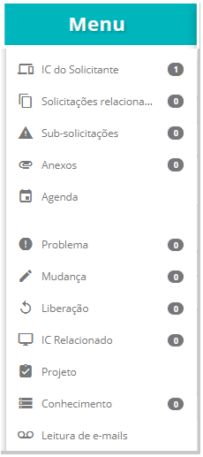

   **Figura 6 - Cadastro de ticket - menu lateral**

  -	Para adicionar arquivos ao ticket, basta clicar em Anexos;

  -	Para relacionar um problema ao ticket, clique em Problema;

  -	Para relacionar uma requisição de mudança ao ticket, clique em Mudança;

  -	Para relacionar uma requisição de liberação ao ticket, clique em Liberação;

  -	Para relacionar um IC ao ticket, clique em Itens de Configuração;

  -	Para relacionar um projeto ao ticket, clique em Projeto;

  -	Para relacionar um conhecimento ao ticket, clique em Conhecimento.

   !!! warning "ATENÇÃO"

        Os conhecimentos relacionados ao registro do ticket de atividade de requisição/incidente do serviço serão exibidos no Smart Portal, se a atividade de requisição/incidente estiver disponibilizada no mesmo.

Vinculação itens de configuração do solicitante
----------------------------------------------

### Pré-condições

1.	Ter ao menos um Item de Configuração cadastrado (ver conhecimento Gerenciamento de itens de configuração).

### Vinculando um item de configuração do solicitante

1.	Localize o ticket desejado, pressione sobre o mesmo e logo em seguida clique no ícone  ;
2.	Será apresentada a tela de registro do determinado ticket. Clique no botão de menu   e após isso, clique no Itens de configuração (IC) do solicitante;
3.	Será exibida a tela de Itens de configuração do solicitante, conforme a figura abaixo:

    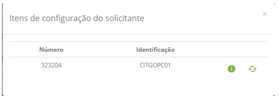

    **Figura 7 - Itens de configuração do solicitante**

4.	É possível visualizar as informações sobre este IC, clicando no ícone  . Já para vincular o IC, basta clicar em   para realizar a operação.

Vinculando sub-solicitações
---------------------------

1.	Localize o ticket desejado, pressione sobre o mesmo e logo em seguida clique no ícone ;
2.	Será apresentada a tela de registro do determinado ticket. Clique no botão de menu   e após isso, clique em Sub-solicitações;
3.	Será exibida a tela de Sub-tickets, clique no botão Pesquisar solicitações e será exibida uma listagem dos tickets registrados, conforme a figura abaixo:

    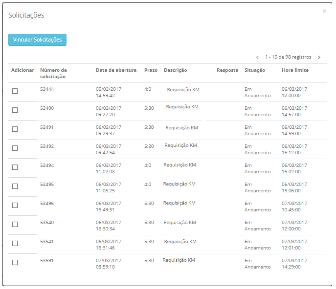

    **Figura 8 - Tela de vinculação de sub-tickets**

4.	Selecione o ticket desejado e clique em Vincular solicitações para realizar a operação.

Vinculando anexos
----------------

1.	Localize o ticket desejado, pressione sobre o mesmo e logo em seguida clique no ícone  ;
2.	Será apresentada a tela de registro do determinado ticket. Clique no botão de menu   e após isso, clique em Anexos;
3.	Será exibida a tela de Anexos, vincule o arquivo desejado, conforme a figura abaixo:

    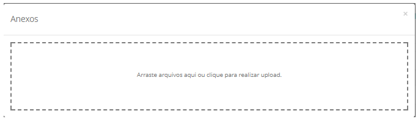

    **Figura 9 - Tela de vinculação de anexos**

Verificação das atividades periódicas
------------------------------------

1.	Localize o ticket desejado, pressione sobre o mesmo e logo em seguida clique no ícone  ;
2.	Será apresentada a tela de registro do determinado ticket. Clique no botão de menu  e após isso, clique em Agenda;
3.	Será apresentada a tela de Agenda de Atividades. A mesma é exibida em formato de calendário, onde poderá ser visualizada as atividades. A figura abaixo ilustra essa tela:

    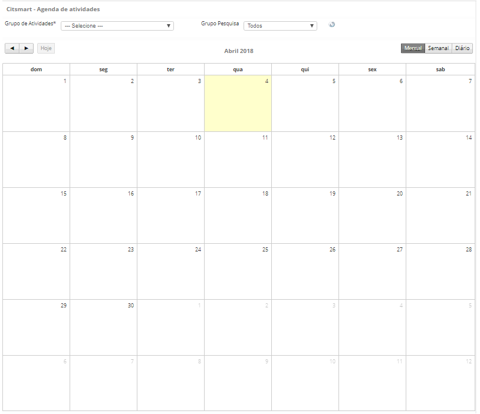

    **Figura 10 - Agenda de atividades**

•	Grupo de Atividades: selecione o grupo executor de atividades periódicas para visualizar suas tarefas agendadas;

•	Grupo Pesquisa: selecione o gerenciamento que deseja visualizar a suas atividades de que foram agendadas;

•	As atividades podem ser visualizadas mensalmente, semanalmente ou diariamente. Para definir o tipo de visualização, clique em um dos botões localizados acima do calendário: Mensal, Semanal ou Diária.

Vinculando problemas
-------------------

### Pré-condições

1.	Ter ao menos um problema cadastrado (ver conhecimento Cadastro de problema).

### Filtros

1.	O seguinte filtro possibilita ao usuário restringir a participação de itens na listagem padrão da funcionalidade, facilitando a localização dos itens desejados:

•	Pesquisar Problema.

   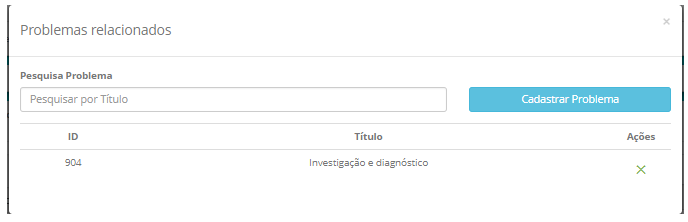

   **Figura 11 - Tela de pesquisa de problemas relacionados**

2.	No campo de pesquisa, é permitido a busca pelo título de problema previamente cadastrados;

3.	Se desejar excluir o vínculo do problema com o ticket, basta clicar no ícone  do mesmo.

### Listagem de itens

1.	Os seguintes campos cadastrais estão disponíveis ao usuário para facilitar a identificação dos itens desejados na listagem padrão da funcionalidade: ID e Título;
2.	Existe um botão de ação disponível ao usuário em relação a cada item da listagem, é ele: Remover.

### Vinculação de problemas

1.	Localize o ticket desejado, pressione sobre o mesmo e logo em seguida clique no ícone  ;
2.	Será apresentada a tela de registro do determinado ticket. Clique no botão de menu  e após isso, no item de Problema;
3.	Será exibida a tela de Problemas relacionados, clique no botão Cadastrar Problema e será exibida a tela de registro de problema, conforme ilustrado na figura abaixo:

    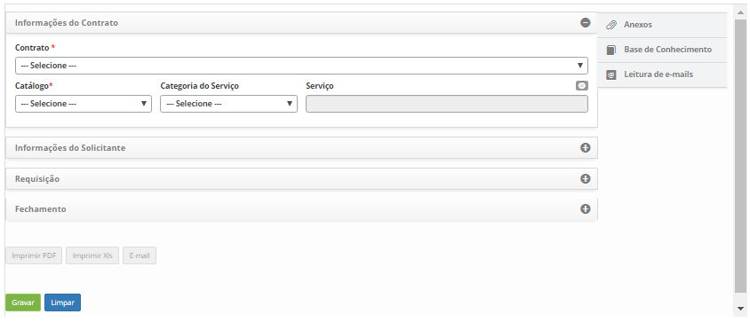

    **Figura 12 - Tela de registro de problema**

4.	Preencha os campos com as informações necessárias e clique no botão Gravar para efetuar o registro.

Vinculando requisição de mudança
-------------------------------

### Pré-condições

1.	Ter ao menos uma requisição de mudança cadastrada (ver conhecimento Cadastro de requisição de mudança).

### Filtros

1.	O seguinte filtro possibilita ao usuário restringir a participação de itens na listagem padrão da funcionalidade, facilitando a localização dos itens desejados:

•	Pesquisar mudança.

   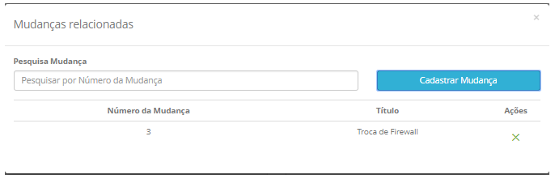

   **Figura 13 - Tela de pesquisa de mudanças relacionadas**

2.	No campo de pesquisa, é permitido a busca pelo número da mudança previamente cadastrada;
3.	Se desejar excluir o vínculo da requisição de mudança com o ticket, basta clicar no ícone   do mesmo.

### Listagem de itens

1.	Os seguintes campos cadastrais estão disponíveis ao usuário para facilitar a identificação dos itens desejados na listagem padrão da funcionalidade: Número da mudança e Título;
2.	Existe um botão de ação disponível ao usuário em relação a cada item da listagem, é ele: Remover.

### Vinculação de mudanças

1.	Localize o ticket desejado, pressione sobre o mesmo e logo em seguida clique no ícone   ;
2.	Será apresentada a tela de registro do determinado ticket. Clique no botão de menu   e após isso, clique no item de Mudança;
3.	Será exibida a tela de Mudanças relacionadas, clique no botão Cadastrar Mudança e será exibida a tela de registro de requisição de mudança, conforme ilustrado na figura abaixo:

    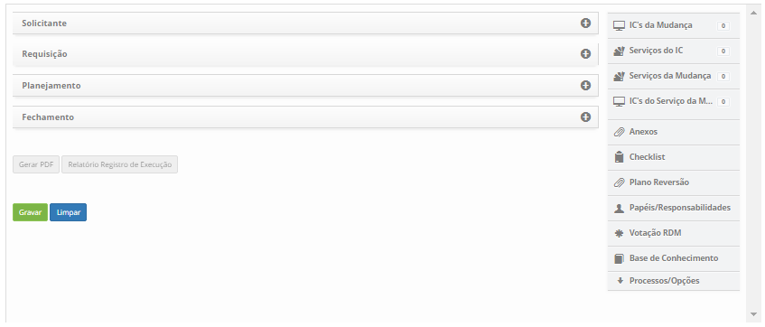

    **Figura 14 - Tela de registro de requisição de mudança**

4.	Preencha os campos com as informações necessárias e clique no botão Gravar para efetuar o registro.

Vinculação de requisição de liberação
------------------------------------

### Pré-condições

1.	Ter ao menos uma requisição de liberação cadastrada (ver conhecimento Cadastro e pesquisa de requisição de liberação).

### Filtros

1.	Os seguintes filtros possibilitam ao usuário restringir a participação de itens na listagem padrão da funcionalidade, facilitando a localização dos itens desejados:

•	Pesquisar Liberação.

   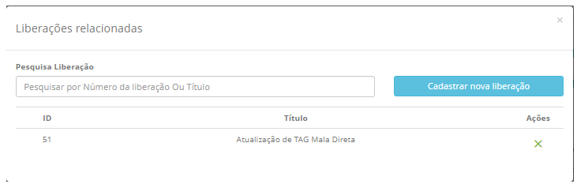

   **Figura 15 - Tela de pesquisa de liberações relacionadas**

2.	No campo de pesquisa, é permitido a busca pelo título da liberação ou pelo seu número. São pesquisadas as liberações anteriormente cadastradas;
3.	Se desejar excluir o vínculo da requisição de liberação com o ticket, basta clicar no ícone   do mesmo.

### Listagem de itens

1.	Os seguintes campos cadastrais estão disponíveis ao usuário para facilitar a identificação dos itens desejados na listagem padrão da funcionalidade: ID e Título;
2.	Existe um botão de ação disponível ao usuário em relação a cada item da listagem, é ele: Remover.

### Vinculação de liberação

1.	Localize o ticket desejado, pressione sobre o mesmo e logo em seguida clique no ícone   ;
2.	Será apresentada a tela de registro do determinado ticket. Clique no botão de menu   e após isso, clique no item de Liberação;
3.	Será exibida a tela de Liberações relacionadas, clique no botão Cadastrar nova liberação e será exibida a tela de registro de requisição de liberação, conforme ilustrado na figura abaixo:

    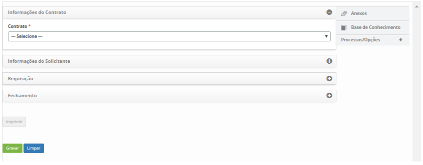

    **Figura 16 - Tela de registro de requisição de liberação**

4.	Preencha os campos com as informações necessárias e clique no botão Gravar para efetuar o registro.

Vinculando item de configuração relacionado
-------------------------------------------

### Pré-condições
 
1.	Ter ao menos um Item de Configuração cadastrado (ver conhecimento Gerenciamento de itens de configuração).

### Filtros 

1.	Os seguintes filtros possibilitam ao usuário restringir a participação de itens na listagem padrão da funcionalidade, facilitando a localização dos itens desejados:

•	Identificação;

•	Grupo;

•	Data Início;

•	Data Fim;

•	Status;

•	Criticidade do Serviço;

•	Exibir itens filhos.

   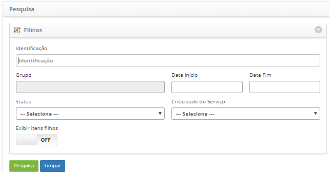

   **Figura 17 - Tela de pesquisa de item de configuração relacionado**

2.	Realize a pesquisa do item de configuração:

•	Caso deseje listar todos os itens de configuração, basta clicar diretamente no botão Pesquisa.

### Listagem de itens

1.	Os seguintes campos cadastrais estão disponíveis ao usuário para facilitar a identificação dos itens desejados na listagem padrão da funcionalidade: ID e Identificação;
2.	Existem botões de ação disponíveis ao usuário em relação a cada item da listagem, são eles: Visualizar e Selecionar.

    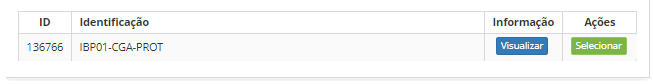

    **Figura 18 - Tela de listagem de item de configuração relacionado**

### Vinculação do item de configuração relacionado

1.	Localize o ticket desejado, pressione sobre o mesmo e logo em seguida clique no ícone  ;
2.	Será apresentada a tela de registro do determinado ticket. Clique no botão de menu  e após isso, clique no item de Item de configuração (IC) relacionado;
3.	Será exibida a tela de Itens de Configuração Relacionados, clique no botão Pesquisa item de configuração e será exibida a tela de pesquisa de item de configuração relacionado;
4.	Realize a pesquisa e selecione o item de configuração desejado e clique o botão Selecionar para efetuar a vinculação;
5.	Se desejar excluir o vínculo do item de configuração com o ticket, basta clicar no ícone  do mesmo.

Vinculando projeto
-----------------

### Pré-condições

1.	Ter permissão para executar a solicitação de serviço (ver conhecimento Cadastro e pesquisa de grupo);
2.	Ter ao menos um projeto cadastrado (ver conhecimento Cadastro e gerenciamento de projetos).

### Filtros

1.	O seguinte filtro possibilita ao usuário restringir a participação de itens na listagem padrão da funcionalidade, facilitando a localização dos itens desejados:

•	Projeto.

   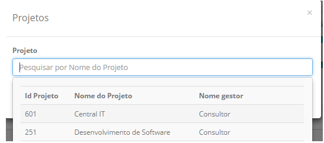

   **Figura 19 - Tela de pesquisa de projetos**

2.	Para mostrar os projetos disponíveis, basta clicar o mouse sobre o filtro.

### Listagem de itens

1.	Os seguintes campos cadastrais estão disponíveis ao usuário para facilitar a identificação dos itens desejados na listagem padrão da funcionalidade: ID Projeto, Nome do projeto e Nome gestor (vide figura anterior).

### Vinculação do projeto

1.	Localize ticket desejado, pressione sobre o mesmo e logo em seguida clique no ícone  ;
2.	Será apresentada a tela de registro do determinado ticket. Clique no botão de menu  e após isso, clique no item de Projetos;
3.	Será exibida a tela de Projetos, clique o mouse sobre o filtro. Feito isso, será exibida uma listagem dos Projetos disponíveis;
4.	Selecione o projeto desejado para efetuar a vinculação do mesmo ao ticket;
5.	Se desejar excluir o vínculo do projeto ao ticket, basta clicar no ícone  do mesmo.

Vinculando conhecimento
-----------------------

### Pré-condições

1.	Ter ao menos um conhecimento cadastrado (ver conhecimento Gerenciamento de Conhecimento).

### Filtros

1.	Os seguintes filtros possibilitam ao usuário restringir a participação de itens na listagem padrão da funcionalidade, facilitando a localização dos itens desejados:

•	Título;

•	Conteúdo.

   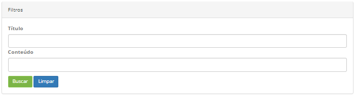

   **Figura 20 - Tela de pesquisa de conhecimentos**

2.	Realize a pesquisa do conhecimento desejado.

### Listagem de itens

1.	Os seguintes campos cadastrais estão disponíveis ao usuário para facilitar a identificação dos itens desejados na listagem padrão da funcionalidade: ID, Título, Versão, Publicado e Arquivado .

    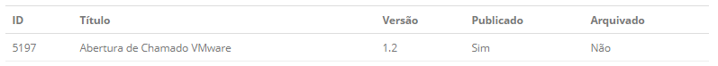

    **Figura 21 - Tela de listagem de conhecimentos**

### Vinculação do conhecimento

1.	Localize o ticket desejado, pressione sobre o mesmo e logo em seguida clique no ícone  ;
2.	Será apresentada a tela de registro do determinado ticket. Clique no botão de menu  e após isso, clique em Conhecimento;
3.	Será exibida a tela de Conhecimento, clique no botão Pesquisa de Conhecimentos. Será aberto a tela de pesquisa da base de conhecimento;
4.	Pesquise e selecione o conhecimento desejado para efetuar a vinculação do mesmo ao ticket;
5.	Se desejar excluir o vínculo do conhecimento ao ticket, basta clicar no ícone  do mesmo.

Vinculando e-mails lidos
------------------------

### Pré-condições

1.	Ter permissão para registrar ticket (ver conhecimento Cadastro e pesquisa de grupo);
2.	Ter o colaborador cadastrado (ver conhecimento Cadastro e pesquisa de colaborador);
3.	Ter o grupo cadastrado (ver conhecimento Cadastro e pesquisa de grupo);
4.	Ter o contrato cadastrado (ver conhecimento Cadastro e pesquisa de contrato);
5.	Ter a unidade cadastrada (ver conhecimento Cadastro e pesquisa de unidade);
6.	Ter o grupo vinculado ao contrato (ver conhecimento Como relacionar grupo ao contrato?);
7.	Ter a unidade vinculada ao contrato (ver conhecimento Como relacionar unidade ao contrato?);
8.	Ter o portfólio com o serviço e as atividades de requisição e incidente cadastrados (ver conhecimentos Cadastro de portfólio de serviços, Cadastro de serviços, Configuração dos atributos do serviço);
9.	Ter o tempo de atendimento das atividades de requisição e incidente definidos (ver conhecimento Cadastro e pesquisa de tempo de atendimento);
10. Ter o contrato vinculado ao serviço (ver conhecimento Configuração dos atributos do serviço);
11. Ter as atividades de requisição e incidente vinculadas ao contrato do serviço (ver conhecimento Configuração dos atributos do contrato do serviço);
12. Configure o parâmetro 9 (ver conhecimento Regras de parametrização - ticket);
13. O solicitante deve estar incluído no grupo que está vinculado ao contrato para que seja possível registrar o ticket;
14. Configure os parâmetros 23,24,25,26,27,28 e 72 (ver conhecimento Regras de parametrização - e-mail).

### Vinculação de leituras de e-mail

   !!! info "INFORMAÇÃO"

        A leitura de e-mail só será realizada se os parâmetros estiverem configurados corretamente.
        
1.	Localize o ticket desejado, pressione sobre o mesmo e logo em seguida clique no ícone  ;
2.	Será apresentada a tela de registro do ticket. Clique no botão de menu  e após isso, clique no item de Leitura de e-mails;
3.	Será exibida uma tela para verificar os e-mails recebidos, conforme ilustrada na figura abaixo:

    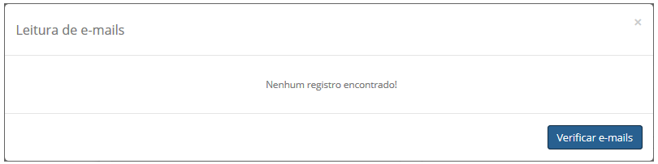

    **Figura 22 - Tela de leitura de e-mails**
    
4.	Clique no botão Verificar e-mails. Serão exibidos os e-mails, conforme exemplo ilustrado na figura abaixo:

    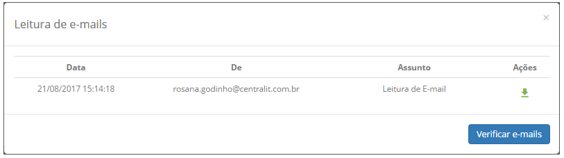

    **Figura 23 - Leitura de e-mails**
    
5.	Clique no ícone  do e-mail para criar o ticket com base no mesmo. Feito isso, será apresentada a tela de cadastro de ticket;
6.	Caso o remetente do e-mail escolhido seja um colaborador cadastrado no sistema, após clicar no ícone  , os campos para preenchimento de informações do solicitante serão preenchidos pelo sistema. Mas caso o remetente não seja um colaborador cadastrado no sistema, deverá preencher os campos com as informações necessárias;
7.	Independente se o remetente é ou não um colaborador cadastrado no sistema, o campo Descrição será preenchido com o conteúdo do e-mail, conforme mostrado na figura abaixo:

    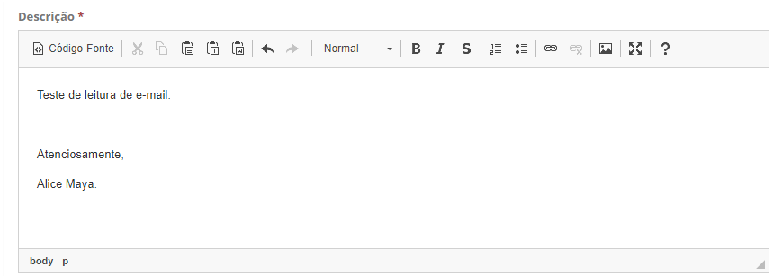

     **Figura 24 - Tela de registro de ticket**
    
8.	Registre as demais informações do ticket, clique no botão de opções  e logo em seguida clique no botão gravar  para efetuar o registro, onde a data, hora e usuário serão gravados automaticamente para uma futura auditoria.

Captura de ticket
----------------

### Pré-condições

1.	Ter permissão para executar o ticket (ver conhecimento Cadastro e pesquisa de grupo).

### Capturando ticket

1.	Será apresentada a tela de Gerenciamento de Ticket;
2.	Localize o ticket desejado, pressione sobre o mesmo e logo em seguida clique no ícone  ;
3.	Será exibida a tela para confirmar a captura do ticket, ou seja, para confirmar que é o responsável pela execução do ticket, conforme ilustrada na figura a seguir:

    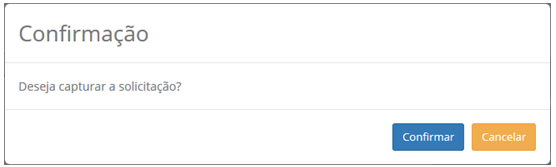

    **Figura 25 – Confirmação da captura do ticket**
    
4.	Confirme a captura do ticket. Após isso, será apresentada a tela de registro do ticket para verificação de suas informações.

    !!! warning "ATENÇÃO"
    
        Uma vez capturado o ticket, passa a ser possível executar a vinculação dele com vários outros itens: Itens de configuração do           solicitante, solicitações relacionadas, sub-solicitações, anexos, agenda, problema, mudança, liberação, itens de configuração           relacionado, projeto, conhecimento e leituras de e-mails (vide a figura 6), conforme explanado nas seções seguintes.

Cadastro da execução do ticket
-----------------------------

### Pré-condições

1.	Ter permissão para executar o ticket (ver conhecimento Cadastro e pesquisa de grupo);
2.	Ter a causa de incidentes cadastrada (ver conhecimento Cadastro e pesquisa de causa de incidentes);
3.	Ter a categoria de solução cadastrada (ver conhecimento Cadastro e pesquisa de categoria de solução).

### Cadastrando a execução do ticket

1.	Será exibida a tela de Gerenciamento Ticket;
2.	Localize o ticket que irá registrar sua execução, clique sobre o mesmo e logo em seguida clique no ícone  ;
3.	Será apresentada a tela de registro do determinado ticket. Registre as informações necessárias referente à execução do mesmo;

    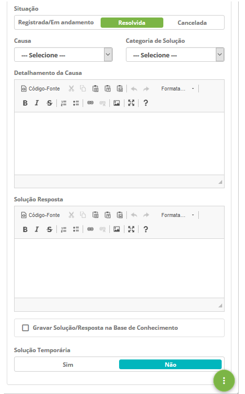

    **Figura 26 - Cadastro da execução do ticket**

•	Caso tenha concluído o atendimento do ticket, altere a situação do mesmo para "Resolvida", basta clicar na situação para alterar. Após isso, informe os dados sobre a solução que foi realizada:

  -	Se o tipo de ticket for Incidente, preencha os campos:

     * Causa: selecione a causa do incidente;
     * Categoria de Solução: selecione a categoria de solução do incidente;
     * Detalhamento da Causa: descreva os detalhes da causa do incidente;
     * Solução Resposta: descreva os detalhes da solução que foi realizada para atendimento do incidente;
     * Gravar Solução/Resposta na Base de Conhecimento: caso queira gravar a "solução resposta" na base de conhecimento, marque esse campo e informe o título do novo conhecimento;
     * Solução Temporária: indique se a atividade realizada para atendimento do incidente foi uma solução temporária.

   -	Se o tipo de ticket for Requisição, preencha o campo Solução Resposta, descreva o que foi realizado para atendimento da requisição de serviço.
      
•	Para anexar um arquivo referente à execução do ticket, basta clicar no ícone de menu   e clicar em Anexos;

•	Para registrar uma ocorrência referente ao ticket, clique no ícone   localizado no canto superior direito da tela.

4.	Após registro das informações sobre a execução da atividade para atendimento do ticket, clique no botão de opções  e logo em seguida clique no botão   para gravar e avançar o fluxo, onde o ticket será encaminhado para fase de validação e encerramento. Mas, caso queira gravar somente as informações registradas sobre a execução do ticket e manter a tarefa atual, clique no botão  .

   !!! warning "ATENÇÃO"

       Caso tenha optado por "Gravar a Solução/Resposta na Base de Conhecimento", ao gravar o ticket, o conhecimento será criado e            vinculado ao ticket.

Validação e encerramento do ticket
----------------------------------

### Pré-condições

1.	Ter permissão para validar o ticket (ver conhecimento Cadastro e pesquisa de grupo);

### Validando o ticket

1.	Localize o ticket que irá registrar sua execução, clique sobre o mesmo e logo em seguida clique no ícone  ;
2.	Será exibida a tela de registro do determinado ticket. Certifique-se que foi feito o atendimento do ticket de acordo com o que foi solicitado e registre as informações necessárias sobre a validação do mesmo;

    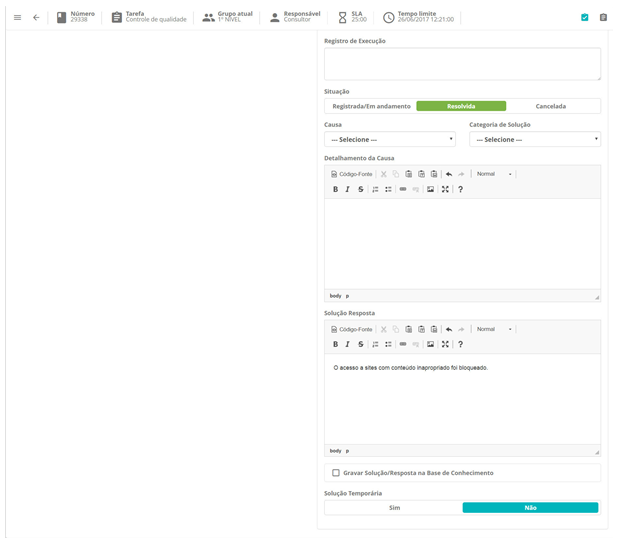

    **Figura 27 - Registro do ticket**

3.	No campo Registo de Execução, descreva as informações sobre a execução de sua atividade;
4.	Após a validação do atendimento do ticket, clique no botão de opções   e logo em seguida clique no botão   para gravar e avançar o fluxo, onde o ticket será finalizado com sucesso. Mas, caso queira gravar somente as informações registradas sobre a validação do ticket e manter a tarefa atual, clique no botão   .

Cadastro de ocorrência referente ao ticket
------------------------------------------

### Pré-condições

1.	Ter permissão para executar o ticket (ver conhecimento Cadastro e pesquisa de grupo).

### Cadastrando ocorrência referente ao ticket

1.	Será apresentada a tela de Gerenciamento de Ticket. Localize o ticket no qual irá registrar a ocorrência, clique sobre o mesmo e logo em seguida clique no ícone  .
2.	No registro do ticket, clique no ícone   localizado no canto superior direito da tela. Após isso, serão exibidas as ocorrências do ticket, conforme exemplo ilustrado na figura abaixo:

    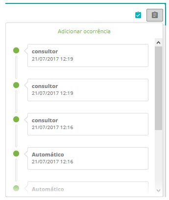

    **Figura 28 - Ocorrências do ticket**

3.	Clique em Adicionar ocorrência. Feito isso, será apresentada a tela de Ocorrências, clique na aba Cadastro de Ocorrências;

    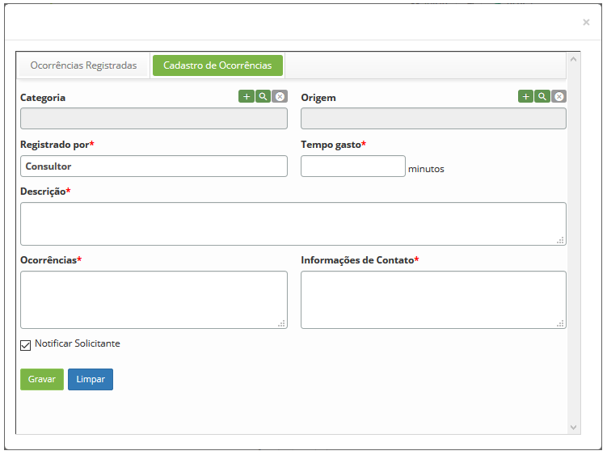

    **Figura 29 - Tela de cadastro de ocorrência**
    
4.	Preencha os campos conforme orientação abaixo:

•	Categoria: informe a categoria da ocorrência. Caso não seja encontrada a categoria, é possível realizar um cadastro rápido a partir dessa tela, basta clicar no ícone  ;

•	Origem: informe a origem da ocorrência. Caso não seja encontrada a origem, é possível realizar um cadastro rápido a partir dessa tela, basta clicar no botão ícone  ;

•	Registrado por: informe por quem está sendo registrada a ocorrência;

•	Tempo Gasto: informe a quantidade de minutos gasto com a ocorrência;

•	Descrição: informe uma breve descrição da ocorrência;

•	Ocorrência: descreva as ocorrências;

•	Informações de Contato: descreva as informações para contato;

•	Notificar Solicitante: marque este campo caso deseje comunicar ao solicitante o registro da ocorrência, sendo assim, será enviado um e-mail de notificação de ocorrência ao solicitante utilizando o modelo de e-mail vinculado ao parâmetro que o define.

5.	Após os dados informados, clique no botão Gravar para efetuar a operação, como complemento da operação, a data, hora e usuário serão gravados automaticamente para uma futura auditoria.

Aprovação de ticket
------------------

### Pré-condições

1.	Ter permissão para aprovar o ticket (ver conhecimento Cadastro e pesquisa de grupo).

### Aprovando o ticket

   !!! note "NOTA"
    
        Em alguns casos, os tickets do tipo “Requisição” irão passar por uma fase de aprovação para execução dos mesmos. Isso irá depender do fluxo de trabalho do ticket, o qual está vinculado a atividade de requisição do serviço.

1.	Será exibida a tela de Gerenciamento Ticket;
2.	Localize o ticket que irá aprovar para o atendimento, clique sobre o mesmo e logo em seguida clique no ícone  .
3.	Será exibida a tela de registro do determinado ticket. Verifique o ticket e registre as informações necessárias referente à aprovação do mesmo;

    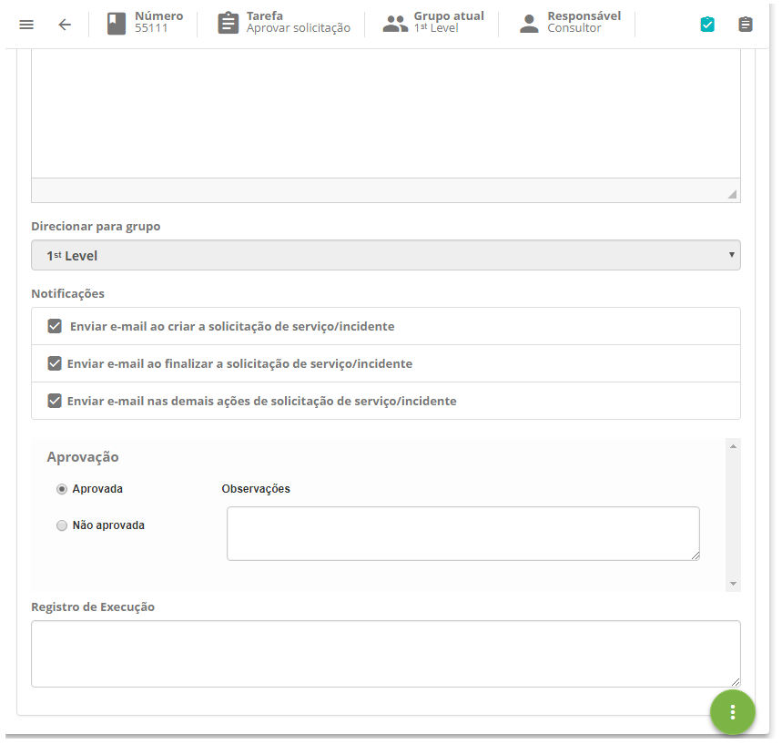

    **Figura 30 - Cadastro de aprovação do ticket**

•	Marque uma das opções de aprovação: Aprovada ou Não aprovada;

•	Caso tenha marcado "Aprovada", descreva as observações, se achar necessário;

•	Caso tenha marcado "Não aprovada", descreva as observações, informe a justificativa e o complementa da justificativa.

4.	Após registro das informações sobre a aprovação do ticket, clique no botão de opções   e logo em seguida clique no botão   para gravar e avançar o fluxo. Feito isso, se o ticket estiver sido aprovado, o mesmo será encaminhado para a fase de execução, ou seja, para o atendimento do mesmo. Mas, caso o ticket não seja aprovado, o mesmo será encerrado.

Cancelamento de ticket
----------------------

### Pré-condições

1.	Ter permissão para cancelar o ticket (ver conhecimento Cadastro e pesquisa de grupo).

### Cancelando o ticket

1.	Será exibida a tela de Gerenciamento Ticket;
2.	Localize o ticket desejado, pressione sobre o mesmo e logo em seguida clique no ícone   ;
3.	Será exibida a tela de registro do determinado ticket. Registre as informações necessárias referente ao cancelamento do mesmo;

    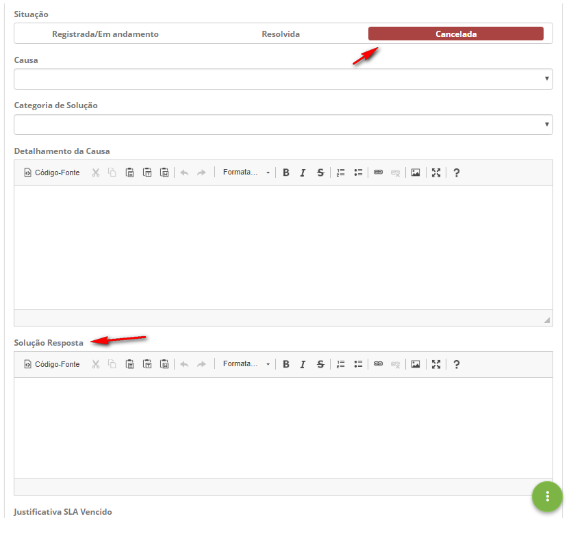

    **Figura 31 - Registro do cancelamento do ticket**

•	Altere a situação do ticket para "Cancelada", basta clicar na situação para alterar;

•	No campo Solução Resposta, descreva o porquê de estar cancelando o ticket.

4.	Após registro das informações do cancelamento do ticket, clique no botão de opções   e logo em seguida clique no botão   para gravar e avançar o fluxo, onde o ticket será cancelado. Mas, caso queira gravar somente as informações registradas sobre o cancelamento do ticket e manter a tarefa atual, clique no botão  .

Direcionamento do ticket
-----------------------

### Pré-condições

1.	Ter permissão para executar o ticket (ver conhecimento Cadastro e pesquisa de grupo).

### Direcionando o ticket para atendimento

1.	Será apresentada a tela de Gerenciamento de Ticket. Localize o ticket desejado, pressione sobre o mesmo e logo em seguida clique no ícone  ;
2.	Será exibida a tela de registro do ticket com os campos preenchidos, com o conteúdo referente ao ticket selecionado;
3.	No campo Direcionar para grupo, selecione o grupo para o qual será direcionado o ticket para realizar o atendimento do mesmo;
4.	Clique no botão de opções   e logo em seguida clique no botão  para gravar e avançar o fluxo, onde o ticket será encaminhado para fase de atendimento. Mas, caso queira gravar somente as informações registradas sobre a validação do ticket e manter a tarefa atual, clique no botão  .

Delegação do ticket
-------------------

### Pré-condições

1.	Ter permissão para executar o ticket (ver conhecimento Cadastro e pesquisa de grupo);
2.	Para que essa opção esteja visível é necessário sua configuração no fluxo vinculado (ver conhecimento Manutenção de fluxo de trabalho, seção Implementando a funcionalidade delegar no fluxo sobre a atividade).

### Delegando um ticket

1.	Localize o ticket que irá delegar, clique sobre o mesmo e logo em seguida clique no ícone de “opções” e em Delegar, conforme indicado na figura abaixo:

    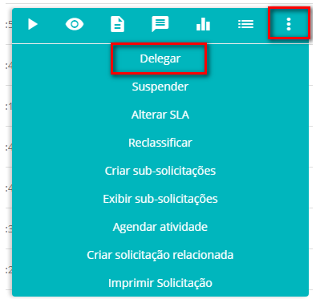

    **Figura 32 – Delegar o ticket**
    
2.	Será exibida a tela de atribuição, conforme ilustrada na figura abaixo:

    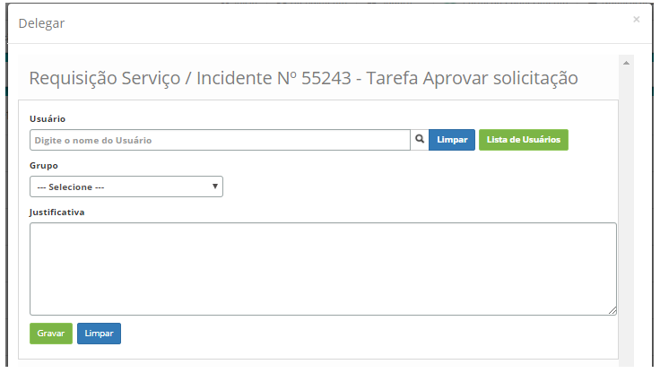

    **Figura 33 – Tela de atribuição**
    
3.	Informe o grupo ou usuário que deseja delegar o ticket;
4.	Descreva a justificativa da delegação do ticket.

    !!! info "INFORMAÇÃO"

        No campo “Atribuir ao grupo”, serão disponibilizados somente os grupos em que pertence. No campo onde se informa o usuário, serão disponibilizados somente os membros dos grupos em que pertence.

5.	Após informar os dados, clique no botão Gravar. Feito isso, será exibida uma mensagem questionando a delegação da tarefa, basta clicar em Ok para efetuar a operação;
6.	O registro do ticket será atualizado, exibindo o nome do grupo ou usuário, ao qual foi delegado o ticket, de acordo com o exemplo ilustrado na figura a seguir:

    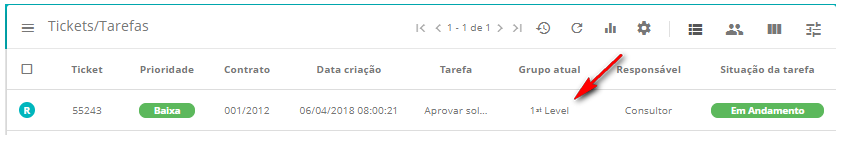

    **Figura 34 – Ticket delegado**

Suspensão do ticket
------------------

### Pré-condições

1.	Ter permissão para suspender a solicitação de serviço (ver conhecimento Cadastro e pesquisa de grupo);
2.	Ter a justificativa de suspensão de solicitação cadastrada (ver conhecimento Cadastro e pesquisa de justificativa de solicitação).

### Suspendendo o ticket

1.	Localize o ticket que irá suspender, clique sobre o mesmo e logo em seguida clique no ícone de “Opções” e em Suspender, conforme indicado na figura abaixo:

    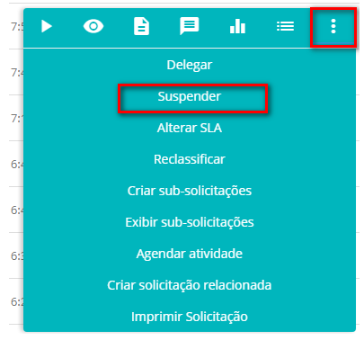

    **Figura 35 - Suspendendo ticket**

2.	Será exibida a tela de registro da justificativa da suspensão do ticket;

    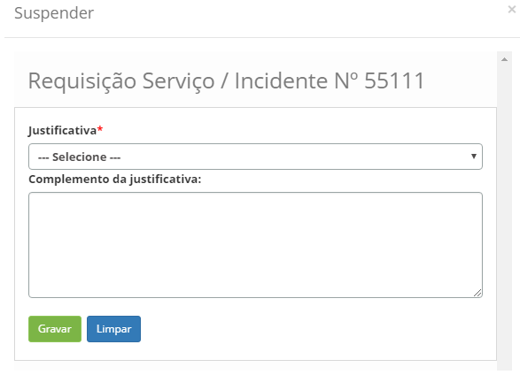

    **Figura 36 - Registro da justificativa da suspensão do ticket**

•	Justificativa: selecione a justificativa de suspensão do ticket;

•	Complemento da Justificativa: descreva o complemento da justificativa selecionada, se achar necessário.

3.	Após os dados informados, clique no botão Gravar para efetuar a operação, onde a data, hora e usuário serão gravados automaticamente para uma futura auditoria;
4.	Após a suspensão do ticket, o mesmo será atualizado, mudando a situação para “Suspensa”, conforme exemplo ilustrado na figura abaixo:

    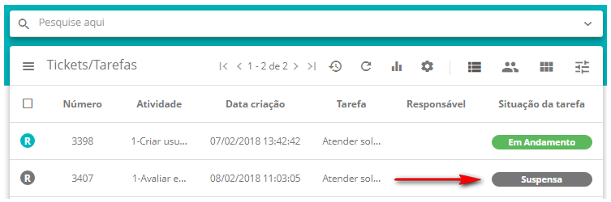

    **Figura 37 - Ticket suspenso**

Suspensão e reativação de múltiplos tickets
------------------------------------------

### Pré-condições

1.	Ter permissão para realizar a suspensão e reativação de múltiplos tickets (ver conhecimento Cadastro e pesquisa de grupo);
2.	Ter o contrato cadastrado (ver conhecimento Cadastro e pesquisa de contrato);
3.	Ter o colaborador cadastrado (ver conhecimento Cadastro e pesquisa de colaborador);
4.	Ter o grupo cadastrado (ver conhecimento Cadastro e pesquisa de grupo);
5.	Ter a justificativa de ticket cadastrada (ver conhecimento Cadastro e pesquisa de justificativa de solicitação).

### Suspendendo múltiplos tickets

1.	Será exibida a tela de Gerenciamento Ticket;
2.	Clique no ícone   e em Suspensão/Reativação, conforme indicado na figura abaixo:

    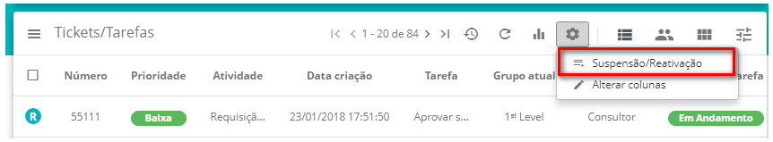

    **Figura 38 - Suspensão de tickets**

3.	Será exibida a tela de Suspensão de Múltiplos Tickets, conforme ilustrada na figura abaixo:

    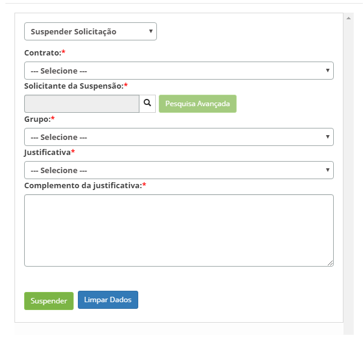

    **Figura 39 - Tela de suspensão de múltiplos tickets**

4.	Todos os campos dessa tela na verdade são filtros, ou seja, o usuário que vai suspender em massa filtra:

  -	Contrato: selecione o contrato (o sistema filtra pelos contratos que o usuário logado possui permissão de acesso), no qual será realizada a suspensão dos tickets;

  -	Solicitante da Solicitação: informe o responsável por solicitar a suspensão dos tickets (esse campo filtra os tickets cujo o solicitante está). Basta clicar dentro da caixa de texto e digitar as inicias do nome do solicitante que será feita a busca dos usuários ligados ao contrato selecionado. Outra forma de busca é utilizar o botão Pesquisa Avançada, que apresentará uma tela de pesquisa, onde poderá informar os dados necessários para sua pesquisa e após informá-los, clicar em Pesquisar e selecionar o colaborador, responsável pela suspensão dos tickets;

  -	Grupo: selecione o grupo responsável pelo atendimento dos tickets que serão suspensos. Neste campo, serão disponibilizados somente os grupos de Service Desk ativos ao qual o solicitante informado pertence;

   !!! warning "ATENÇÃO"

        Ao registrar o grupo do qual o usuário é membro (através da funcionalidade Acesso e Permissão → Grupo), no campo "Suspensão/Reativação" selecione o valor "Não". O fato do usuário selecionar "Não" para este campo Suspensão/Reativação da tela de cadastro de grupo não influencia no aparecimento do botão “Suspensão/Reativação” na tela de ticket

  -	Justificativa: selecione uma justificativa da suspensão dos tickets;

  -	Complemento da justificativa: descreva o complemento da justificativa selecionada.

   !!! warning "ATENÇÃO"

        O usuário logado sempre é colocado como responsável da suspensão ou da reativação dos tickets.

5.	Após os dados informados, clique no botão Suspender para efetuar a operação, onde todas aos tickets "em andamento" do grupo executor selecionado serão suspensos.

### Reativando múltiplos tickets suspensos

1.	Na tela de Gerenciamento Ticket, clique no ícone   e em Suspensão/Reativação, conforme indicado na figura abaixo:

    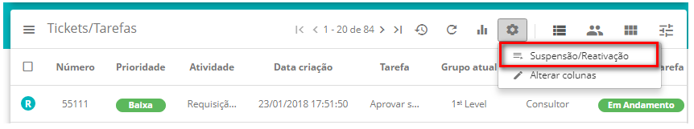

    **Figura 40 - Reativação de tickets**

2.	Será exibida a tela de Suspensão/Reativação de Múltiplos Tickets. Selecione a opção "Reativar Solicitação". Feito isso, será apresentada a tela para reativação dos tickets, conforme ilustrado na figura abaixo:

    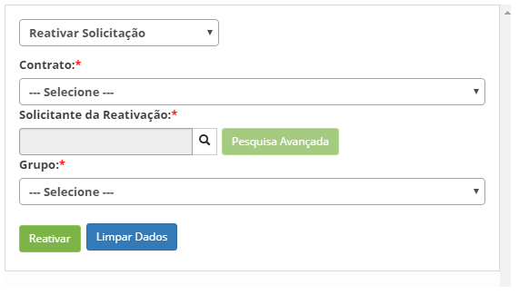

    **Figura 41 - Tela de reativação de tickets suspensos**

  -	Contrato: selecione o contrato, no qual será realizada a reativação dos tickets suspensos;

  -	Solicitante da Reativação: informe o responsável por solicitar a reativação dos tickets suspensos. Basta clicar dentro da caixa de texto e digitar as inicias do nome do solicitante que será feita a busca dos usuários ligados ao contrato selecionado. Outra forma de busca é utilizar o botão Pesquisa Avançada, que apresentará uma tela de pesquisa, onde poderá informar os dados necessários para sua pesquisa e após informá-los, clicar em Pesquisar e selecionar o colaborador, responsável pela reativação dos tickets suspensos;

  -	Grupo: selecione o grupo responsável pelo atendimento dos tickets que estão suspensos. Neste campo serão disponibilizados somente os grupos de Service Desk ativos ao qual o solicitante informado pertence.

3.	Após os dados informados, clique no botão Reativar, para efetuar a operação, onde todos os tickets do grupo executor selecionado que estão suspensos serão reativados.

Reativação de um ticket suspenso
--------------------------------

### Pré-condições

1.	Ter permissão para reativar o ticket suspenso (ver conhecimento Cadastro e pesquisa de grupo).

### Reativando o ticket

1.	Será exibida a tela de Gerenciamento Ticket;
2.	Localize o ticket suspenso que irá reativar, clique sobre o mesmo e logo em seguida clique no ícone de “opções” e em Reativar, conforme indicado na figura abaixo:

    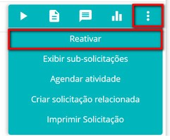

    **Figura 42 - Reativar o ticket**

3.	Será exibida uma mensagem para confirmação da reativação do ticket, basta clicar em Confirmar para efetuar a operação.

Alteração do sla do ticket
-------------------------

### Pré-condições

1.	Ter permissão para alterar o SLA do ticket (ver conhecimento Cadastro e pesquisa de grupo);
2.	Ter a justificativa de ticket cadastrada (ver conhecimento Cadastro e pesquisa de justificativa de solicitação).

### Alterando o SLA

1.	Localize o ticket que irá modificar o tempo de atendimento, clique sobre o mesmo e logo em seguida clique no ícone de opções e em Alterar SLA, conforme indicado na figura abaixo:

    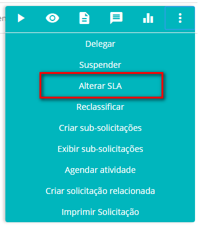

    **Figura 43 - Alteração de tempo de atendimento**

2.	Será exibida a tela para modificar o tempo de atendimento da determinado ticket, conforme ilustrada na figura abaixo:

    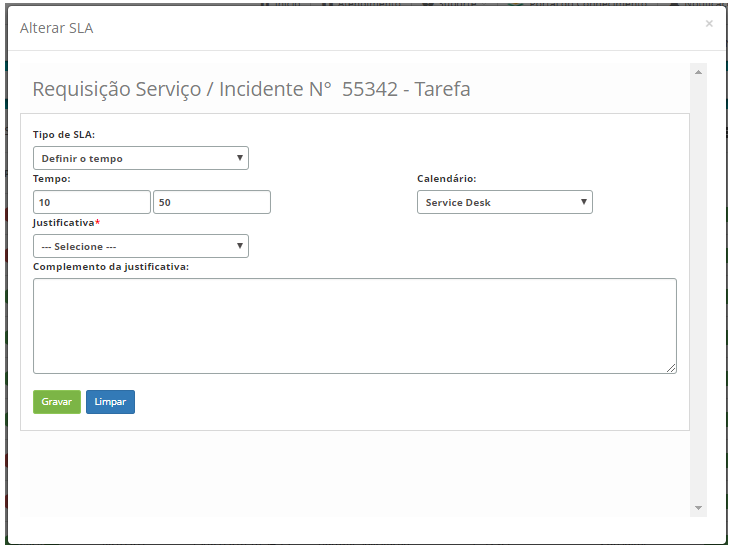

    **Figura 44 - Alteração de SLA do ticket**

  -	Tipo de SLA: defina o tipo de acordo de nível de serviço;

  -	Tempo: defina a quantidade de horas que levará para atender o ticket;

  -	Calendário: informe o calendário que seguirá para contabilizar o tempo de atendimento;

  -	Justificativa: selecione a justificativa referente a mudança do tempo de atendimento do ticket;

  -	Complemento da justificativa: descreva os detalhes da justificativa selecionada, se achar necessário.

3.	Após os dados informados, clique no botão Gravar para efetuar a operação, onde a data, hora e usuário serão gravados automaticamente para uma futura auditoria.

Reclassificação do ticket
------------------------

### Pré-condições

1.	Pertencer ao grupo executor do ticket;
2.	Ter permissão para "criar" no fluxo da atividade destino quando a reclassificação incluir troca da atividade e se for um cenário de fluxos diferentes. Neste mesmo cenário, para manter o responsável deve ter permissão para "executar" no fluxo da atividade destino;
3.	Não é permitido delegar ao ticket a um atendente se a situação dela for Resolvida.

### Reclassificando o ticket

1.	Localize o ticket que irá reclassificar, clique sobre o mesmo e logo em seguida clique no ícone de opções e em Reclassificar, conforme indicado na figura abaixo:

    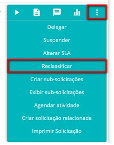

    **Figura 45 - Reclassificar ticket**

2.	Será exibida a tela de registro da determinado ticket;
3.	Reclassifique as informações do serviço. Após isso, clique no botão de opções  e logo em seguida clique no botão gravar . Feito isso, o ticket será reclassificado.

   !!! warning "ATENÇÃO"
    
       Após efetuar a alteração das informações do ticket (incidente), será enviado um e-mail para o solicitante notificando sobre a alteração feita. Se essa alteração for na descrição do ticket, será apresentado no e-mail de notificação (em destaque) a alteração feita na descrição. Lembrando que esse e-mail de notificação somente será enviado caso tenha habilitado o envio do mesmo no parâmetro "231 - Ativar envio de e-mail quando for editado um incidente (S ou N - Default: S)". A reclassificação inclui uma delegação implícita para o Grupo ou Atendente destino, em versões anteriores, o usuário tinha que: reclassificar, capturar a atividade e delegar a outro grupo

Criação e visualização de sub-solicitação
-----------------------------------------

### Pré-condições

1.	Ter permissão para registrar ticket (ver conhecimento Cadastro e pesquisa de grupo);
2.	Ter o colaborador cadastrado (ver conhecimento Cadastro e pesquisa de colaborador);
3.	Ter a unidade cadastrada (ver conhecimento Cadastro e pesquisa de unidade).

### Criando a sub-solicitação

1.	Localize o ticket do qual irá criar um sub-ticket, clique sobre o mesmo e logo em seguida clique no ícone de “opções” e em Criar sub-solicitações, conforme indicado na figura abaixo:

    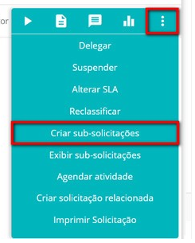

    **Figura 46 - Criar sub-ticket**

2.	Será exibida a tela de Criação de Sub-solicitação, conforme ilustrada na figura abaixo:

    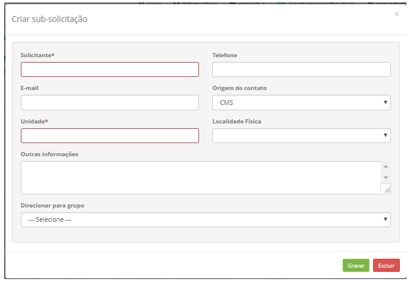

    **Figura 47 - Cadastro de sub-ticket**

3.	Preencha os campos com as informações do solicitante:

  -	Solicitante: informe o nome do solicitante, ou seja, o nome da pessoa que está solicitando o serviço referente ao ticket;

   !!! note "NOTA"
    
        Caso o solicitante já tenha os dados pessoais (telefone, e-mail e/ou unidade) registrados no sistema, após informá-lo, os campos referentes aos dados serão preenchidos com as respectivas informações

  -	Telefone: informe o telefone do solicitante para contato;

  -	E-mail: informe o e-mail do solicitante para contato;

  -	Origem do contato: informe a origem do contato para registro do sub-ticket;

  -	Unidade: informe a unidade do solicitante;

  -	Localidade física: informe a localização do solicitante;

  -	Outras Informações: descreva as observações sobre o solicitante, se achar necessário;

  -	Direcionar para grupo: informe em qual grupo você deseja direcionar o sub-ticket.

4.	Após os dados informados, clique no botão Gravar para efetuar a operação, onde a data, hora e usuário serão gravados automaticamente para uma futura auditoria.

### Visualizando sub-solicitações

1.	Localize o ticket que irá visualizar o sub-ticket, clique sobre o mesmo e logo em seguida clique no ícone de “opções” e em Exibir sub-solicitações, conforme indicado na figura abaixo:

    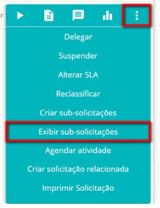

    **Figura 48 - Exibir sub-ticket**

2.	Será exibida uma tela contendo os sub-tickets, conforme exemplo ilustrado na figura abaixo:

    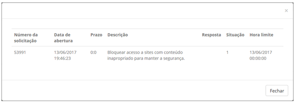

    **Figura 49 - Sub-ticket**

Agendamento de atividade de ticket
---------------------------------

### Pré-condições

1.	Ter os grupos de atividade periódica cadastrados para agendamento das atividades do ticket (ver conhecimento Cadastro e pesquisa de grupo de atividade periódica).

### Agendando atividade

1.	Localize o ticket que deseja agendar uma atividade, clique sobre o mesmo e logo em seguida clique no ícone de opções e em Agendar Atividade, conforme indicado na figura abaixo:

    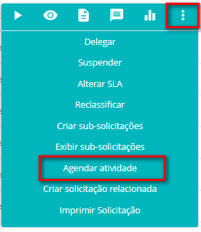

    **Figura 50 - Agendar atividade referente ao ticket**

2.	Será exibida a tela de Agendamento de Atividades, clique na aba Criar Agendamento e preencha os campos, conforme indicado a seguir;

    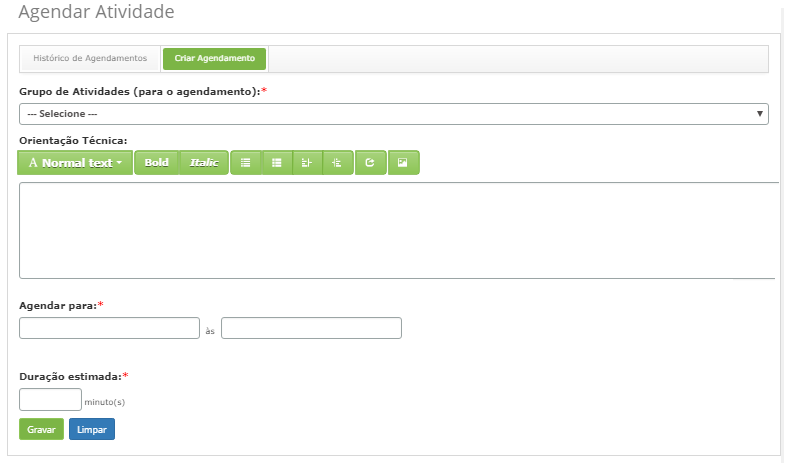

    **Figura 51 - Agendamento de atividades**

  -	Grupo de Atividades (para o agendamento): selecione o grupo que será responsável por executar a atividade;

  -	Orientação Técnica: descreva a orientação técnica necessária para execução da atividade;

  -	Agendar para: informe a data e hora, período que será agendado a atividade para sua execução;

  -	Duração estimada: informe a duração estimada em minutos, ou seja, o tempo que levará para realizar a atividade.

3.	Após os dados informados, clique no botão Gravar para efetuar a operação, onde a data, hora e usuário serão gravados automaticamente para uma futura auditoria.

     !!! info "INFORMAÇÃO"

         As atividades que foram agendadas poderão ser visualizadas na Agenda de Atividades. Para acessar a agenda, clique em Agenda, localizada no menu da tela de Gerenciamento de Ticket ou no menu principal, Gestão Integrada > Automação das Operações de TI > Agenda Ativ. Periódicas

Cadastro e vinculação de ticket relacionado
------------------------------------------

### Pré-condições

1.	Ter permissão para registrar ticket (ver conhecimento Cadastro e pesquisa de grupo);
2.	Ter o colaborador cadastrado (ver conhecimento Cadastro e pesquisa de colaborador);
3.	Ter o contrato cadastrado (ver conhecimento Cadastro e pesquisa de contrato);
4.	Ter a unidade cadastrada (ver conhecimento Cadastro e pesquisa de unidade);
5.	Ter o grupo vinculado ao contrato (ver conhecimento Como relacionar grupo ao contrato?);
6.	Ter a unidade vinculada ao contrato (ver conhecimento Como relacionar unidade ao contrato?);
7.	Ter o portfólio com o serviço e as atividades de requisição e incidente cadastrados (ver conhecimentos Cadastro de portfólio de serviços, Cadastro de serviços, Configuração dos atributos do serviço);
8.	Ter o tempo de atendimento das atividades de requisição e incidente definidos (ver conhecimento Cadastro e pesquisa de tempo de atendimento);
9.	Ter o contrato vinculado ao serviço (ver conhecimento Configuração dos atributos do serviço)
10.	Ter as atividades de requisição e incidente vinculadas ao contrato do serviço (ver conhecimento Configuração dos atributos do contrato do serviço);
11.	Informe o conteúdo abaixo no parâmetro (ver conhecimento Regras de parametrização - sistema):

-  	Parâmetro 385: setar em "S".

   !!! note "NOTA"

        Existe na funcionalidade duas formas de cadastrar um ticket. Enquanto uma forma permite um cadastro mais completo, com o preenchimento de campos mais detalhados dentro do próprio ticket (maiores informações na seção seguinte). A outra permite um cadastro mais superficial através de um atalho que se localiza fora do ticket (explicado na seção Criando o ticket relacionado pelo atalho).

### Vinculação de tickets relacionados

1.	Localize o ticket desejado, pressione sobre o mesmo e logo em seguida clique no ícone  ;
2.	Será apresentada a tela de registro do determinado ticket. Clique no botão de menu  e após isso, clique em Solicitações relacionadas;
3.	Será exibida a tela de Solicitações relacionados, conforme ilustrado na figura abaixo:

    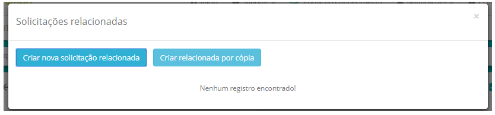

    **Figura 52 - Tela de solicitações relacionadas**

4.	Ao clicar no botão Criar nova solicitação relacionada , será exibida a tela de registro de ticket relacionado, conforme ilustrado na figura abaixo:

    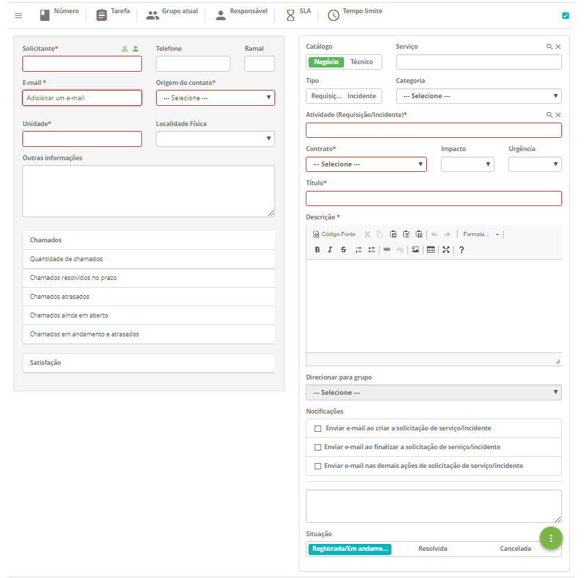

    **Figura 53 - Tela de cadastro de ticket relacionado**
    
5.	Preencha os campos com as informações necessárias e clique no botão Gravar para efetuar o registro;

    !!! warning "ATENÇÃO"
    
       O preenchimento das respostas de qualquer questionário previamente cadastro só pode ser respondido nesta tela pois a mesma fornece um cadastro de ticket mais amplo.

6.	Ao selecionar o botão Criar Relacionada por cópia são reaproveitados os campos descritos na solicitação principal (pai).

    !!! warning "ATENÇÃO"
 
        O botão Criar relacionada por cópia somente estará disponível se o parâmetro 385 for ativado.

  -	São preenchidos automaticamente os campos Solicitante (devidamente com suas ações automáticas de ramal, telefone e unidade) e Descrição;

-	São preenchidas de forma automática também as abas: Anexo, Itens de Configuração e Base conhecimento;

   !!! info "INFORMAÇÃO"

        As informações inseridas de forma automática são advindas da solicitação considerada como pai, ou seja, da solicitação que possibilitou a origem da solicitação relacionada

-	Informe a atividade e caso a mesma possua questionário, o sistema disponibilizará o questionário para resposta;

-	Clique no botão Gravar e então o número do ticket aberto será disponibilizado.

### Criando o ticket relacionado pelo atalho

1.	Localize o ticket que a partir dele irá registrar um ticket relacionado, clique sobre o mesmo e logo em seguida clique no ícone de “opções” e em Criar solicitação relacionada, conforme indicado na figura abaixo:

    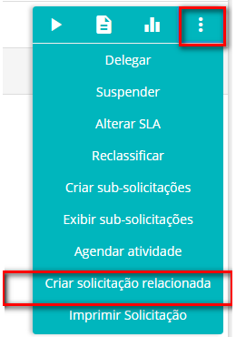

    **Figura 54 – Criar ticket relacionado**

2.	Será exibida a tela de Cadastro de Solicitação Relacionada, conforme ilustrada na figura abaixo:

    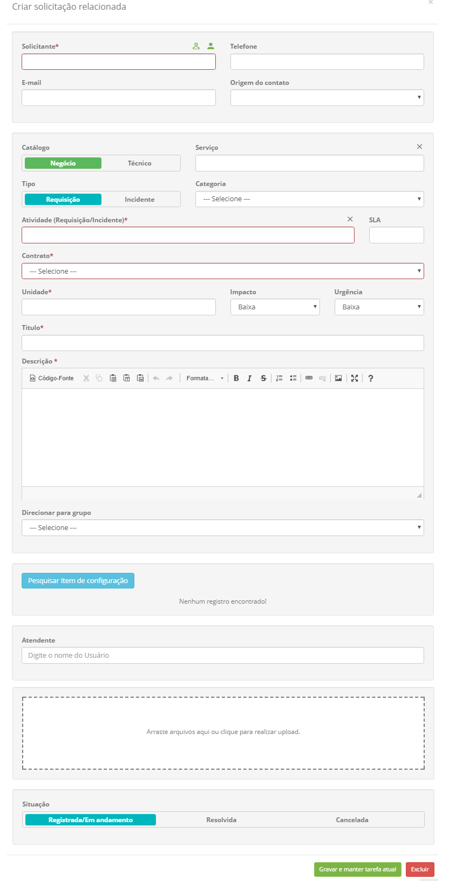

    **Figura 55 – Cadastro de ticket relacionado**

3.	Preencha os campos conforme orientação abaixo:

•	Solicitante: informe o nome do solicitante, ou seja, o nome da pessoa que está solicitando a abertura de incidente ou requisição de serviço;

   -	  : ao clicar no ícone, permite vincular o ticket relacionado ao usuário logado;
    
   -	 : ao clicar no ícone, permite vincular o ticket relacionado ao responsável do ticket principal.

   !!! note "NOTA"

        Caso o solicitante já tenha os dados pessoais (telefone, ramal, e-mail e/ou unidade) registrados no sistema, após informá-lo, os campos referentes aos dados serão preenchidos com as respectivas informações

  -	Telefone: informe o número de telefone do solicitante;

  -	E-mail: informe o e-mail do solicitante;

  -	Origem do contato: informe a origem do contato do ticket;

  -	Catálogo: selecione o catálogo de serviços;

  -	Serviço: informe o serviço referente ao catálogo de serviços. Se o catálogo de serviços for “Negócio”, serão disponibilizados neste campo os serviços de negócio para seleção, mas se o catálogo de serviços for "Técnico", serão disponibilizados neste campo os serviços de apoio/técnico para seleção;

  -	Categoria: informe a categoria de serviço para facilitar a busca da atividade (requisição/incidente);

  -	Tipo: selecione o tipo do ticket, se é incidente ou requisição;

    -	Incidente: caso a situação apresentada seja uma interrupção não planejada, uma redução na qualidade do serviço ou falha de algum item de configuração que ainda não tenha impactado um serviço de TI. Ex: o link de rede está fora, a rede está lenta, o servidor inacessível, etc.
  
    -	Requisição: refere-se aos pedidos de demandas realizados pelos usuários dentro do ambiente da Tecnologia da Informação. Podem ser desde pedidos de acesso até sugestões de melhoria a baixo custo. Ex: pedido de acesso à rede para um novo usuário, solicitação de configuração de algum equipamento, requisição para adicionar algum software na estação de trabalho, etc.
  
  -	Atividade (Requisição/Incidente): informe a atividade que será realizada referente ao tipo de ticket;

  -	SLA: após informar a atividade (requisição/incidente) será estabelecido o tempo de atendimento da mesma;

  -	Contrato: após informar a atividade (requisição/incidente), será exibido o contrato para o qual será feita a abertura de incidente ou requisição de serviço;

  -	Unidade: informe a unidade do solicitante;

  -	Impacto: após informar a atividade (requisição/incidente), será exibida a informação do impacto ao negócio;

  -	Urgência: após informar a atividade (requisição/incidente), será exibida a informação da urgência, a qual indica a velocidade que atividade do serviço precisa ser realizada;

  -	Título: informe o título do ticket;

  -	Descrição: informe a descrição do ticket. A descrição deve ser objetiva, incluindo toda informação necessária para o atendimento da mesma;

  -	Direcionar para grupo: permite escolher um grupo, vinculado ao ticket, para que a solicitação relacionada seja direcionada;

  -	Caso queira vincular um Item de Configuração, clique no botão Pesquisa Item de Configuração, realize a pesquisa e selecione o IC;

  -	Situação: selecione a opção que se encaixa com o atual estado do ticket: Registrada/Em andamento, Resolvida ou Cancelada.

4.	Após os dados informados, clique no botão Gravar e manter tarefa atual. Após isso, o ticket relacionado será criado com sucesso, sendo apresentada no mesmo um ícone que representa o ticket principal, conforme exemplo ilustrado na figura a seguir;

    !!! info "IMPORTANTE"
    
        O ticket relacionado será direcionado para o grupo executor definido no registro do vínculo da atividade de requisição/incidente ao contrato do serviço. Mas caso não esteja definido o grupo executor no registro do vínculo da atividade, o mesmo será direcionado para o grupo executor definido no parâmetro “9 – ID Grupo Nível 1”.

    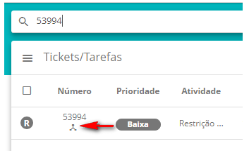

    **Figura 56- Ticket relacionada**

5.	Para visualizar o ticket principal (ticket de origem), basta clicar no ícone  .

    !!! info "IMPORTANTE"

         O sistema enviará e-mails de notificação a respeito de criação, escalonamento, captura, encerramento e demais alterações dos tickets relacionados para o grupo executor do ticket principal.

Impressão do ticket
-------------------

1.	Localize o ticket que irá imprimir, clique sobre o mesmo e logo em seguida clique no ícone de “opções” e em Imprimir Solicitação, conforme indicado na figura abaixo:

    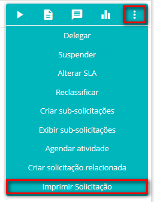

    **Figura 57 - Imprimir o ticket**

2.	Será gerada a impressão do registro do determinado ticket.

    !!! info "IMPORTANTE"

        Para visualizar a impressão é necessário desabilitar o pop-up do navegador para o produto.

Quadro kanban
-------------

Esta opção tem por objetivo auxiliar gestores no acompanhamento detalhado de suas filas de atendimento de tickets, fazendo uso da técnica de gestão chamada de Kanban. Segundo o site Significados, Kanban é a utilização de cartões (post-it e outros) para indicar o andamento dos fluxos de produção em empresas de fabricação em série.
Nesses cartões são colocadas indicações sobre uma determinada tarefa, por exemplo, “para executar”/“em execução”/“feito”, e sempre que o fluxo avança seu posicionamento muda para a direita no quadro.
Esta técnica faz parte da estratégia comum da administração chamada “Gestão à Vista” que prima pela transparência do avanço dos trabalhos para toda a equipe.

### Pré-condições

1.	Ter ao menos um ticket registrado;
2.	Dar permissão para o Perfil de Acesso desejado (ver conhecimento Permissão de acesso do gerenciamento de tickets).

### Explicando o quadro kanban

1.	O quadro Kanban recupera os tickets de cada atendente (usuário) que compõem o grupo selecionado. Esses tickets são agrupados por atendente numa forma gráfica, didática e dinâmica;
2.	As informações estão estruturadas com modos de exibição, filtros, legendas e raias que agrupam os tickets de cada atendente;
3.	Clique no ícone  . Será apresentada a tela principal da funcionalidade no modo de exibição "quadro Kanban", conforme ilustrado na figura abaixo:

    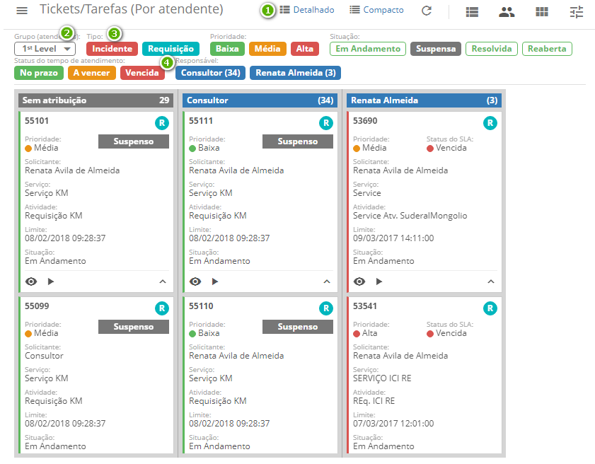

    **Figura 58 - Quadro Kanban**

 - 1: Modos de Exibição: escolha entre:  (mostra todos os campos do ticket) e   (esconde a maior parte desses detalhes)
 - 2: Grupo (atendentes): selecione o grupo de atendentes (usuários) que deseja acompanhar
 - 3: Legendas: conjunto didático de legendas sobre: Tipo, Prioridade, Situação e Status do Tempo de Atendimento
 - 4: Responsável: legenda específica sobre responsáveis pelos tickets, indicando o nome das pessoas que estão no Grupo selecionado

    !!! info "INFORMAÇÃO"

        Para atribuir o ticket para um atendente basta usar o mouse clicando e arrastando (simulando o conceito da mudança de um post-it em um quadro real fixado na parede)

### Ticket (modo detalhado)

   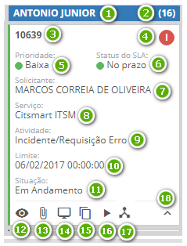

   **Figura 59 - Detalhes**
    
-	1: Responsável: indica para qual atendente ele foi atribuído

-	2: Quantidade: contabiliza os tickets atribuídos ao atendente

-	3: ID: identificador único

-	4: Tipo: indica se é uma requisição ou um incidente

-	5: Prioridade: indica o nível de urgência (Baixa, Média ou Alta)

-	6: Status da SLA: indica a situação em relação ao seu prazo de solução (No prazo, A vencer, Vencida)

-	7: Solicitante: é quem pediu pela execução

-	8: Serviço: indica o tipo de serviço vinculado

-	9: Atividade: indica o tipo de atividade vinculada

-	10: Limite: indica a data e hora limite de conclusão

-	11: Situação: indica o estágio geral do ticket (Em atendimento, Resolvida, etc.)

-	12: Clique para mostrar um resumo dos dados do ticket

-	13: Clique para mostrar os anexos

-	14: Clique para mostrar os itens de configuração vinculados

-	15: Indica que a solicitação possui outras tarefas relacionadas (solicitação filho)

-	16: Permite ao usuário capturar e ser responsável pela solicitação.

-	17: Mostra a solicitação inicial (solicitação pai)

-	18: Clique para mudar modo de exibição para compacto

Auditoria do ticket
------------------

### Como acessar

1.	Na tela de Gerenciamento de Ticket, clique no botão de menu  e após isso, clique no item de Auditoria.

    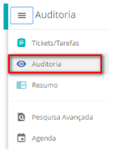

    **Figura 60 - Opção de auditoria de ticket**

### Filtros

1.	Os seguintes filtros possibilitam ao usuário restringir a participação de itens na listagem padrão da funcionalidade, facilitando a localização dos itens desejados:

  -	Número;

  -	Data Inicial;

  -	Data Final.

   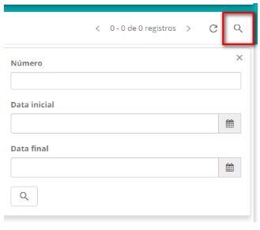

   **Figura 61 - Tela de auditoria de ticket**

2.	Depois de concluir a pesquisa, clique no ícone 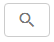  para definir os filtros necessários para verificar o histórico das instâncias do ticket para a auditoria.

### Listagem de itens

1.	Os seguintes campos cadastrais estão disponíveis ao usuário para facilitar a identificação dos itens desejados na listagem padrão da funcionalidade: Descrição, Registrado por, Data/Hora, Origem, Contrato, Serviço, Situação, Responsável, SLA e Descrição.

    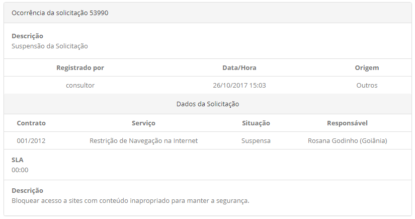

    **Figura 62 - Tela de auditoria de ticket**

### Realizando auditoria do ticket

1.	Na tela de Gerenciamento de Ticket, informe os filtros conforme sua necessidade e clique no ícone de busca para efetuar a operação. Após isso, serão apresentados os dados do ticket para auditoria.

Pesquisa avançada
----------------

### Como acessar

1.	Na tela de Gerenciamento de Ticket, clique no botão de menu   e após isso, clique no item de Pesquisa Avançada.

### Pré-condições

1.	Possuir chamados abertos, em qualquer situação.
2.	Informe os conteúdos abaixo nos parâmetros (ver conhecimento Regras de parametrização - ticket):

  -	Parâmetro 40;

  -	Parâmetro 41;

  -	Parâmetro 260: default 1-Lista sem Restrição;

  -	Parâmetro 261;

  -	Parâmetro 343: default: "S";

3.	Configure o parâmetro 378 (ver conhecimento Regras de parametrização - sistema).

   !!! note "NOTA"

       Se o usuário informar o valor igual a 0 (Zero), o sistema sempre irá fazer o download em segundo plano. Se o usuário deixar o campo em branco, o sistema limita o download em segundo plano para cinco mil registros. Se o usuário colocar valor superior ou inferior a cinco mil registros o sistema considera o valor informado pelo usuário.

### Filtros

1.	Os seguintes filtros possibilitam ao usuário restringir a participação de itens na listagem padrão da funcionalidade, facilitando a localização dos itens desejados:

-	Data de abertura: informar o período que deseja verificar os registros de ticket;

-	Data de encerramento: informar o período de encerramento do ticket para verificar os tickets que foram fechados no determinado período;

-	Número: informar o número de identificação do ticket, caso queira verificar um ticket específico;

  -	Ordenação: definir a ordem em que os tickets serão apresentados;

  -	Contrato: informar o contrato para verificar os tickets relacionados ao mesmo;

  -	Catálogo: informar o tipo de catálogo de serviços para verificar os tickets referentes;

  -	Serviço/Serviço de Apoio: informar o serviço caso deseje verificar os tickets referente ao mesmo;

  -	Tipo de solicitação: informar o tipo de ticket para verificação dos tickets;

  -	Atividade (Requisição/Incidente): informar o serviço caso deseje verificar os tickets referentes ao mesmo;

  -	Considerar Hierarquia: marcar este campo caso queira considerar a hierarquia do serviço;

  -	Item de Configuração: informar o item de configuração para verificar os tickets relacionados ao mesmo;

  -	Situação: informar a situação para verificar os tickets referentes;

  -	Prioridade: informar a prioridade para verificar os tickets referentes;

  -	Grupo executor/solucionador: informar o grupo executor para verificar os tickets que foram direcionados ao mesmo;

  -	Fase: informar a fase do ticket para verificar os tickets que se encontram na determinada fase;

  -	Origem: informar a origem do contato do ticket para verificar os tickets relacionados;

  -	Unidade: informar a unidade desejada para verificar os tickets relacionados a mesma;

   !!! note "NOTA"

       Caso o parâmetro “61 – Vincula contratos a unidade” esteja habilitado, serão disponibilizadas somente as unidades vinculadas ao contrato ao qual tem vínculo com os grupos em que pertence.

  -	Localidade: informar a localidade para verificar os tickets relacionados ao mesmo;

  -	Palavra-chave: informar a palavra-chave para verificar os tickets relacionados ao mesmo;

  -	Solicitante: informar o solicitante de serviços para verificar seus tickets;

  -	Criado por: informar o responsável que fez o registro de ticket para verificar os tickets que foram registrados pelo mesmo;

  -	Responsável Atual: informar o responsável pelo atendimento do ticket para os tickets que foram atendidos pelo mesmo;

  -	Exibir campo de descrição em relatórios?: marcar este campo caso queira que o conteúdo do campo “Descrição” do ticketseja exibido no relatório;

   !!! info "IMPORTANTE"

        A eficácia da pesquisa depende do seguimento de algumas regras de permissão pelo filtro, tais como: execução, delegação, acompanhamento, visualização, grupos de usuários, vínculo com contrato, unidades e colaborador logado.

   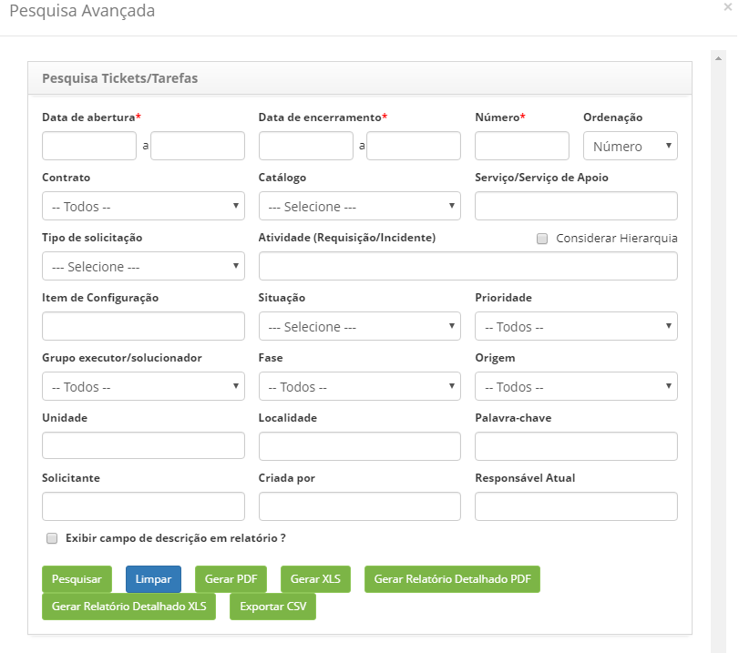

   **Figura 63 - Pesquisa avançada de tickets**
    
2.	Após definir os filtros, clique no botão Pesquisar. Feito isso, serão listados os tickets, conforme os filtros escolhidos;
3.	Realizada a pesquisa, escolha um dos formatos de arquivo (PDF, XLS e CSV) para gerar o relatório. Depois de escolher o formato, o sistema verificará o parâmetro 261 e encontrando registro maior que a quantidade permitida, será exibida a seguinte mensagem:

  -	"A quantidade de registros encontrados ultrapassa a quantidade máxima permitida de visualização. Favor redefinir os filtros de pesquisa."

4.	Porém, caso a quantidade de registro retornada da pesquisa for menor que o limitado no parâmetro 261, então o sistema verifica a configuração do parâmetro 378;
5.	É verificada a quantidade de registros para gerar o relatório em 2º plano, se a quantidade for maior que a quantidade parametrizada, então o sistema exibe a seguinte mensagem:

  -	"O relatório está sendo processado. Uma notificação lhe será enviada quando estiver pronto."

6.	Caso o arquivo a ser gerado for muito extenso, o sistema disparará uma notificação na tela principal, informando que o download do mesmo está finalizando. Ao concluído, clique no botão Visualizar e acesse o relatório através do link disponibilizado;
7.	O sistema retorna a quantidade de chamados encontrados acima da apresentação da pesquisa.

### Listagem de itens

1.	Os seguintes campos cadastrais estão disponíveis ao usuário para facilitar a identificação dos itens desejados na listagem padrão da funcionalidade: ID, Serviço, Atividade (Requisição/Incidente) Tipo, Solicitante, Criador, Data/hora abertura, Tempo atendimento, Descrição, Solução/resposta, Situação, Data/Hora limite Grupo, Data/hora encerramento, Tempo restante eResponsável Atual.

    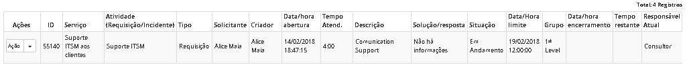

    **Figura 64 - Tela de listagem de tickets**

2.	Em cada item apresentado no resultado é possível realizar as seguintes ações:

  -	Visualizar registro do ticket principal e reabrir, basta clicar no botão de Ação e logo em seguida em Reabrir Ticket;

  -	Para consultar o histórico do ticket(ocorrências), basta clicar no botão de Ação e logo em seguida em Consultar histórico da Ticket;

  -	Para visualizar o registro do ticket, basta clicar no botão de Ação e logo em seguida em Visualizar Ticket;

  -	Para visualizar os anexos do ticket, basta clicar no botão de Ação e logo em seguida em Visualizar Anexos.

### Geração e exportação do resultado da pesquisa avançada

1.	Caso queira gerar um relatório com informações resumidas da pesquisa que foi realizada:

  -	clique no botão Gerar PDF para gerar o relatório em formato PDF;

  -	clique no botão Gerar XLS para gerar o relatório em formato Excel.

2.	Caso queira gerar um relatório com informações detalhadas da pesquisa que foi realizada:

  -	clique no botão Gerar Relatório Detalhado PDF para gerar o relatório detalhado em formato PDF;

  -	clique no botão Gerar Relatório Detalhado XLS para gerar o relatório detalhado em formato Excel;

3.	Após realizada a pesquisa avançada o usuário insere um dos filtros obrigatórios e pode clicar no botão Exportar CSV.

    !!! note "NOTA"

        Para exportar os dados em CSV, eliminando qualquer caractere especial, é necessário, ao abrir o arquivo em Excel, alternar a origem do arquivo que estará setado no modo de visualização Europeu Ocidental (Windows) para o Unicode (UFT-8).

    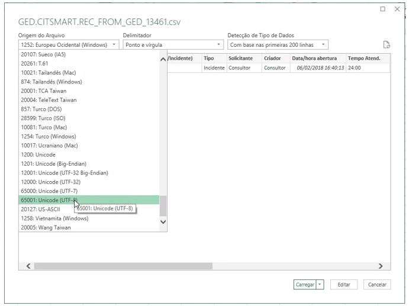

    **Figura 65 - Tela de configuração de modo visualização do arquivo**

4.	O sistema exporta o resultado no formato desejado, com os seguintes campos:

  -	ID Solicitação Serviço: número do ticket aberto;

  -	Serviço: descrição do Serviço de Negócio;

  -	Atividade (Requisição/Incidente): descrição da atividade;

  -	Tipo: destinação do ticket:

    -	Requisição;

    -	Incidente;

    -	Procedimento.

  -	Solicitante: nome do usuário que solicitou a atividade;

  -	Criador: nome do usuário que criou o ticket;

  -	Data/hora abertura: data e hora em que ticket foi aberto;

   !!! note "NOTA"

       Os três campos seguintes somente aparecerão se possuir uma atividade que possua SLA de captura cadastrado e aberto no sistema.

  -	Data/Hora de captura: data e hora em que o analista realizou a primeira da captura para atendimento do chamado;

  -	Tempo captura: prazo decorrido entre a data/hora de abertura do chamado e a data/hora da 1ª captura;

  -	Prazo de captura (SLA): tempo em horas ou minutos inserido no cadastro de tempo de atendimento para captura do chamado;

  -	Tempo atendimento: tempo gasto entre a data hora encerramento e a data e hora de abertura dentro do calendário;

   !!! info "IMPORTANTE" 

         No caso do SLA ter se excedido o tempo de atendimento, o sistema contará da abertura do chamado até o encerramento e desconsiderará o calendário.

  -	Descrição: o que foi solicitado na atividade;

  -	Solução/resposta: o que o técnico descreveu como resposta ao ticket pedido;

  -	Situação: status do ticket;

  -	Data/Hora limite: tempo estabelecido no acordo de nível de serviço;

  -	Grupo: grupo que está responsável ou encerrou o atendimento;

  -	Data/hora encerramento: caso exista, retorna a data e a hora que o ticket foi colocado como resolvido ou fechado;

  -	Responsável Atual: nome do técnico que está atuando no ticket ou nome do técnico que encerrou o ticket.

  -	Origem do Contato: canal de atendimento por onde se iniciou o ticket (ex: Telefone, Internet, e-mail etc);

  -	Data e hora da suspensão: data e hora da última suspensão;

    -	Pré condição: o ticket deverá ter sido suspenso, caso contrário não existe informação nesse campo;
  
    -	Um ticket pode possuir várias suspensões ao longo do seu ciclo de vida, por isso, esse campo retornará somente dados da última suspensão;

  -	Data e hora da reativação: data e hora da última reativação;

    -	Pré condição: o ticket deverá estar suspenso, caso contrário não existe informação nesse campo;
  
    -	Um ticket pode possuir várias reativações ao longo do seu ciclo de vida, por isso, esse campo retornará somente dados da última reativação;

  -	Impacto: reflete o nível impelido no ticket,

    -	Os impactos podem variar caso o parâmetro 104 - Calcular a prioridade do ticket dinamicamente usando a fórmula cadastrada. (Ex: S ou N - Default: 'N') esteja ativo;

    -	Os impactos podem ser: Alto, Médio ou Baixo (sem o parâmetro 104);

    -	Os impactos podem ser: Altíssimo, Alto, Elevado, Médio, Baixo (com o parâmetro 104);

  -	Urgência: reflete o quanto para o usuário o ticket aberto precisa de tratamento imediato;

    -	A urgência também pode sofrer variação do parâmetro 104;

    -	As urgências podem ser: alta, média ou baixa (sem o parâmetro 104);

    -	As urgências podem ser: crítica, alta, média ou baixa (com o parâmetro 104);
  -	Causa: motivos que ocasionaram o reporte do ticket;

  -	Detalhamento da Causa: descrição detalhada sobre o que ocasionou o reporte do ticket;

  -	Categoria da Solução: descrição da Solução dada ao encerrar um ticket.

  -	Contrato: retorna o número do contrato que gerou o ticket;

  -	SLA: tempo de atendimento para a atividade aberta, conforme contrato;

  -	Prioridade: obtido pelo fator Impacto X Urgência, a prioridade é representada em termos numéricos de 1 a 5 e é um limiar contido ao cadastrar o Tempo de Atendimento;

  -	Tempo de atraso do SLA: prazo em HH:MM que o SLA está fora do prazo estabelecido para atendimento;
  
    -	o SLA fora do prazo é contado pela subtração entre o tempo de atendimento e tempo total de atendimento, lembrando que se o SLA estiver fora do prazo, o sistema desconsidera o calendário;

  -	Dentro SLA?: informa se o prazo de atendimento ficou dentro ou fora do acordo de nível de serviço (SLA)

    -	Valores possíveis: Sim ou Não;

  -	Localidade: local para onde foi aberta o ticket;

  -	Lista IC: lista dos Itens de Configuração vinculados ao ticket;

  -	Telefone do solicitante: número do telefone de contato do solicitante:

    -	Esse campo pode ser alterado no momento do cadastro do ticket;

  -	Ramal do solicitante: número do ramal do solicitante;

  -	E-mail do solicitante: informação sobre o endereço de e-mail do solicitante;

    -	Esse campo pode ser alterado no momento do cadastro do ticket;

  -	Unidade: órgão ao qual pertence o solicitante;

  -	Justificativa de SLA vencido: descrição do motivo pelo qual o tempo de atendimento não foi suficiente;

    -	Caso o tempo de atendimento tenha se excedido, esse campo é de preenchimento obrigatório;

  -	Tipo de catálogo: negócio/técnico;

  -	Solicitação Pai (Sub-Solicitação): número do ticket pai do sub- ticket;

  -	Solicitação Pai (Relacionada): número do ticket pai do ticket relacionado que teve os dados descritos;

  -	Quantidade de anexos: número de anexos que possui o ticket;

    -	Essa quantidade pode ser incrementada ou decrementada durante o ciclo de vida do ticket, portanto ele deve refletir a quantidade no momento em que se imprime o relatório.

Reabertura de ticket
-------------------

### Como acessar

1.	Clique no botão de menu   e após isso, clique no item de Pesquisa Avançada.

### Reabrindo o ticket

1.	Será exibida a tela de Pesquisa de Tickets;
2.	Realize a pesquisa do ticket que deseja reabrir. Após isso, clique no botão de Ação e Reabrir Ticket do item desejado;
3.	Será apresentada uma mensagem para confirmação da reabertura do ticket, basta clicar em Ok para efetuar a operação;
4.	O ticket será reaberto e exibido na lista de ticket, conforme exemplo ilustrado na figura abaixo:

    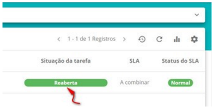

    **Figura 66 – Ticket reaberto**

Cadastro de ticket via template
------------------------------

### Pré-condições

1.	Ter os templates cadastrados para registro de uma solicitação utilizando essa funcionalidade (ver conhecimento Cadastro e pesquisa de template de incidentes, requisições e procedimentos);
2.	Ter permissão para registrar um ticket (ver conhecimento Cadastro e pesquisa de grupo);
3.	Ter o grupo cadastrado (ver conhecimento Cadastro e pesquisa de grupo);
4.	Ter a unidade cadastrada (ver conhecimento Cadastro e pesquisa de unidade);
5.	Ter o contrato cadastrado (ver conhecimento Cadastro e pesquisa de contrato);
6.	Ter o portfólio com o serviço e as atividades de requisição e incidente cadastrados (ver conhecimentos Cadastro de portfólio de serviços, Cadastro de serviços, Configuração dos atributos do serviço);
7.	Ter o tempo de atendimento das atividades de requisição e incidente definidos (ver conhecimento Cadastro e pesquisa de tempo de atendimento);
8.	Ter o contrato vinculado ao serviço (ver conhecimento Configuração dos atributos do serviço);
9.	Ter as atividades de requisição e incidente vinculadas ao contrato do serviço (ver conhecimento Configuração dos atributos do contrato do serviço);
10. Ter o grupo vinculado ao contrato (ver conhecimento Como relacionar grupo ao contrato?);
11. Ter a unidade vinculada ao contrato (ver conhecimento Como relacionar unidade ao contrato?);
12. Ter o usuário vinculado à unidade;
13. Ter o usuário vinculado ao grupo.

### Cadastrando o ticket via template

1.	Clique no botão de opções   localizado no canto inferior direito da tela, logo em seguida clique no botão de cadastro via template  . Feito isso, será exibida a tela de templates contendo os templates listados, conforme exemplo ilustrado na figura abaixo:

    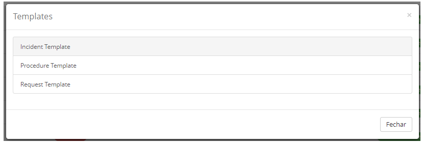

    **Figura 67 - Tela de template**

2.	Selecione o template desejado e será direcionado à tela de Cadastro de Ticket com os campos preenchidos de acordo com o template escolhido;
3.	Preencha os campos com as informações necessárias;
4.	Após os dados informados, clique no botão de opções  e logo em seguida clique no botão gravar 
 para efetuar o registro, onde a data, hora e usuário serão gravados automaticamente para uma futura auditoria.

!!! tip "About"

    <b>Product/Version:</b> CITSmart | 8.00 &nbsp;&nbsp;
    <b>Updated:</b>07/11/2019 – Anna Martins
