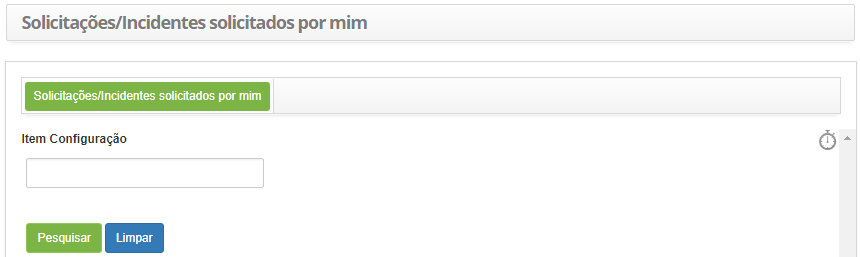
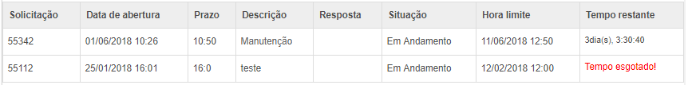

title: Verificação de meus tickets
Description: Tem o objetivo fornecer um resumo das solicitações de serviços
(tickets) feitas pelo usuário

# Verificação de meus tickets

Esta funcionalidade tem por objetivo fornecer um resumo das solicitações de
serviços (tickets) feitas pelo usuário.

O acesso às solicitações do usuário também pode ser realizado no Portal de
Serviços, tornando a consulta mais rápida sem ter que entrar no sistema.

Como acessar
------------

1.  Acesse a funcionalidade de Minhas Requisições através da navegação no menu
    principal **Processos ITIL > Gerência de Ticket > Minhas
    Requisições**.

Pré-condições
-------------

1.  Ter um item de configuração cadastrado (ver conhecimento [Gerenciamento de
    itens de
    configuração](https://itsm.citsmartcloud.com/citsmart/pages/knowledgeBasePortal/knowledgeBasePortal.load#/knowledge/754) seção
    Registrando um novo item de configuração) e estar vinculado a uma
    solicitação de serviço (ver conhecimento [Gerenciamento de ticket
    (serviços)](https://itsm.citsmartcloud.com/citsmart/pages/knowledgeBasePortal/knowledgeBasePortal.load#/knowledge/4558) seção
    Vinculação itens de configuração do solicitante);

2.  Ter solicitações de serviço cadastradas (ver conhecimento [Gerenciamento de
    ticket
    (serviços)](https://itsm.citsmartcloud.com/citsmart/pages/knowledgeBasePortal/knowledgeBasePortal.load#/knowledge/4558) seção
    Cadastro de ticket).

Filtros
-------

1.  O seguinte filtro possibilita ao usuário restringir a participação de itens
    na listagem padrão da funcionalidade, facilitando a localização dos itens
    desejados, conforme ilustrado na figura abaixo:

    -  Item Configuração

1.  Será apresentada a tela de verificação de Tickets solicitados por mim,
    conforme ilustrada na figura abaixo:

    

    **Figura 1 - Tela de pesquisa de tickets**

    -   Informe o item de configuração e clique em *Pesquisar*. Feito isso, serão
    listados os resumos das solicitações de serviço (tickets) relacionadas ao
    item de configuração;

    -   Caso deseje verificar todas as solicitações de serviço (tickets), clique
    diretamente no botão *Pesquisar*

    !!! info "IMPORTANTE"

        Esta tela possui um temporizador  que, ao ser ativado com um clique,
        apresenta um cronômetro sobre o tempo gasto e o tempo restante para
        finalizar o atendimento da solicitação no campo Tempo restante da listagem
        de itens.

Listagem de itens
-----------------

1.  Os seguintes campos cadastrais estão disponíveis ao usuário para facilitar a
    identificação dos itens desejados na listagem padrão da funcionalidade:
    **Solicitação**, **Data de abertura**, **Prazo**, **Descrição**,
    **Resposta**, **Situação**, **Hora limite** e **Tempo Restante**.

**Figura 2 - Tela de listagem de tickets**
    

Preenchimento dos campos cadastrais
-----------------------------------

1.  Não se aplica.

!!! tip "About"

    <b>Product/Version:</b> CITSmart | 8.00 &nbsp;&nbsp;
    <b>Updated:</b>07/12/2019 – Anna Martins
