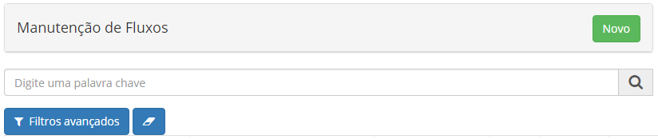
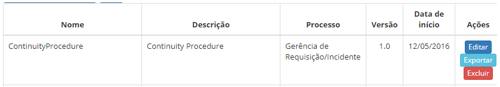
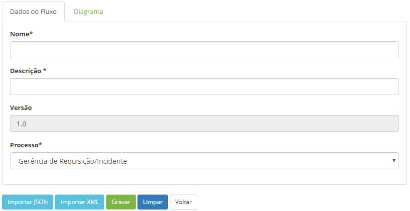
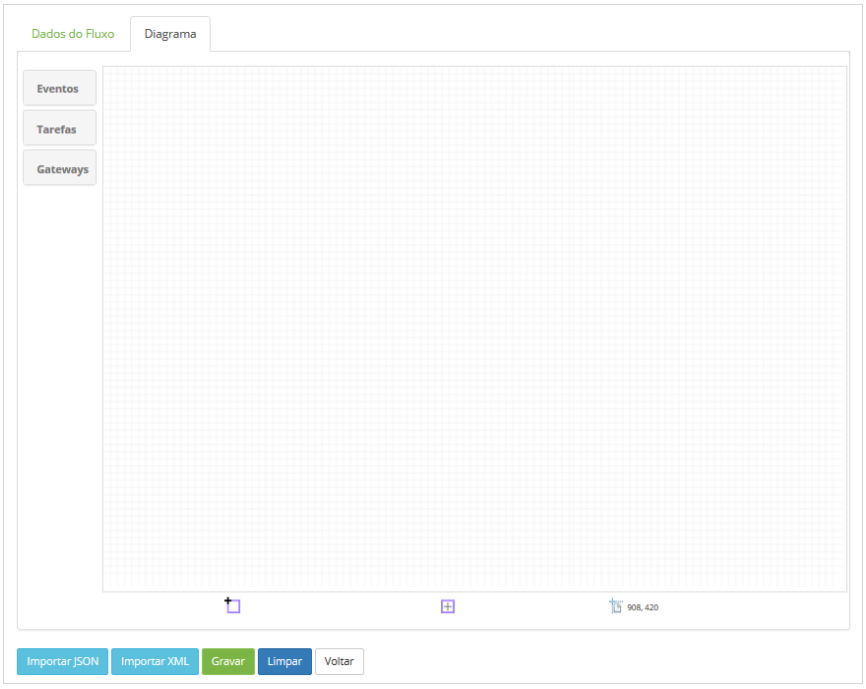
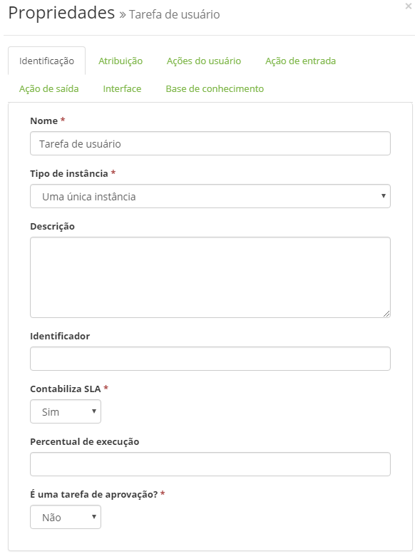
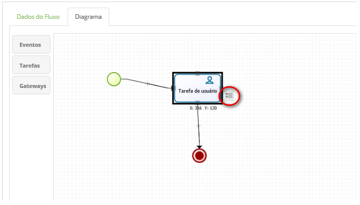
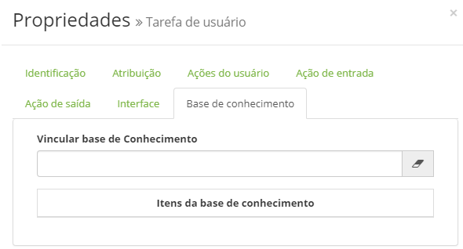
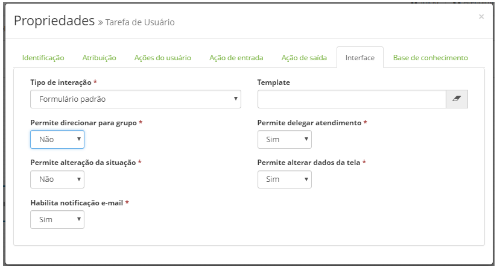

title: Manutenção de fluxo de trabalho

Description: A funcionalidade de Manutenção de Fluxos tem a finalidade de modelar seus objetivos de negócio.

# Manutenção de fluxo de trabalho

A funcionalidade de Manutenção de Fluxos tem a finalidade de modelar seus
objetivos de negócio, descrevendo os passos que precisam ser executados para
atingir esses objetivos, através de um fluxograma.

Como acessar
-----------

1.  Acesse o menu principal **Sistema > Manutenção de Fluxos**.

Pré-condições
------------

1.  Não se aplica.

Filtros
------

1.  O seguinte filtro possibilita ao usuário restringir a participação de itens
    na listagem padrão da funcionalidade, facilitando a localização dos itens
    desejados:

    -   Pesquisa.

    
    
    **Figura 1 - Tela de pesquisa fluxo**

Listagem de itens
----------------

1.  Os seguintes campos cadastrais estão disponíveis ao usuário para facilitar a
    identificação dos itens desejados na listagem padrão da
    funcionalidade: Nome, Descrição, Processo, Versão e Data de início.

2.  Existem botões de ação disponíveis ao usuário em relação a cada item da
    listagem, são eles: *Editar*, *Exportar* e *Excluir*.

    
    
    **Figura 2 - Tela de listagem de fluxo**

Criação de fluxo
----------------

### Preenchimento dos campos cadastrais

1.  Clique no botão *Novo*. Após isso, será exibida a tela para definir as
    informações do fluxo, conforme apresentada na figura abaixo:

    
    
    **Figura 3 - Cadastro das informações do fluxo**

2.  Informe os dados do fluxo:

    -   **Nome**: informe o nome do fluxo;

    -   **Descrição**: informe uma breve descrição do fluxo;

    -   **Versão**: é apresentado a versão do fluxo neste campo;

    -   **Processo**: selecione o processo para qual será feito o desenho do fluxo.

3.  Após os dados do fluxo registrados, clique na aba **Diagrama** para desenho
    do fluxo. Após isso, será apresentada a área de desenho, conforme ilustrada
    na figura abaixo:

   
**Figura 4 - Cadastro das informações do fluxo**

   -  **Eventos:** apresenta os elementos de eventos para ser utilizado no desenho
    do fluxo;

   -  **Tarefas:** apresenta os elementos de tarefas para ser utilizado no desenho
    do fluxo;

   -  **Gateways:** apresenta os elementos de condições para ser utilizado no
    desenho do fluxo.

  -  Para inserir os elementos, basta clicar no elemento desejado e arrastá-lo
    para a área de desenho. Ao arrastar e soltar o elemento na área de desenho,
    será exibida uma tela para definição das propriedades, conforme exemplo
    ilustrado na figura abaixo:

   
    
   **Figura 5 - Definição das propriedades do elemento "Tarefa" do fluxo**

   -  As propriedades de um elemento também podem ser definidas ao clicar duas
    vezes no elemento ou clicar no elemento e logo após clicar no ícone
    apresentado ao lado do mesmo, conforme indicado na figura abaixo:

   
    
   **Figura 6 - Elemento do fluxo**

   -  Caso queira excluir um elemento que foi inserido no desenho do fluxo, clique
    no mesmo e pressione a tela Ctrl + Delete.

4.  Após o fluxo definido, clique no botão *Gravar* para efetuar a operação.

Vinculando a um conhecimento
---------------------------

1.  Ao clicar na aba "Base de Conhecimento" o usuário pode preencher o campo de
    filtro com parte do título ou número do conhecimento desejado. Uma vez
    selecionado, esse conhecimento ficará gravado associado à atividade do
    fluxo,

!!! note "NOTA"

     O objetivo principal desta vinculação de conhecimento é permitir que o
     atendente de uma requisição/incidente tenha facilmente acesso a ele. Assim
     que o fluxo chegue na atividade do fluxo vinculado a um conhecimento, o
     ícone que é mostrado no canto superior direito da tela de Requisição/Incidente
     para dar acesso de leitura ao conteúdo, para tanto, tal conhecimento
     geralmente é um escrito na forma de um passo a passo.

   
    
   **Figura 7 - Aba do conhecimento**

Implementando funcionalidades no fluxo sobre a atividade
------------------------------------------------------

1.  Ao clicar nas propriedades da Tarefa de usuário localizada no fluxo,
    selecionando a aba Interface, a seguinte tela será apresentada:

    
    
    **Figura 8 - Aba interface**

2.  Preencha os campos conforme direcionamento abaixo:

    -   **Tipo de interação**: é o modo com que a interface
    de **Questionário** ou **Neuro **vai ser aplicada na solicitação de serviço;

    -   **Template**: permite a vinculação de template de solicitação de serviço
    previamente cadastrada (ver conhecimento [Cadastro e pesquisa de template de
    solicitação de serviço];

    !!! note "NOTA"

         Caso não ocorra a vinculação de nenhum template de solicitação de serviço na
         aba interface, o sistema subentenderá e aplicará as configurações de um
         formulário padrão, habilitando a vinculação de item de configuração,
         mudança, problema e solicitação relacionada ao ticket tela de gerenciamento
         de solicitação de serviço

    -   **Permite direcionar para grupo**: possibilita a ativação da opção
    "Direcionar para grupo" no cadastro de um ticket;

    -   **Permite alteração da situação**: possibilita a escolha da etapa em que se
    encontra o ticket na tela de solicitação de serviço (Registrada/Em
    andamento; Resolvida e Cancelada);

    -   **Habilita notificação e-mail**: habilita a notificação por e-mail quando
    criar novos tickets;

    -   **Permite delegar atendimento**: possibilita a ativação da opção "Delegar"
    para que esta esteja visível no menu opções do gerenciamento de um ticket;

    -   **Permite alterar dados da tela**: possibilita a edição de questionários na
    tela de gerenciamento do ticket.

    !!! note "NOTA"

        As normativas configuradas no fluxo terão prioridade em relação às
        marcações do template de solicitação de serviço, pois esta é um complemento
        do fluxo.

Exportação de fluxo
------------------

1.  Na tela de **Manutenção de Fluxos**, busque pelo fluxo que deseja exportar.
    Após isso, basta clicar no botão *Exportar* do registro do fluxo.

Importação de fluxo
-------------------

1.  Na tela de **Manutenção de Fluxos**, clique no botão *Novo*. Após isso, será
    exibida a tela de cadastro, conforme ilustrada na figura 2;

2.  Clique no botão *Importar JSON* para importar o arquivo no formato ".txt"
    ou clique no botão *Importar XML* para importar o arquivo no formato ".xml";

3.  Após a importação do fluxo, clique no botão *Gravar* para efetuar a
    operação.

Componente IBM WATSON
-------------------

1.  A partir da versão 7.2.2.0 um novo componente que interage com a **API
    Conversation** do **IBM Watson** passou a estar disponível na barra de
    ferramentas (grupo **Tarefa**), chamado de **Watson conversation** .

2.  A solução **IBM Watson** é um sistema de resposta a perguntas em linguagem
    natural que não usa respostas preparadas, mas determina suas respostas e
    pontuações de confiança associadas, que são baseadas em conhecimento
    adquirido;

3.  Ao incluir este componente em um fluxo, deve-se preencher seus atributos:

    -   **Nome**: nome que vem preenchido com "Conversação Watson";

    -   **ID Workspace**: identificador a servir para referências;

    -   **Data da versão**: data que deve ser preenchida no formato aaaa-mm-dd;

    -   **Usuário para conexão**: credencial de conexão;

    -   **Senha para conexão**: credencial de conexão;

    -   **Texto de entrada**: texto que aparecerá na entrada.

   !!! info "IMPORTANTE"

         Para usar este componente, a organização deve possuir a arquitetura IBM
         BlueMIX, possibilitando assim acesso à API Conversation do Watson.**

   !!! note "NOTA"

         IBM Bluemix é uma implementação da arquitetura de nuvem aberta da IBM,
         baseada em Cloud Foundry, que permite criar, implementar e gerenciar
         rapidamente seus aplicativos na nuvem. Como o Bluemix está baseado em Cloud
         Foundry, é possível aproveitar o ecossistema de frameworks e serviços de
         tempo de execução.

Veja também
----------

-   [Gerenciamento de ticket (serviços)].

!!! tip "About"

    <b>Product/Version:</b> CITSmart | 8.00 &nbsp;&nbsp;
    <b>Updated:</b>07/24/2019 – Anna Martins
