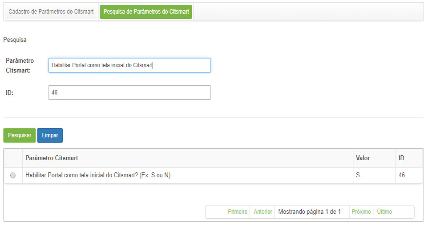
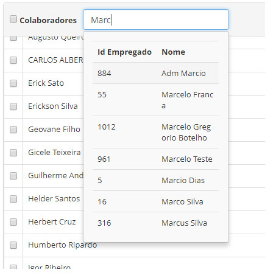

Title: FAQ
Description: Aqui você tem as respostas das pergundas mais comuns quando se fala da ferramenta CITSmart.

# Perguntas Frequentes - FAQ

!!! Question "Erro: certificado digital não assinado por autoridade (CA)"

    Exportação de Certificados SSL da aplicação alvo, importe-o para o servidor do Stash JVM TrustStore e reinicie Stash para que
    Stash a confiar no aplicativo de destino.
   
    a. Resolução de um certificado auto assinado ou um certificado não assinado por uma autoridade CA
   
    Senha padrão: a senha Java TrutstStore é: changeit.
   
    b. Exportar o Certificado da aplicação (JIRA, Multidão, Bambu, etc), que deseja se conectar:
   
    A sintaxe de comando:

    keytool-exportação-alias <existing_alias_in_keystore>-file

    <any_filename_here>-keystore <path/to/keystore>
   
    Por exemplo:
   
    - No Windows:
    % JAVA_HOME% \ bin \ keytool-export-apelido jira_tomcat-file jira_cert.cerkeystore C: \ Users \ jira_user \ jira.keystore
   
    - No Linux:

    $ JAVA_HOME / bin / keytool-export-apelido jira_tomcat-file jira_cert.cerkeystore / home / jira_user / jira.keystore
   
    *Importar o certificado do aplicativo para o servidor TrustStore Stash*:
   
    O arquivo TrustStore default (cacerts) está localizado no diretório home Java nesta pasta:
   
    <Java directory> home / jre / lib / security
   
    A sintaxe de comando:
   
    keytool-import-alias <new_unique_alias>-file
   
    <any_filename_here_from_above>-keystore <path/to/truststore>
   
    Por exemplo:
   
    - No Windows:
    % JAVA_HOME% \ bin \ keytool-import-alias do jira_tomcat-file jira_cert.cer-keystore% JAVA_HOME% \ jre \ lib \ security \ 
    cacerts

    - No Linux:
    $ JAVA_HOME / bin / keytool-import-alias do jira_tomcat-file jira_cert.cerkeystore $ JAVA_HOME / jre / lib / security / 
    cacerts
  
    (OPCIONAL) Caso tenha alterado a localização TrustStore padrão certifique-se de definir o JAVA_OPTS variável de ambiente 
    antes de reiniciar:
  
    - No Windows:
    set JAVA_OPTS =% JAVA_OPTS%-Djavax.net.ssl.trustStore = "c: \ my \ caminho \ \ aqui cacerts"-Djavax.net.ssl.trustStorePassword = "changeit"
   
    - No Linux:
   
    JAVA_OPTS exportação = "$ JAVA_OPTS-Djavax.net.ssl.trustStore = / meu / path / here / cacerts-Djavax.net.ssl.trustStorePassword = changeit"
    
    Restart Stash
   
!!! Question "[Ambiente] Erro: pesquisa na base não encontra o documento mesmo após acionar a atualização pelo sistema"
    
    Após mudanças estruturais nas coleções do SolR, não basta atualizar SolR pela aplicação ITSM, deve-se antes atualizar os
    configset do SolR.
    
    Segue os passos para atualização:
    
    1. Remover qualquer coleção existente no configset “base_conhecimento_configs”
    2. Parar o servidor Solr com o comando: solr stop –all
    3. Acessar a pasta raiz do Solr $PATH_SOLR/server/solr/configsets/
    4. Excluir a pasta “base_conhecimento_configs”
    5. Copiar o novo config que está em anexo para esta pasta
    6. Subir o servidor Solr com o comando: solr start -noprompt
    7. Executar o comando para criação da coleção: solr create -c base_conhecimento -d base_conhecimento_configs
    8. Acessar o sistema CITSmart no caminho: Sistema > Configurações > Gerência de Conhecimento (Indexação) (ver conhecimento
    Indexação de conhecimentos)
    9. Clicar no botão: Indexar base de conhecimento

!!! Question "[Ambiente] Perda do caminho das fontes"
    
    a. Descrição
    
    Não está sendo possível gerar o relatório nativo "Relatório Execução Solicitação".
    
    b. Solução/Resposta
    
    Atribuir ("setar") via linha de comando no servidor o caminho correto das fontes.
       
!!! Question "Como acessar a solicitação de serviço a partir da notificação de e-mail?"
    
    Para acessar a solicitação de serviço a partir da notificação de e-mail, proceda conforme orientações abaixo:
    
    1. Certifique-se de que esteja logado no sistema;
    2. Abra a notificação de e-mail referente a solicitação de serviço;
    3. A notificação terá o número da solicitação com um hyperlink, basta clicar no número, que logo em seguida será redirecionado
    para tela de Gerenciamento de Serviços apresentando as informações da solicitação.
    
    .jpg)

!!! Question "Como configurar a autenticação do Nagios via LDAP?"
    
    A configuração de autenticação do Nagios via LDAP passa por:
    
    1. Alterar o arquivo thruk.conf da seguinte forma:
    
    - vim /etc/apache2/conf-available/thruk.conf
    
    - <Location /thruk/>
      Options ExecCGI FollowSymLinks
      AuthName "LDAP Authentication"
      AuthType Basic
      AuthBasicProvider ldap
      AuthLDAPURL ldap://auth01.citsmartcloud.com/dc=citsmart,dc=com?uid?sub?(objectClass=*)
      Require ldap-group ou=people,o=citsmartco,dc=citsmart,dc=com
      Require valid-user
      </Location>
      
    2. Executar:
    
    - /etc/init.d/apache2 restart
    
    - /etc/init.d/apache2 restart
    
    - /etc/init.d/nagios reload
      
!!! Question "Como configurar a resposta automática de pesquisas de satisfação?"

    O mecanismo de resposta automática, que responderá automaticamente as pesquisas de satisfação das solicitações de serviço, 
    acontece quando a pesquisa de satisfação não for respondida pelo usuário, dentro de um prazo definido pelo administrador do
    sistema.
    
    Para realizar a configuração das respostas automáticas, proceda conforme orientações abaixo:
    
    1. Configure os seguintes parâmetros do sistema que definem o comportamento do mecanismo de resposta automática ( ver 
    conhecimento Regras de parametrização - Provisionamento e logística):
    
        - Parâmetro 139: Define o prazo máximo, em dias, que o usuário tem para responder a pesquisa de satisfação, antes que 
        essa seja respondida automaticamente pelo sistema;
        - Parâmetro 152: Nota padrão que será atribuída as pesquisas de satisfação que forem respondidas automaticamente. 
        Opções: OTIMO, BOM, REGULAR E RUIM;
        - Parâmetro 151: Ativa ou Desativa as respostas automáticas no sistema. S para ativar e N para desativar.
        
    2. Acesse a funcionalidade de Processamento Batch (**Sistema > Processamento Batch**).
    
    3. Será apresentada a tela de cadastro de processamento batch preencha os campos:
    
        - Descrição: informe a descrição que identificará esse processamento. Por exemplo: “Resposta automática pesquisa
        satisfação”;
        - Situação: a situação define se esse processamento estará ativo ou inativo. Quando ele se encontrar inativado as 
        solicitações deixarão de ser respondidas;
        - Tipo: selecionar o tipo “Classe Java”;
        - Agendamento: define quando essa rotina será executada, cabe ao administrador do sistema definir qual o melhor 
        horário e frequência para a execução;
        - Conteúdo: informe o texto: **br.com.centralit.citcorpore.quartz.job.AvaliarSolicitacoesNaoRespondidas**;
        
    4. Clique no botão Gravar para efetuar o registro.
    
    !!! info "IMPORTANTE"
    
        A partir do momento da gravação, no horário e dia agendado, as solicitações não respondidas (com prazo superior ao 
        definido no parâmetro 139) serão automaticamente respondidas (com o valor definido no parâmetro 152), caso o parâmetro 
        151 esteja com valor ‘S’.
        
!!! Question "Como configurar as notificações de e-mail de solicitação de serviços?"

    Ao registrar uma solicitação de serviço, realizar demais ações e encerrar a mesma, o solicitante será notificado.
    
    Para que essa notificação seja enviada é necessário realizar os seguintes procedimentos:
    
    1. Acesse os Serviços do Contrato referente ao serviço de negócio Gerenciamento de Portfólio > Portfólio de Serviços >
    Serviço de Negócio > Contrato > Serviços e serviço técnico Gerenciamento de Portfólio > Portfólio de Serviços > Serviço de
    Negócio > Serviço de Apoio/Técnico > Contrato > Serviços e informe o modelo de e-mail nos campos:
        - "Modelo de E-mail Abertura Incidente/Requisição"
        - "Modelo de E-mail na finalização de Solicitações/Incidentes"
        - "Modelo de E-mail nas demais ações de Solicitações/Incidentes"
        
    !!! info "IMPORTANTE"
    
        Caso não informe os modelos de e-mail, as notificações não serão enviadas.
        
    2. Acesse a funcionalidade de Cadastro de Grupo através da navegação no menu principal Cadastro Gerais > Gerência de
    Pessoal > Grupo.
    
    3. Será apresentada a tela de Cadastro de Grupo. Caso o grupo já esteja registrado no sistema, realize a pesquisa do 
    grupo;
    
    4. Selecione o mesmo;
    
    5. Será exibida a tela de registro do determinado grupo, defina se as notificações de e-mail (abertura, andamento e 
    encerramento) referentes às solicitações, serão de envio obrigatório;
    
    !!! warning "ATENÇÃO"
    
        Caso tenha determinado que as notificações serão obrigatórias, ao registrar uma solicitação de serviço, na tela de 
        Registro de Incidente/Requisição de Serviço, essas opções já estarão selecionadas, não permitindo a sua alteração. Mas 
        caso tenha determinado que as notificações não serão obrigatórias, ao registrar uma solicitação de serviço, essas opções
        poderão ser definidas pelo responsável do registro da solicitação.
        
    6. Na tela de Registro de Incidente/Requisição de Serviço, ao registrar uma solicitação de serviço será estabelecida a
    regra referente a notificação por e-mail, definida no cadastro de grupo.
    
    !!! note "NOTA"
    
        Quando registrar uma solicitação de serviço, será enviada a notificação somente para o grupo executor, o qual é 
        responsável pelo atendimento da solicitação. Quando realizar a execução das demais ações e encerramento da solicitação de
        serviço, as notificações serão encaminhadas somente para o solicitante.
        
!!! Question "Como configurar o nome das fases do ciclo de vida dos ICs (itens de configuração)?"

    A configuração dos nomes das fases do ciclo de vida do IC pode ser realizada a partir da tela de Configuração do GCAS e a 
    partir da tela de Parâmetros do CITSmart. Para realizar essa configuração, proceda conforme orientações abaixo:
    
    Configuração a partir da tela de configuração do GCAS
    
    1. Acesse a funcionalidade de Configuração do GCAS através da navegação no menu principal Processos ITIL > Gerência de
    Configuração > Configuração do GCAS. Feito isso, será apresentada a tela de configuração dos parâmetros (atributos) de 
    gerenciamento de configuração e ativos de serviço;
    
    2. Informe os valores dos parâmetros (atributos):
        - Nome do Grupo de ICs que estão na Fase de Desenvolvimento (Ex: ICs em Desenvolvimento)
        - Nome do Grupo de ICs que estão na Fase de Produção (Ex: ICs em Produção)
        - Nome do Grupo de ICs que estão na Fase de Produção (Ex: ICs em Homologação).
        
    3. Clique no botão Gravar para efetuar a operação, onde a data, hora e usuário serão gravados automaticamente para uma futura
    auditoria.
    
    4. Após configuração dos parâmetros referente ao nome das fases do ciclo de vida do IC, será exibido na tela de 
    Gerenciamento de Itens de Configuração a descrição das fases do ciclo de vida do IC, conforme especificado no valor do 
    parâmetro.
    
    a. Configuração a partir da tela de parâmetros do CITSmart
    
    1. Acesse a funcionalidade de Parâmetros do CITSmart através da navegação no menu principal Parametrização > Parâmetros 
    CITSmart.
    
    2. Após isso, será apresentada a tela de Parâmetros do Citsmart, clique na aba Pesquisa de Parâmetros do Citsmart.
    Será apresenta a tela para pesquisa de parâmetros;
    
    3. Realize a pesquisa do parâmetro "92 - Nome do Grupo de ICs que estão na Fase de Desenvolvimento (Ex: ICs em 
    Desenvolvimento)"
    
    4. Selecione o mesmo. Após isso, será apresentada a tela de registro do parâmetro com o conteúdo referente ao registro 
    selecionado
    
    5. No campo valor, informe o nome do grupo de ICs da fase de desenvolvimento
    
    6. Clique no botão Gravar para efetuar a operação, neste caso a data, hora e usuário serão armazenados automaticamente para
    uma futura auditoria.
    
    7. Realize a pesquisa do parâmetro "93 - Nome do Grupo de ICs que estão na Fase de Produção (Ex: ICs em Produção)"
    
    8. Selecione o mesmo. Após isso, será apresentada a tela de registro do parâmetro com o conteúdo referente ao registro 
    selecionado;
    
    9. No campo valor, informe o nome do grupo de ICs da fase de produção
    
    10. Clique no botão "Gravar" para efetuar a operação, neste caso a data, hora e usuário serão armazenados automaticamente 
    para uma futura auditoria.
    
    11. Selecione o mesmo. Após isso, será apresentada a tela de registro do parâmetro com o conteúdo referente ao registro 
    selecionado
    
    12. No campo valor, informe o nome do grupo de ICs da fase de homologação
    
    13. Clique no botão "Gravar" para efetuar a operação, neste caso a data, hora e usuário serão armazenados automaticamente 
    para uma futura auditoria.
    
!!! Question "Como definir a obrigatoriedade do vínculo da mudança com IC?"

    A obrigatoriedade do vínculo da mudança com o IC é definida na tela de Parâmetro do CITSmart. Para definir essa 
    obrigatoriedade, proceda conforme orientações abaixo:
    
    1. Acesse a funcionalidade de Parâmetros do CITSmart através da navegação no menu principal Parametrização > Parâmetros
    CITSmart;
    
    2. Será apresentada a tela de Parâmetros do CITSmart, clique na aba Pesquisa de Parâmetros do CITSmart;
    
    3. Será apresenta a tela para pesquisa de parâmetros. Realize a pesquisa do parâmetro "85 - Verificação de vínculo de
    mudança relacionada ao Item de configuração (Default: S);
    
    4. Selecione o mesmo;
    
    5. Será apresentada a tela de registro do parâmetro com o conteúdo referente ao registro selecionado, no campo valor, 
    informe o valor "S";
    
    6. Clique no botão "Gravar" para efetuar a operação, neste caso a data, hora e usuário serão armazenados automaticamente para
    uma futura auditoria;
    
    7. Após configuração do parâmetro, quando for registrar um Item de Configuração, será obrigatório o vínculo da mudança.
    
!!! Question "Como definir um grupo padrão para o atendimento de primeiro nível da solicitação de serviço?"

    Para definir o grupo padrão para atendimento de 1º nível, proceda conforme as orientações abaixo:
    
    1. Acesse a funcionalidade de Cadastro de Grupo através da navegação no menu principal Acesso e Permissão > Grupo. 
    Será apresentada a tela de cadastro de grupo, exibindo os contratos;
    
    2. Realize o cadastro do grupo de 1º nível, caso não esteja cadastrado, e proceda com o preenchimento dos campos;
    
    3. Caso o grupo de 1º nível já esteja cadastrado no sistema, realize a pesquisa do grupo e obtenha o seu número de 
    identificação (ID);
    
    4. Após obter o ID do grupo de 1º nível, acesse a funcionalidade de Parâmetros do Citsmart através da navegação no menu 
    principal Parametrização > Parâmetros Citsmart;
    
    5. Será apresentada a tela Parâmetros do Citsmart, clique na aba Pesquisa de Parâmetros do Citsmart;
    
    6. Realize a pesquisa do parâmetro "9 - ID Grupo Nível 1";
    
    7. Selecione o mesmo;
    
    8. Será apresentada a tela de registro do parâmetro com o conteúdo referente ao registro selecionado, no campo valor, 
    informe o número de identificação (ID) do grupo de 1º nível;
    
    9. Clique no botão "Gravar" para efetuar a operação, neste caso a data, hora e usuário serão armazenados automaticamente para
    uma futura auditoria.
    
    !!! note "NOTA"
    
        Após a configuração do parâmetro, ao realizar o registro de uma Solicitação de Serviço/Incidente, caso não tenha
        informado o grupo para atendimento do serviço, será escalado o grupo, o qual foi definido no parâmetro para atendimento
        de 1º nível.
        
!!! Question "Como faço o desenho de ativos que compõem o meu serviço?"

    É feito o desenho de ativos que compõem o serviço utilizando a ferramenta de Desenho de Mapa de Serviço que proporciona 
    desenhos eficientes e eficazes para gerenciamento do serviço durante seu ciclo de vida, demonstrando os itens de configuração
    relacionados.
    
    Para realizar esse desenho, proceda conforme as orientações abaixo (ver conhecimento [Configuração dos atributos do serviço][2])
    
    1. Acesse a funcionalidade de **Desenho de Mapa do Serviço** referente ao Serviço de Negócio Gerência de Portfólio e 
    Catálogo > Gerenciamento de Portfólio e Catálogo > Menu Apoio > Avançar Portfólio > Catálogo de Serviços > Avançar Serviço > Mapa de Serviço;
    
    2. Será apresentada a tela para desenho dos ativos que compõem o serviço de negócio;
    
    3. Realize o desenho;
    
    4. Salvar o desenho.
    
!!! Question "Como habilitar a pesquisa de satisfação?"

    A pesquisa de satisfação é a avaliação do atendimento da solicitação feita através da notificação por e-mail.
    
    Para habilitar essa pesquisa de satisfação, proceda conforme orientações abaixo:
    
    1. Crie o modelo de e-mail (o modelo de e-mail deve conter a seguinte palavra-chave: ${LINKPESQUISASATISFACAO})
    
    2. Acesse a funcionalidade de Parâmetros do Citsmart através da navegação no menu principal Parametrização >
    Parâmetros Citsmart;
    
    3. Será apresentada a tela de Parâmetros do Citsmart, clique na aba Pesquisa de Parâmetros do Citsmart;
    
    4. Realize a pesquisa do parâmetro "31 - Envia e-mail na execução dos fluxos de solicitações/incidentes";
    
    5. Selecione o mesmo;
    
    6. Será apresentada a tela de registro do parâmetro com o conteúdo referente ao registro selecionado, no campo valor, 
    informe o valor "S" para que seja habilitado o envio de e-mail referente as solicitações de serviço;
    
    7. Clique no botão "Gravar" para efetuar a operação;
    
    8. Acesse os serviços de requisição, incidente e procedimento do contrato referente ao serviço de negócio Gerência de 
    Portfólio e Catálogo > Gerenciamento de Portfólio e Catálogo > Menu Apoio > Avançar Portfólio > Catálogo de Serviços > 
    Avançar Serviço e serviço técnico Gerência de Portfólio e Catálogo > Gerenciamento de Portfólio e Catálogo > Menu Apoio >
    Avançar Portfólio > Catálogo de Serviços > Avançar Serviço e verifique se o modelo de e-mail que foi criado está informado
    no campo "Modelo de E-mail na finalização de Solicitações/Incidentes";
    
    9. Ao receber uma notificação por e-mail da solicitação de serviço que foi atendida, será exibido um link para realizar a 
    avaliação do atendimento. Ao clicar no link será aberta uma tela para avaliação do atendimento.
    
!!! Question "Como habilitar a regra de escalonamento das solicitações de serviço?"

    A regra de escalonamento de solicitação de serviço é habilitada na tela de Parâmetro do Citsmart. Para habilitar essa regra,
    proceda conforme orientações abaixo:
    
    1. No arquivo citsmart.cfg colocar a rotina START_MONITORA_INCIDENTES=TRUE
    
    2. Acesse a funcionalidade de Parâmetros do Citsmart através da navegação no menu principal Sistema > Parâmetros Citsmart;
    
    3. Será apresentada a tela de Parâmetros do Citsmart, clique na aba Pesquisa de Parâmetros do Citsmart;
    
    4. Pesquise e altere o parâmetro 190 - Liga o funcionamento das regras de escalonamento? (Ex: S ou N - Default:'N') 
    informando o valor "S" para ativar escalonamento de solicitação de serviço;
    
    5. Pesquise e altere o parâmetro 31 - Envia e-mail na execução dos fluxos de solicitações/incidentes (Ex: S ou N) 
    informando o valor "S";
    
    6. Pesquise e altere o parâmetro 297 - Desativa envio de e-mails do sistema (Valores: "S" ou "N" Default: "N") informando
    o valor "N";
    
    7. Também faça as devidas alterações nos seguintes parâmetros, conforme as necessidade e cenário da instalação:
        - 195: Id do modelo de e-mail para envio de notificação de solicitação com prazo a vencer (Ex.: 1 );
        - 197: Login do usuário que receberá e-mail referente a regras de escalonamento de solicitação de serviço que estão
        vencendo (Ex.: Consultor);
        - 113: ID do modelo de e-mail para escalação automática;
        - 10: SMTP ENVIO - E-mail origem das notificações de solicitações de serviço;
        - 33: URL de acesso ao sistema.
        
    8. Clique no botão "Gravar" para efetuar a operação, neste caso a data, hora e usuário serão armazenados automaticamente 
    para uma futura auditoria.
    
!!! Question "Como habilitar a regra de escalonamento do módulo de mudanças?"

    A regra de escalonamento de mudanças é habilitada na tela de Parâmetro do Citsmart.
    
    Para habilitar essa regra, proceda conforme orientações abaixo:
    
    1. Acesse a funcionalidade de Parâmetros do Citsmart através da navegação no menu principal Parametrização > Parâmetros
    Citsmart;
    
    2. Será apresentada a tela de Parâmetros do Citsmart, clique na aba Pesquisa de Parâmetros do Citsmart;
    
    3. Será apresenta a tela para pesquisa de parâmetros, realize a pesquisa do parâmetro "193 - Habilita o escalonamento de
    mudanças definido nas regras de escalonamento? (Ex: S ou N - Padrão 'N') e selecione o mesmo;
    
    4. Será apresentada a tela de registro do parâmetro com o conteúdo referente ao registro selecionado, no campo valor, 
    informe o valor "S" para ativar escalonamento de mudanças;
    
    5. Clique no botão "Gravar" para efetuar a operação, neste caso a data, hora e usuário serão armazenados automaticamente para 
    uma futura auditoria.
    
!!! Question "Como habilitar a regra de escalonamento do módulo de problemas?"

    A regra de escalonamento de problema é habilitada na tela de Parâmetro do Citsmart.
    
    Para habilitar essa regra, proceda conforme orientações abaixo:
    
    1. Acesse a funcionalidade de Parâmetros do Citsmart através da navegação no menu principal Parametrização → Parâmetros 
    Citsmart;
    
    2. Será apresentada a tela de Parâmetros do Citsmart, clique na aba Pesquisa de Parâmetros do Citsmart;
    
    3. Será apresenta a tela para pesquisa de parâmetros, realize a pesquisa do parâmetro "194 - Habilita o escalonamento de 
    problema definido nas regras de escalonamento? (Ex: S ou N - Default 'N')" e selecione o mesmo;
    
    4. Será apresentada a tela de registro do parâmetro com o conteúdo referente ao registro selecionado, no campo valor, informe 
    o valor "S" para ativar escalonamento de problemas;
    
    5. Clique no botão "Gravar" para efetuar a operação, neste caso a data, hora e usuário serão armazenados automaticamente para 
    uma futura auditoria.
    
!!! Question "Como habilitar a rotina de leitura automática de e-mails?"

    Ao enviar um e-mail para o suporte do CITSmart será feita a leitura do e-mail automática, caso o e-mail seja referente a uma 
    solicitação, será verificado o título do e-mail, se contém a palavra ‘Solicitação’ e o número da solicitação, caso contenha, 
    será armazenado o e-mail como ocorrência na solicitação referente.
    
    Para que essa rotina de leitura de e-mails funcione perfeitamente, é necessário realizar os seguintes procedimentos:
    
    1. Instalar a versão do java 7, caso tenha versão inferior a rotina não funcionará;
    
    2. Acesse a funcionalidade de Parâmetros do Citsmart através da navegação no menu principal Parametrização→ Parâmetros 
    Citsmart;
    
    3. Será apresentada a tela de Parâmetros do Citsmart, clique na aba Pesquisa de Parâmetros do Citsmart;
    
    4. Será apresenta a tela para pesquisa de parâmetros, realize a pesquisa do parâmetro "23 - SMTP LEITURA - Servidor de 
    entrada de e-mails do Service Desk" e selecione o mesmo;
    
    5. Será apresentada a tela de registro do parâmetro com o conteúdo referente ao registro selecionado, no campo valor, informe 
    o servidor de entrada de e-mail (ex.: orion.egrupo.com.br);
    
    6. Clique no botão Gravar para efetuar a operação, neste caso a data, hora e usuário serão armazenados automaticamente para 
    uma futura auditoria;
    
    7. Realize a pesquisa do parâmetro "24 - SMTP LEITURA - Caixa de entrada de e-mails do Service Desk" e selecione o mesmo;
    
    8. Será apresentada a tela de registro do parâmetro com o conteúdo referente ao registro selecionado, no campo valor, informe 
    o e-mail ou login da conta de e-mail (ex.: suporte.citsmart);
    
    9. Clique no botão Gravar para efetuar a operação, neste caso a data, hora e usuário serão armazenados automaticamente para 
    uma futura auditoria;
    
    10. Realize a pesquisa do parâmetro "25 - SMTP LEITURA - Senha da Caixa de entrada de e-mails do Service Desk" e selecione o 
    mesmo;
    
    11. Será apresentada a tela de registro do parâmetro com o conteúdo referente ao registro selecionado, no campo valor, a 
    senha da conta de e-mail;
    
    12. Clique no botão Gravar para efetuar a operação, neste caso a data, hora e usuário serão armazenados automaticamente para 
    uma futura auditoria;
    
    13. Realize a pesquisa do parâmetro "26 - SMTP LEITURA - Provider do servidor de e-mails do Service Desk (imaps, pops, imap, 
    pop, etc)" e selecione o mesmo;
    
    14. Será apresentada a tela de registro do parâmetro com o conteúdo referente ao registro selecionado, no campo valor, 
    informe o protocolo que será utilizado para leitura de e-mails (ex.: imap ou pop) e clique no botão Gravar para efetuar a 
    operação, neste caso a data, hora e usuário serão armazenados automaticamente para uma futura auditoria;
    
    15. Realize a pesquisa do parâmetro "27 - SMTP LEITURA - Porta do servidor de e-mails do Service Desk" e selecione o mesmo;
    
    16. Será apresentada a tela de registro do parâmetro com o conteúdo referente ao registro selecionado, no campo valor, 
    informe a porta que será utilizada para acessar o servidor de e-mails (587 para servidor pop ou 995 para servidor imap);
    
    17. Clique no botão Gravar para efetuar a operação, neste caso a data, hora e usuário serão armazenados automaticamente para 
    uma futura auditoria;
    
    18. Realize a pesquisa do parâmetro "28 - SMTP LEITURA - Pasta da caixa de entrada de e-mails do Service Desk" e selecione o 
    mesmo;
    
    19. Será apresentada a tela de registro do parâmetro com o conteúdo referente ao registro selecionado, no campo valor, 
    informe a pasta da caixa de entrada da conta de e-mail;
    
    20. Clique no botão Gravar para efetuar a operação, neste caso a data, hora e usuário serão armazenados automaticamente para 
    uma futura auditoria;
    
    21. Realize a pesquisa do parâmetro "200 - Habilitar rotina para leitura de e-mails novos automaticamente ?(ex: S ou N - 
    Default 'N')" e selecione o mesmo;
    
    22. Será apresentada a tela de registro do parâmetro com o conteúdo referente ao registro selecionado, no campo valor, 
    informe o valor "S" para ativar a rotina de leitura de e-mail automaticamente;
    
    23. Clique no botão Gravar para efetuar a operação, neste caso a data, hora e usuário serão armazenados automaticamente para 
    uma futura auditoria.
    
!!! Question "Como habilitar o Portal de Serviços (Smart Portal)?"

    Para que os usuários tenham acesso ao Portal ou ao Portal Smart, deve-se habilitar o mesmo da seguinte forma:
    
    1. Acesse a funcionalidade de Parâmetros do Citsmart através da navegação no menu principal Parametrização → Parâmetros 
    Citsmart. Será apresentada a tela de Parâmetros do Citsmart, clique na aba Pesquisa de Parâmetros do Citsmart. Feito isso, 
    será apresenta a tela para pesquisa de parâmetros;
    
    2. Realize a pesquisa do parâmetro "46 - Habilitar Portal como tela inicial do Citsmart?" e selecione o mesmo. Após isso, 
    será apresentada a tela de registro do parâmetro com o conteúdo referente ao registro selecionado, conforme ilustrado na 
    figura abaixo:
    
    
    
    **Figura 1 - Tela de pesquisa de parâmetros do Citsmart**
    
    3. No campo valor, informe o valor "S" para habilitar o portal como tela inicial. Feito isso, clique no botão Gravar para 
    efetuar a operação, neste caso a data, hora e usuário serão armazenados automaticamente para uma futura auditoria;
    
    4. Após configurar o parâmetro, ao logar no sistema, será exibido como tela inicial o Portal.
    
!!! Question "Como integrar o AD da empresa do cliente no CITSmart Enterprise ITSM que está na cloud ofertada pela CITSmart Corporation?"

    Em relação ao LDAP compliance do CITSmart Enterprise ITSM, existem dois cenários:
    
    1. Em ambientes on-demand: há necessidade de conexão ao servidor de diretórios do cliente.
    
    2. Em ambiente cloud (ofertado pela CITSmart Corporation): há necessidade de habilitar a conexão ao servidor de diretórios do 
    cliente.
    
!!! Question "Como melhorar o desempenho do CITSmart Enterprise ITSM?"

    O desempenho do sistema é definido como o tempo que o software demora para realizar uma determinada tarefa, visto que esse 
    desempenho é um forte atributo de qualidade percebido pelos usuários do software.
    
    Existe a capacidade de o sistema funcionar com mais de uma instância, para isso, será necessário utilizar o arquivo de 
    configuração (citsmart.cfg), onde é possível ativar ou inativar rotinas.
    
    Para utilizar essa capacidade, deverá existir o arquivo citsmart.cfg no diretório:
    
    - \jboss\standalone\configuration\ (quando o Jboss sobe como uma única instância)
    - \jboss\domain\configuration\ (quando é utilizado cluster, tem domains e hosts)
    
    Abaixo segue as orientações necessárias para realizar a configuração:
    
    !!! note "NOTA"
    
        Onde estiver ${valor} substitua pelos valores correspondentes.
        
    1. START_MODE_RULES=${valor} (Este parâmetro define se processa as regras de escalonamento. Informe o valor TRUE para ativar 
    ou FALSE para desativar).
    
    2. START_MODE_ITSM=${valor} (Este parâmetro define se apresenta a interface do ITSM. Informe o valor TRUE ou FALSE. Se 
    estiver definido com o valor FALSE, não irá permitir abrir as funcionalidades de incidentes, etc. (do ITSM)).
    
    3. START_MONITORING_ASSETS=${valor} (Este parâmetro define se o monitoramento de ativos será ativado. Informe o valor TRUE 
    para ativar ou FALSE para desativar).
    
    4. QUANTIDADE_BACKUPLOGDADOS=${valor} (Este parâmetro define a quantidade de itens da tabela logdados que serão feitos 
    backup. Informe a quantidade de itens, ex.: 1000).
    
    5. Os parâmetros abaixo quando não ativados faz com que o sistema suba com as threads desativadas para melhorar o desempenho 
    do sistema. É necessário configurar esses parâmetros antes da inicialização do Jboss para o funcionamento dos mesmos.
    
    6. START_MONITORA_INCIDENTES=${valor} (Este parâmetro define se desativa o monitoramento de incidentes. Informe o valor TRUE 
    ativar ou FALSE desativar).
    
    7. START_VERIFICA_EVENTOS=${valor} (Este parâmetro define se desativa a verificação de eventos. Informe o valor TRUE ativar 
    ou FALSE desativar).
    
    8. O uso dos parâmetros abaixo é opcional. Os mesmos fazem a separação do pool de conexão principal com o pool de execução do 
    fluxo, inventário e relatório.
        - JDBC_ALIAS_BPM=java:/jdbc/${valor} (Este parâmetro define o nome do datasource do fluxo. Informe o nome do datasource, 
        ex.: java:/jdbc/citsmartFluxo).
        - JDBC_ALIAS_INVENTORY= java:/jdbc/${valor} (Este parâmetro define o nome do datasource do inventário. Informe o nome do 
        datasource, ex.: java:/jdbc/citsmart_inventory).
        - JDBC_ALIAS_REPORTS= java:/jdbc/${valor} (Este parâmetro define o nome do datasource dos relatórios. Informe o nome do 
        datasource, ex.: java:/jdbc/citsmart_reports).
        
    9. O parâmetro abaixo separa o processamento da rotina de eventos BPM em um pool de thread separado do pool de thread 
    principal do sistema, para aliviar no uso de recursos do banco de dados e do servidor.
        - JDBC_ALIAS_BPM_EVENTOS=java:/jdbc/${valor} (Este parâmetro define o nome do datasource de eventos BPM. Informe o nome 
        do datasource, ex.: java:/jdbc/citsmartBpmEventos).
        
!!! Question "Como navegar pelas telas usando os controles presentes no CITSmart Enterprise ITSM?"

    [Navegação](/pt-br/citsmart-platform-7/get-started/navigate.html)
    
!!! Question "Como o Gerenciamento de Eventos pode se transformar numa ferramenta de monitoramento de negócios?"

    a. Esquema de Webservice para sistemas legados (monitoramento de negócios)
    
    É possível conectar o componente EVM com qualquer software, mesmo um diferente daqueles que o módulo de Gerenciamento de 
    Eventos normalmente se integra (Nagios, Zabbix e Inventory), desde que os dados enviados (via webservice) segam um padrão 
    pré-estabelecido.
    
    Uma vez que os dados são enviados para o Citsmart Event Monitor, podem ser criadas regras (por exemplo, com o EPL do Esper) 
    para que determinados eventos sejam disparados de acordo com alguma condição observada nos dados.
    
    Exemplo "Folha de Pagamentos":
    
    - Digamos que seja regra de uma empresa não contratar mais de 5 funcionários por setor.
    - O programa de folha de pagamento poderia enviar os dados mínimos de cada contratação por departamento (definido no 
    plano orçamentário da empresa), de modo que sempre que o número de contração por departamento ultrapassar o limite pré-
    estabelecido, um evento de “excesso de contratação” poderia ser disparado.
        
!!! Question "Como relacionar grupo ao contrato?"

    Para relacionar grupo ao contrato, proceda conforme as orientações abaixo:
    
    1. Acesse a funcionalidade de Parâmetros do CITSmart através da navegação no menu principal. Posicione o mouse na opção 
    Parametrização e clique na opção Parâmetros CITSmart. Será apresentada a tela de Parâmetros do CITSmart, clique na aba 
    Pesquisa de Parâmetros do CITSmart. Feito isso, será apresenta a tela para pesquisa de parâmetros;
    
    2. Realize a pesquisa do parâmetro "41 - Faz o controle de vínculo de colaboradores aos contratos (S/N)?" e selecione o 
    mesmo;
    
    3. No campo valor, informe o valor "S" para que seja exibido os contratos na tela de cadastro de grupo. Feito isso, clique no 
    botão Gravar para efetuar a operação, neste caso a data, hora e usuário serão armazenados automaticamente para uma futura 
    auditoria.
    
    4. Após configurar o parâmetro, acesse a funcionalidade de Cadastro de Grupo através da navegação no menu principal Acesso e 
    Permissão > Grupo. Será apresentada a tela de cadastro de grupo, exibindo os contratos (ver conhecimento 
    [Cadastrar um grupo](/pt-br/citsmart-platform-7/initial-settings/access-settings/user/group.html)).
    
    5. Caso o grupo que deseja vincular ao contrato já esteja registrado no sistema, realize a pesquisa do grupo e selecione o 
    mesmo;
    
    6. Feito isso, será exibida a tela de registro do determinado grupo;
    
    7. Selecione os contratos, os quais o grupo será vinculado. Após isso, clique no botão "Gravar" para efetuar a operação, 
    neste caso a data, hora e usuário serão armazenados automaticamente para uma futura auditoria.
    
!!! Question "Como relacionar unidade ao contrato?"

    Para relacionar unidade ao contrato, proceda conforme as orientações abaixo:
    
    1. Acesse a funcionalidade de Parâmetros do CITSmart através da navegação no menu principal. Posicione o mouse na opção 
    Parametrização e clique na opção Parâmetros CITSmart. Após isso, será apresentada a tela de Parâmetros do CITSmart, clique na 
    aba Pesquisa de Parâmetros do CITSmart. Feito isso, será apresenta a tela para pesquisa de parâmetros;
    
    2. Realize a pesquisa do parâmetro "61 - Vincula contratos a unidade" e selecione o mesmo. Após isso, será apresentada a tela 
    de registro do parâmetro com o conteúdo referente ao registro selecionado;
    
    3. No campo valor, informe o valor "S" para que seja exibido os contratos na tela de cadastro de unidade. Feito isso, clique 
    no botão Gravar para efetuar a operação;
    
    4. Após configurar o parâmetro, acesse a funcionalidade de Cadastro de Unidade através da navegação no menu principal 
    Cadastros Gerais > Gerência de Pessoal > Unidade. Será apresentada a tela de cadastro de unidade, exibindo os contratos;
    
    5. Caso a unidade que deseja vincular ao contrato já esteja registrada no sistema, realize a pesquisa da unidade e selecione 
    a mesma. Feito isso, será exibida a tela de registro da determinada unidade;
    
    6. Selecione os contratos, os quais a unidade será vinculada.
    
    7. Clique no botão "Gravar" para efetuar a operação, neste caso a data, hora e usuário serão armazenados automaticamente para 
    uma futura auditoria.
    
!!! Question "Como são ranqueados os documentos no momento da pesquisa do Solr na base de conhecimento?"

    Para rankear (posicionar) os documentos no momento da pesquisa, o Solr gera uma pontuação (score) para cada documento.
    
    Assim, o documento que possuir a maior pontuação, é apresentado em primeiro lugar e os demais, com menor pontuação, em 
    sequência.
    
    Para calcular a pontuação dos documentos o Solr utiliza um algoritmo padrão, onde é verificado a frequência do termo (term 
    frequency) pesquisado. Mas, é possível alterar a pontuação com a utilização dos impulsionadores (boosts).
    
    Os impulsionadores do Solr podem ser utilizados em dois momentos, no momento da indexação ou consulta, sendo mais comum o seu 
    uso na pesquisa.
    
    Alguns impulsionadores que podem alterar o cálculo da pontuação, no momento da pesquisa, são:
    
    - term^num: onde o “num” é a importância do termo pesquisado, exemplo: incident^2;
    - E também pode ser utilizado os impulsionadores de campo e as funções do dismax e edismax para impulsionar a pesquisa.
        
    No ITSM não é utilizado nenhum impulsionador, até o momento, somente é utilizado o cálculo padrão de pontuação do Solr, e no 
    final da pesquisa é realizado a ordenação pela pontuação e pela quantidade de vezes que o conhecimento foi votado/curtido.
    
    Os impulsionadores estão em aberto para o uso, mas para utilizá-los é necessária uma análise melhor da importância dos campos 
    e dos documentos adicionados ao Solr, pela base de conhecimento.
    
!!! Question "Como vincular colaboradores (usuários) a um grupo?"

    Há duas formas de vincular os colaboradores (usuários) aos grupos, sendo:
    
    a. A partir do cadastro de grupo
    
    1. Acesse a funcionalidade de Cadastro de Grupo através da navegação no menu principal. Posicione o mouse na opção Acesso e 
    Permissão e clique na opção Grupo (ver conhecimento [Cadastro e pesquisa de grupo](/pt-br/citsmart-platform-7/initial-settings/access-settings/user/group.html));
    
    2. Será apresentada a tela de Cadastro de Grupo. Caso o grupo já esteja registrado no sistema, realize a pesquisa do grupo e 
    selecione o mesmo. Feito isso, será exibida a tela de registro do determinado grupo;
    
    3. Clique no ícone de adicionar do campo Colaboradores, será exibida a tela para pesquisa de colaboradores;
    
    4. Realize a pesquisa do colaborador que deseja vincular ao grupo e selecione o mesmo. Após isso, o colaborador será 
    vinculado ao grupo conforme indicado no exemplo ilustrado na figura abaixo:
    
        
        
        **Figura 1 - Tela de Colaboradores**
        
    5. Após o vínculo, clique no botão "Gravar" para efetuar a operação, neste caso a data, hora e usuário serão armazenados 
    automaticamente para uma futura auditoria.

    

    

  
  

[2]:/pt-br/citsmart-platform-7/processes/portfolio-and-catalog/configure-service-attribute.html
